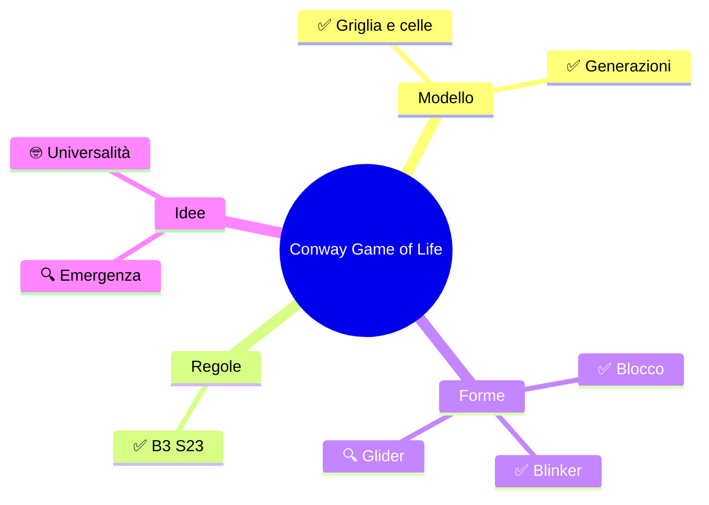
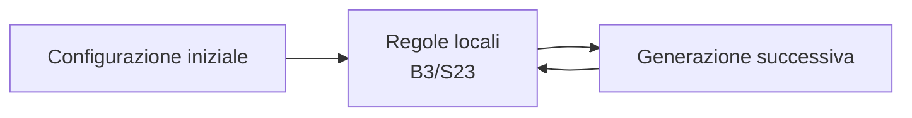

# 🧬 Conway's Game of Life

⏱️ **Tempo di esplorazione: circa 20 minuti.** ✅ essenziale: 12 min. 🔍 per andare oltre: 8 min. Nessun compito obbligatorio.

> **In una frase:** da regole semplicissime, una griglia può far nascere forme che sembrano vivere, oscillare e viaggiare.

> **Legenda:** ✅ idea essenziale · 🔍 approfondimento · 🤓 curiosità · 🧪 esempio · 🧠 da ricordare · ✏️ prova · 🃏 flashcard

## 🗺️ Mappa



## 📜 Un gioco senza giocatori

Il matematico britannico **John Conway** inventò il *Game of Life*, il «Gioco della Vita». **Martin Gardner** lo fece conoscere al grande pubblico in un articolo di *Scientific American* del 1970.

Non ci sono avversari, punti o mosse da scegliere. Si disegna una configurazione iniziale e si lascia evolvere la griglia.

Il gioco è un **automa cellulare**: un modello formato da celle disposte su una griglia. Ogni cella può essere in uno di due stati: **viva** o **morta**. Il suo stato cambia in base a poche regole locali, cioè regole che guardano solo le celle vicine.



*Il computer ripete lo stesso passaggio: una generazione dopo l'altra.*

## ⚙️ Le regole B3/S23

Per aggiornare una cella, si contano le **otto vicine**: quelle sopra, sotto, a destra, a sinistra e in diagonale. La cella stessa non si conta.

| Vicine vive | Se la cella è viva | Se la cella è morta |
|---:|---|---|
| 0 o 1 | Muore: solitudine | Resta morta |
| 2 | Sopravvive | Resta morta |
| 3 | Sopravvive | Nasce |
| 4 o più | Muore: sovraffollamento | Resta morta |

La sigla **B3/S23** riassume le regole: **B** (*birth*, nascita) con 3 vicine; **S** (*survival*, sopravvivenza) con 2 o 3. In tutti gli altri casi, la cella è o diventa morta.

<u>Tutte le celle vengono aggiornate insieme usando la generazione precedente.</u> Non si aggiorna una cella per volta: altrimenti l'ordine cambierebbe il risultato.

🧪 **Una nascita.** Il punto al centro è morto, ma ha tre vicine vive: nella generazione successiva nasce.

```text
· ■ ·
■ · ■
· · ·
```

<details>
<summary>🃏 <b>Quante vicine si contano?</b></summary>
Otto: le celle attorno, comprese quelle diagonali.
</details>
<details>
<summary>🃏 <b>Quando nasce una cella morta?</b></summary>
Quando ha esattamente tre vicine vive.
</details>
<details>
<summary>🃏 <b>Che cosa significa B3/S23?</b></summary>
Una cella nasce con 3 vicine e sopravvive con 2 o 3.
</details>

## 🧪 Forme che sembrano vive

Nonostante le regole non cambino, alcune configurazioni producono forme riconoscibili.

**Blocco — una forma stabile.** Rimane identico a ogni generazione.

```text
····
·■■·
·■■·
····
```

**Blinker — un oscillatore.** Alterna tre celle orizzontali e tre verticali; dopo due generazioni torna alla forma iniziale.

```text
·····       ·····
·····       ··■··
·■■■·   →   ··■··
·····       ··■··
·····       ·····
  G0           G1
```

**Glider — una forma che viaggia.** Dopo quattro generazioni ricompare spostata di una cella in diagonale.

```text
·■··
··■·
■■■·
····
```

**Stabile, oscillante o in movimento?** Sono comportamenti diversi ottenuti applicando sempre la stessa regola.

<details>
<summary>🃏 <b>Che cos'è un oscillatore?</b></summary>
È una configurazione che alterna un ciclo di forme e poi si ripete.
</details>
<details>
<summary>🃏 <b>Che cosa fa un glider?</b></summary>
Dopo quattro generazioni si ripete spostandosi di una cella in diagonale.
</details>

## 🧠 Regole semplici, comportamenti sorprendenti

Il blocco, il blinker e il glider non sono disegnati da un regista: emergono dall'applicazione ripetuta delle regole. **Emergenza** significa proprio questo: un comportamento complessivo nasce da interazioni locali, senza che una singola cella conosca o controlli l'insieme.

Il gioco è **deterministico**: se la configurazione iniziale è uguale, anche tutte le generazioni successive sono uguali. Non c'è casualità nascosta.

> 🤓 **Un computer dentro il gioco?** Con configurazioni costruite apposta e abbastanza spazio, il Game of Life può simulare un computer generale. Si dice quindi **Turing completo**. Non significa che ogni disegno faccia calcoli: servono strutture preparate con cura. Se vuoi approfondire, leggi [Macchine di Turing e completezza](<Macchine di Turing e completezza.md>).

Il collegamento con [la mappa delle astrazioni informatiche](<Mappa delle astrazioni informatiche.md>) è questo: il computer non vede «vita», ma una griglia di valori accesi o spenti e applica regole precise. Noi osserviamo il risultato a un livello più alto: forme che si conservano o si muovono.

🌐 **[Play Game of Life](https://playgameoflife.com/)** — prova una configurazione, avanza di una generazione alla volta e osserva i pattern. Il sito include anche una spiegazione delle regole.

⚠️ **Il mondo teorico è infinito.** Un simulatore mostra solo una porzione della griglia; il comportamento ai bordi dipende da come è impostato.

## 📚 Fonti e risorse

- [Wolfram MathWorld — Game of Life](https://mathworld.wolfram.com/GameofLife.html): regole, storia e configurazioni note.
- [Play Game of Life](https://playgameoflife.com/): simulatore interattivo e lessico dei pattern.
