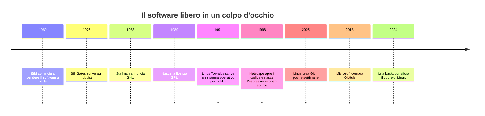

# 🐃 La ribellione del software libero

**Stallman, GNU, Linux, open source e l'invenzione della licenza più ingegnosa della storia**

⏱️ Lettura: circa 25 minuti. Nessun compito, nessuna verifica: è una storia.

> **Come leggere.** 🎬 scena · 📜 fatti e date · 💥 drama · 🔧 la parte tecnica, spiegata piano · 🧠 l'idea da portarsi via · 😄 un sorriso · 🔮 e oggi?

---

## 🎬 Una stampante inceppata (MIT, circa 1980)

Immagina un corridoio del Massachusetts Institute of Technology, il celebre **MIT**. In fondo c'è una stampante laser Xerox, nuova di zecca e costosissima. Ha un difetto: si inceppa, e nessuno se ne accorge. La gente manda un documento, aspetta un'ora, poi scopre che la carta è bloccata da tempo.

Nel laboratorio di intelligenza artificiale lavora un programmatore di ventisette anni con i capelli lunghissimi e una barba da profeta: **Richard Stallman**. La soluzione gli sembra ovvia. Basta modificare il software della stampante, così che avvisi chi ha lanciato la stampa quando la carta si blocca. Con la vecchia stampante lo avevano già fatto.

Ma il programma della Xerox è un **blocco chiuso**: il codice sorgente non si può leggere. Stallman scopre che un ricercatore di un'altra università l'ha visto. Va a chiederglielo. Quello risponde, con imbarazzo, che ha firmato un accordo di riservatezza e non può condividerlo.

Stallman racconterà per anni quel momento come la scintilla di tutto. Non era la stampante. Era la sensazione che qualcuno avesse **costruito un muro attorno a un gesto che prima era normale**: aiutare un collega.

Per capire perché una stampante fece tanto rumore, dobbiamo tornare indietro. A un tempo in cui il software non si vendeva.

---

## 📜 Quando il software era un regalo

Nei primi computer il valore stava nelle macchine: enormi, costose, fatte di armadi e cavi. I programmi erano un accessorio. Chi comprava un computer riceveva il software insieme, spesso con il **sorgente**, cioè il testo leggibile del programma. Se trovavi un errore lo correggevi. Se facevi un miglioramento lo passavi ad altri.

Era una cultura da laboratorio e da officina. Gli utenti di grandi calcolatori IBM si riunivano in gruppi come **SHARE** (1955) proprio per scambiarsi programmi. All'MIT, un gruppo di studenti appassionati di trenini elettrici, il Tech Model Railroad Club, usava la parola **hacker** per chi trovava soluzioni brillanti e divertenti a un problema. Era un complimento.

Poi tre cose cambiarono, una alla volta:

1. **1969.** Sotto la pressione delle cause antitrust, IBM annuncia che venderà il software separatamente dall'hardware. Per la prima volta il programma ha un prezzo.
2. **Anni Settanta.** Arrivano i microcomputer: piccoli, economici, per hobbisti. Il software, ora, può essere venduto a milioni di persone.
3. **1980.** Negli Stati Uniti la legge chiarisce che il software è protetto dal **diritto d'autore**, come un romanzo. Copiarlo senza permesso diventa un illecito.

### 💥 La lettera che fece arrabbiare gli hobbisti

Il 3 febbraio 1976, un giovane di venti anni scrive una **lettera aperta agli hobbisti**. Si chiama **Bill Gates** e ha appena fondato Microsoft con Paul Allen. Hanno scritto un interprete BASIC per il microcomputer Altair, e qualcuno lo sta copiando e distribuendo gratis ai raduni dell'Homebrew Computer Club.

Gates non è contento. Scrive che la maggior parte di loro **ruba il software**, e che è difficile fare un lavoro professionale se non puoi essere pagato. Una frase è rimasta famosa: *chi può permettersi di lavorare gratis?*

La lettera è dura, ma Gates ha un argomento che merita rispetto: chi scrive codice ha bisogno di vivere. Non è un cattivo. È il primo atto di una discussione che dura ancora.

🧠 **Idea da ricordare:** il software non nasce proprietario. Lo è diventato, per ragioni economiche e legali, in pochi anni.

---

## 🎬 L'ultimo hacker

Torniamo a Stallman, nato a New York nel 1953. È stato un ragazzo brillante e solitario. Dal 1971 vive nel **laboratorio di Intelligenza Artificiale dell'MIT**: per lui è più casa di casa.

Quel laboratorio funzionava come una comunità. Il codice stava in cartelle aperte a tutti. Per anni non ci furono nemmeno **password**, e Stallman fece una campagna perché non ci fossero. Si diceva che la sua password fosse semplicemente un invio: premere Invio.

Lì scrive **Emacs** (1976), un editor di testo che i programmatori ancora oggi amano o odiano con fervore religioso. Stallman lo regala a chiunque promettendo una cosa sola: se lo migliori, condividi i tuoi miglioramenti.

Poi, all'inizio degli anni Ottanta, il mondo si chiude attorno a lui.

- Una parte dei suoi colleghi lascia il laboratorio per aziende che producono computer per l'intelligenza artificiale, come **Symbolics**. Il loro software ora è segreto.
- Per un paio d'anni Stallman, da solo, riscrive ogni miglioramento di Symbolics per non lasciare il laboratorio senza strumenti. Una piccola guerra personale di un uomo contro un'azienda.
- Arriva la stampante Xerox.
- Anche **Unix**, il sistema operativo più amato nelle università, cambia. L'azienda AT&T, che per ragioni legali l'aveva dato quasi in regalo agli atenei, dopo il 1984 può venderlo. Ora lo vende, e la sua fetta di università diventa una fetta di mercato.

Stallman si trova davanti a una scelta. Può lavorare per aziende che chiudono il codice, come tutti i suoi colleghi. Può cambiare mestiere. Oppure può fare una cosa assurda.

---

## 🎬 27 settembre 1983: «Free Unix!»

Una sera di settembre, Stallman invia un messaggio ai gruppi di discussione di Internet. Il tono è tranquillo. Dice più o meno così: *«Dal prossimo Giorno del Ringraziamento scriverò un sistema compatibile con Unix, completo, e lo regalerò a chiunque lo possa usare.»*

Lo chiama **GNU**. Il nome è uno scherzo da nerd: **GNU's Not Unix**, «GNU non è Unix». Un acronimo **ricorsivo**, che contiene sé stesso nella propria definizione. Fa ridere i programmatori e confonde tutti gli altri. Il gnu, l'animale, diventa il suo emblema.

Stallman lascia l'MIT. Non per rabbia: per evitare che l'università possa rivendicare il codice che scriverà. Poi si mette al lavoro.

Nel **1985** pubblica il **Manifesto GNU**. Il suo argomento centrale è semplice: se un programma ti piace, la regola d'oro ti impone di condividerlo con chi lo vuole. Poi fonda la **Free Software Foundation (FSF)**, per raccogliere fondi e sostenere il progetto.

Il lavoro è immenso. Nei sei anni successivi, praticamente da solo e poi con una comunità di volontari, Stallman e gli altri scrivono:

- **GNU Emacs**, l'editor;
- **GCC**, il compilatore C (1987), che trasforma il codice in programmi eseguibili. Per anni sarà uno degli strumenti più importanti del mondo;
- **Bash**, la shell dei comandi (Brian Fox, 1989);
- librerie, debugger, utilità: tutti i pezzi di un sistema operativo.

Quasi tutti. Ne manca uno. Ci arriviamo.

### 🔧 Che cosa vuol dire «libero»?

Stallman precisa subito che «free» in inglese è ambiguo: può voler dire *gratis* o *libero*. Lui intende il secondo. La frase che ripete è: **«libero come la libertà di parola, non come la birra gratis»**.

Un software è **libero** se chi lo usa ha quattro libertà. Stallman le numera partendo da zero, perché la quarta è stata aggiunta dopo, ma logicamente veniva prima di tutte:

| Libertà | Che cosa permette |
|---:|---|
| **0** | eseguire il programma per qualsiasi scopo |
| **1** | studiare come funziona e modificarlo (serve il codice sorgente) |
| **2** | ridistribuire copie |
| **3** | distribuire anche le versioni modificate |

Un software libero può essere venduto. Un software gratuito può non essere libero: pensa a un'app che scarichi senza pagare ma che non puoi né aprire né modificare.

🧠 <u>«Libero» riguarda i diritti di chi usa il software, non il suo prezzo.</u>

😄 Stallman ha fondato anche la **Chiesa di Emacs**. Il suo santo patrono, lui stesso, si presenta a volte come **Sant'IGNUcius**, con un vecchio disco rigido per aureola. Secondo la dottrina, usare l'editor rivale *vi* è peccato; ma se è software libero, è solo un peccato veniale.

---

## 🔧 L'invenzione più geniale: il copyleft

C'è un problema. Se Stallman regala il suo codice, chiunque può prenderlo, migliorarlo e poi **chiuderlo**. Una azienda può usare per anni il lavoro dei volontari e vendere una versione segreta. Cosa resta del sogno?

Stallman e il suo avvocato risolvono il problema con un'idea elegantissima. Se la legge sul diritto d'autore è nata per vietare di copiare, la si può **rovesciare**: si scrive una licenza che usa il diritto d'autore per garantire il contrario.

Si chiama **copyleft**, un gioco di parole su *copyright*. Lo slogan: *all rights reversed*, «diritti rovesciati».

La regola: **puoi usare, modificare e distribuire questo programma, ma se lo distribuisci devi concedere le stesse libertà a chi lo riceve da te.** La libertà diventa ereditaria.

La licenza che incarna questa idea è la **GNU General Public License**, la **GPL**. La prima versione è del **1989**; la seconda, del 1991, resterà la più famosa. La terza arriva nel 2007.

🧠 <u>La GPL non rinuncia al diritto d'autore: lo usa come strumento per proteggere la libertà.</u>

💥 Non tutti la amano. I critici chiamano la GPL **«virale»**: se incorpori codice GPL nel tuo programma e distribuisci il risultato come un unico lavoro, in genere devi rilasciare quel lavoro sotto GPL e fornire il sorgente. Non basta però usare una libreria GPL in qualunque modo: un programma separato che la usa solo come servizio, per esempio, non diventa automaticamente GPL; contano come i componenti sono collegati e distribuiti. Se lo usi solo in privato, senza distribuirlo, la GPL di norma non ti obbliga a pubblicare le modifiche. Un dirigente Microsoft arriverà a paragonarla a un cancro. I sostenitori rispondono che la reciprocità è proprio il punto: chi distribuisce una versione derivata deve lasciare agli altri le stesse libertà.

---

## 🎬 Helsinki, 1991: un ragazzo e un hobby

Nel 1991 il progetto GNU è quasi completo. Ha il compilatore, l'editor, la shell. Gli manca il **kernel**: il nucleo del sistema operativo, che parla direttamente con l'hardware. Quello del progetto GNU, chiamato **Hurd**, è ambizioso, elegante e in ritardo. Molto in ritardo.

Il 25 agosto 1991 un ventunenne finlandese, **Linus Torvalds**, scrive su un gruppo di discussione:

> *«Sto facendo un sistema operativo (gratuito) (solo un hobby, non sarà grande e professionale come GNU) per PC 386/486.»*

Lo pubblica con una licenza sua, che vieta di usarlo per guadagnare. Pochi mesi dopo, all'inizio del 1992, cambia idea e passa alla **GPL**. Più tardi dirà che fu una delle migliori decisioni della sua vita.

Un dettaglio buffo sul nome. Linus voleva chiamarlo *Freax*. Fu l'amministratore del server dove caricò i file, Ari Lemmke, a creare la cartella chiamata **Linux**. Il nome rimase.

### 💥 Il professore e lo studente

Nel gennaio 1992 va in scena un duello a distanza. **Andrew Tanenbaum**, professore olandese e autore di Minix (il sistema da cui Linus aveva preso ispirazione), scrive un messaggio dal titolo *«Linux è obsoleto»*. Sostiene che il design di Linux, un kernel **monolitico** — cioè con molti servizi fondamentali del sistema operativo riuniti nello stesso nucleo — sia un errore di vent'anni prima. Aggiunge che, come studente, Linus non avrebbe preso un bel voto.

Linus risponde con tono sprezzante. La discussione è ricordata ancora oggi come la prima grande «guerra di religione» su Linux. Il tempo ha dato ragione al pragmatismo di Linus più che alla purezza di Tanenbaum.

Il kernel di Linus incontra il resto di GNU, e insieme formano un sistema completo e funzionante. Per anni resterà aperta la questione di come chiamarlo. Stallman insiste su **GNU/Linux**: il cuore è di Linus, ma quasi tutto il resto è GNU. Il mondo ha scelto di dire semplicemente «Linux». La disputa ancora brucia in certi angoli di Internet.

---

## 📜 Gli anni Novanta: la rivoluzione dal basso

Intorno al kernel nasce un ecosistema.

- **1993, Debian.** Ian Murdock, studente americano, lancia una distribuzione Linux fatta dalla comunità. Il nome è la fusione del nome della sua fidanzata, **Deb**ra, e del suo, **Ian**. Il «Contratto sociale» di Debian, scritto qualche anno dopo, diventa un testo fondamentale.
- **1995, Apache.** Il server web libero. Per molti anni sarà il più usato del mondo.
- **1997, il saggio che cambiò il modo di parlarne.** **Eric Raymond**, un programmatore e saggista, pubblica *La cattedrale e il bazaar*. Confronta due modi di costruire software. La **cattedrale**: pochi esperti che lavorano in segreto e rilasciano ogni tanto. Il **bazaar**: un mercato caotico, con tutti che guardano il codice e propongono correzioni. Linux è il bazaar, e funziona. Da Raymond arriva la «legge di Linus»: *con abbastanza occhi, ogni bug diventa evidente*.

E poi c'è un momento che è quasi una trama da film.

---

## 💥 22 gennaio 1998: Netscape apre il codice

Netscape Navigator, il browser più famoso del mondo, sta perdendo la guerra contro Microsoft Internet Explorer. In una mossa disperata e coraggiosa, l'azienda annuncia: **libereremo il codice sorgente del browser**.

Da quel codice nascerà il progetto **Mozilla**, e anni dopo **Firefox**. Un dettaglio curioso: Firefox si chiamò prima *Phoenix* e poi *Firebird*, ma dovette cambiare nome due volte per problemi di marchio.

L'annuncio di Netscape fa scoprire al mondo degli affari una cosa che i programmatori sapevano già: condividere il codice poteva essere un buon affare. Ma c'era un ostacolo di linguaggio.

Le parole *free software* spaventavano i manager. Evocavano ideologia, comunismo, gratis a tutti. Il **3 febbraio 1998**, a Palo Alto, un gruppo di figure del mondo informatico si riunisce per trovare un'etichetta più accettabile. L'espressione **open source** viene suggerita da **Christine Peterson**.

Poche settimane dopo, Raymond e **Bruce Perens** fondano la **Open Source Initiative (OSI)**. Perens aveva scritto le regole di Debian; da quelle nasce la **Open Source Definition**, con dieci criteri per decidere se una licenza è davvero open.

---

## ⚔️ Software libero contro open source: la differenza

Qui comincia uno dei litigi più eleganti dell'informatica. Entrambi i movimenti difendono il codice aperto, usano quasi le stesse licenze, scrivono nello stesso modo. Allora dov'è il problema?

È nelle parole, e nelle ragioni.

| | **Software libero** | **Open source** |
|---|---|---|
| **Nato** | 1983-1985, FSF | 1998, OSI |
| **Domanda di fondo** | «È giusto?» | «Funziona meglio?» |
| **Argomento** | etica: gli utenti hanno diritto alla libertà | pratico: lo sviluppo aperto produce software migliore |
| **Come lo definisce** | le quattro libertà | la Open Source Definition, in dieci punti |
| **Il software chiuso è...** | un'ingiustizia verso gli utenti | un modo di lavorare meno efficace |
| **Il pubblico ideale** | cittadini, attivisti | aziende, sviluppatori |

Stallman l'ha messa così: l'open source è una **metodologia di sviluppo**, il software libero è un **movimento sociale**. E ha scritto un saggio intitolato *Perché l'open source perde di vista il punto del software libero*.

La verità è che la maggior parte dei programmi appartiene a entrambe le famiglie. Per non litigare, molti usano la sigla **FOSS** (*Free and Open Source Software*) o **FLOSS**, dove la L sta per *Libre*, la parola che non può essere letta come «gratis».

🧠 <u>Stesso codice, stesse licenze, due modi di raccontarlo: uno parla ai valori, l'altro ai risultati.</u>

---

## 💥 Il gigante contro il pinguino

Quando Linux comincia a diventare serio, i colossi del software chiuso se ne accorgono.

- **Ottobre 1998.** Trapelano i **Halloween Documents**, memorandum interni di Microsoft. Riconoscono che l'open source è una minaccia tecnica credibile, e discutono come combatterlo.
- **2001.** Il capo di Microsoft, Steve Ballmer, definisce Linux *«un cancro»*, per via della GPL che si propaga a tutto ciò che tocca.
- **2003.** Un'azienda, **SCO**, fa causa a IBM sostenendo che Linux contiene codice Unix rubato, e chiede miliardi. Per anni la comunità trema. Poi si scopre che SCO non aveva nemmeno i diritti che rivendicava. Perde, e fallisce.
- **2000-2019.** Nel frattempo IBM investe un miliardo di dollari in Linux. L'azienda Red Hat va in Borsa nel 1999 e, vent'anni dopo, IBM la compra per 34 miliardi di dollari.

E il finale più ironico. Nel 2014 il nuovo capo di Microsoft, Satya Nadella, dichiara che **Microsoft ama Linux**. Nel 2018 Microsoft compra **GitHub**, la casa del codice aperto, per 7,5 miliardi di dollari. Se hai letto [Github](<Github.md>), sai già di che cosa si tratta.

Ciò che era una rivolta è diventato l'infrastruttura di tutti. Oggi Linux muove tutti i 500 supercomputer più potenti del mondo e, nella forma di **Android**, gran parte dei telefoni.

---

## 🔧 Le licenze: una mappa per non perdersi

Ogni progetto aperto ha una licenza che dice **che cosa si può fare**. Ne esistono centinaia, ma poche coprono quasi tutto. Si dividono in due grandi famiglie.

**Permissive.** Chiedono pochissimo: di solito, di mantenere il nome dell'autore. Puoi prendere il codice e farci quello che vuoi, anche chiuderlo.

**Copyleft.** Chiedono che le libertà **restino** a chi riceve il programma e le sue modifiche.

| Licenza | Famiglia | Idea in una riga | Dove la trovi |
|---|---|---|---|
| **MIT** | permissiva | fai quello che vuoi, tieni il mio nome | React, Ruby on Rails |
| **BSD** | permissiva | simile alla MIT, nata a Berkeley | FreeBSD (che sta dentro la PlayStation) |
| **Apache 2.0** | permissiva | come la MIT, con una tutela esplicita sui brevetti | Kubernetes |
| **MPL** | copyleft «debole» | se modifichi *questi file*, condividili | Firefox |
| **LGPL** | copyleft «debole» | puoi usare la libreria in un programma chiuso, ma se la modifichi condividi | glibc |
| **GPL** | copyleft «forte» | se distribuisci, condividi anche tu | kernel Linux, Git, WordPress |
| **AGPL** | copyleft «fortissimo» | vale anche se offri il programma come servizio online | Mastodon |

Due note veloci:

- Quando Linus ha scelto la GPL versione 2, la versione 3 non era ancora nata. Quando è arrivata, nel 2007, Linus non l'ha adottata. Il kernel è ancora **GPLv2**.
- Fuori dal software, le stesse idee si sono estese ai testi, alle immagini, alla musica. Dal 2001 le **Creative Commons** permettono di dire «puoi usare la mia foto, se citi me». Wikipedia funziona così.

### ⚠️ Attenzione a un errore comune

Se pubblichi un progetto su GitHub **senza licenza**, non è open source. Per legge, il diritto d'autore appartiene a te e tutti i diritti sono riservati: gli altri possono guardare il codice, ma non hanno il permesso di riusarlo. Per concedere qualcosa devi scegliere una licenza. Il sito [choosealicense.com](https://choosealicense.com/) ti guida in due minuti.

### 😄 Il potere del fork

Che cosa succede se un'azienda compra un progetto aperto e lo trascura? La comunità può **forkare**: fare una copia e continuare per conto proprio. È il paracadute del software libero.

- Quando Oracle comprò Sun, il fondatore di MySQL creò **MariaDB**.
- Per lo stesso motivo, la comunità di OpenOffice creò **LibreOffice** (2010).
- E nel 2005 successe qualcosa che riguarda direttamente chi usa GitHub.

---

## 💥 Le settimane in cui nacque Git

Fino al 2005 il kernel Linux veniva sviluppato con un programma proprietario, **BitKeeper**, concesso gratuitamente dall'azienda che lo produceva. Molti nella comunità lo trovavano un compromesso inaccettabile. Stallman, per esempio.

Poi uno sviluppatore, **Andrew Tridgell**, studia come funziona il protocollo di BitKeeper. L'azienda si arrabbia e ritira la licenza gratuita. Il kernel Linux si ritrova senza strumento.

Linus Torvalds si prende un po' di tempo e, in poche settimane, scrive un nuovo sistema da zero. Lo chiama **Git**. Il primo commit è dell'aprile 2005. Oggi Git è usato da quasi tutti i programmatori del pianeta, compresi quelli che non hanno mai sentito parlare di Stallman.

---

## 🔮 Le crepe: che cosa non funziona

Una storia bella ha anche le sue ombre. Le dobbiamo guardare.

**1. Chi paga?** Il software aperto sorregge Internet, ma spesso è mantenuto da pochi volontari. Nel 2014 il bug **Heartbleed** colpisce OpenSSL, la libreria che protegge una parte enorme delle connessioni cifrate. Si scopre che un componente vitale per il mondo era curato da pochissime persone e con pochissimi fondi. Il fumetto di xkcd [«Dependency»](https://xkcd.com/2347/) lo racconta con un disegno: un'enorme torre di tecnologia moderna e, in basso, un blocchetto minuscolo che la regge tutta, mantenuto da una sola persona, senza che nessuno la ringrazi.

**2. La fiducia si può sfruttare.** Nel marzo 2024 un ingegnere, **Andres Freund**, nota che una connessione SSH è più lenta di una frazione di secondo. Indagando, scopre una **backdoor** nascosta in `xz`, una libreria di compressione. Il responsabile, che usava il nome «Jia Tan», aveva passato quasi due anni a guadagnarsi la fiducia del manutentore, per poi inserire il codice malevolo. Fu scoperta per caso, prima che finisse in tutte le distribuzioni stabili. L'apertura del codice ha permesso di scoprirla; ma ci è andata vicina.

**3. Le licenze cambiano.** Quando le aziende costruiscono servizi sul software libero senza contribuire, qualcuno si arrabbia. Alcuni progetti hanno cambiato licenza per limitare il cloud: HashiCorp nel 2023, Redis nel 2024. La comunità ha risposto con dei fork: **OpenTofu** e **Valkey**. Il paracadute ha funzionato ancora.

**4. E l'intelligenza artificiale?** Molti modelli si dicono «open», ma pochi condividono dati di addestramento e procedure complete. L'OSI ha pubblicato nel 2024 una definizione di *Open Source AI*: la discussione è aperta, e le vecchie domande tornano su un terreno nuovo.

**5. Le persone, non solo le idee.** Stallman è stato una figura capace di cambiare il mondo con una convinzione ostinata, e lo stesso carattere intransigente lo ha reso spesso difficile da frequentare. Nel settembre 2019 si è dimesso dalla presidenza della FSF e dal suo ruolo all'MIT dopo commenti sul caso Epstein. Nel 2021 è rientrato nel consiglio della FSF, e la scelta ha suscitato proteste e lettere aperte. Un movimento nato sulle idee deve imparare a separare l'eredità di un fondatore dal comportamento delle persone.

---

## 🧠 Che cosa ci lascia questa storia

All'inizio, i computer erano macchine. Poi sono diventati un mercato. Poi un giorno un uomo con una stampante rotta si è chiesto: *a chi appartiene il codice che ci governa?*

La risposta di Stallman era radicale: a chi lo usa. La risposta di Torvalds era pratica: a chi lo migliora. La risposta di Netscape era strategica: a chi ci costruisce sopra. Messe insieme hanno dato il mondo in cui viviamo, dove un ragazzo di Helsinki, un'azienda californiana e uno studente italiano possono lavorare allo stesso programma senza conoscersi.

**Tre idee da portare via:**

1. <u>Il codice aperto è una forma di cooperazione fra sconosciuti</u>, resa possibile da una licenza: un contratto che sostituisce la fiducia personale.
2. <u>La licenza decide il destino di un progetto</u> quanto il codice che contiene.
3. <u>Usare software libero è comodo; mantenerlo è un lavoro.</u> Chi ne beneficia, a un certo punto, dovrebbe anche restituire qualcosa.

Un pensiero finale, più leggero. Tu probabilmente usi software libero tutti i giorni senza saperlo: in un telefono Android, in un sito web, in un videogioco. E quando premi «Fork» su GitHub, stai compiendo, in piccolo, il gesto di Stallman: *prendo il tuo codice, lo miglioro, e lo restituisco al mondo*.

---

## 📚 Per approfondire

**Testi fondamentali**
- [Il Manifesto GNU](https://www.gnu.org/gnu/manifesto.html) (1985): breve, appassionato, in inglese. Si legge in dieci minuti.
- [La definizione di software libero](https://www.gnu.org/philosophy/free-sw.html): le quattro libertà spiegate dalla FSF.
- [Perché l'open source perde di vista il punto del software libero](https://www.gnu.org/philosophy/open-source-misses-the-point.html): la posizione di Stallman.
- [Storia della Open Source Initiative](https://opensource.org/about/history-of-the-open-source-initiative): la versione dell'altra parte, con la riunione di Palo Alto.
- [La cattedrale e il bazaar](http://www.catb.org/~esr/writings/cathedral-bazaar/): il saggio di Eric Raymond.
- [Lettera aperta agli hobbisti di Bill Gates](https://en.wikipedia.org/wiki/An_Open_Letter_to_Hobbyists) (1976).

**Per scegliere una licenza**
- [choosealicense.com](https://choosealicense.com/): una guida pratica di GitHub.
- [Elenco delle licenze approvate dall'OSI](https://opensource.org/licenses).

**Da guardare**
- [xkcd 2347, «Dependency»](https://xkcd.com/2347/): il fumetto di cui sopra. Si legge in trenta secondi; si ripensa per molto.

**Altre dispense in questa cartella**
- [RFC e come abbiamo inventato la rete](<RFC e come abbiamo inventato la rete.md>): un altro caso di conoscenza condivisa che ha costruito qualcosa di enorme.
- [Github](<Github.md>): dove oggi vive gran parte del codice aperto.
- [Storia dei bit](<Storia dei bit.md>): da dove nasce tutto, prima del software.
