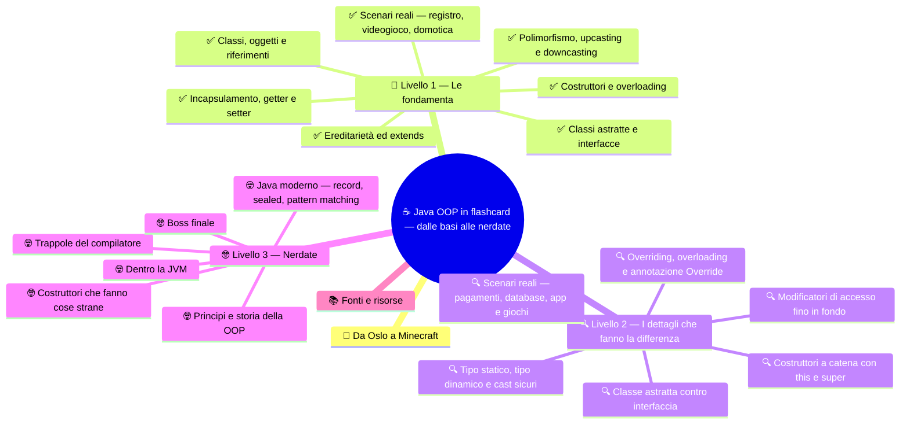

# ☕ Java OOP in flashcard — dalle basi alle nerdate

**4CI · Informatica · Ripasso a flashcard · OOP in Java**

> **Legenda:** ✅ da sapere · 🔍 per capire fino in fondo · 🤓 facoltativo, per curiosi · 🃏 flashcard: rispondi a voce, poi apri per controllare



## 🧭 Da Oslo a Minecraft

Oslo, inizio anni Sessanta. Il mondo è in piena Guerra Fredda, si corre verso la Luna. Due ricercatori norvegesi, **Ole-Johan Dahl** e **Kristen Nygaard**, hanno un problema molto concreto: simulare navi, porti, code di clienti. Ogni nave ha i suoi dati e il suo comportamento. Scrivere tutto con variabili sparse è un incubo.

La loro idea: descrivere un *tipo* di cosa una volta sola (la **classe**) e poi creare tante *cose* di quel tipo (gli **oggetti**). Nasce **Simula 67**, il primo linguaggio con classi, oggetti e sottoclassi.

Negli anni Settanta, in California, **Alan Kay** allo Xerox PARC immagina i programmi come cellule di un organismo, che si scambiano messaggi. Crea **Smalltalk** e inventa il nome *programmazione orientata agli oggetti*. Nel 1995 **James Gosling** e il suo gruppo alla Sun pubblicano **Java**. Oggi Java gira nei server delle banche, in moltissime app aziendali e anche in **Minecraft: Java Edition**.

Questo quiz va in **difficoltà crescente**. Il livello ✅ basta per la sufficienza. Il livello 🔍 serve per puntare in alto. Il livello 🤓 è per chi vuole guardare sotto il cofano: lì ci sono trappole che mettono in crisi anche chi programma da anni.

Nei codici useremo spesso la nostra stalla: `Animale`, `Pollo`, `Mucca`. Quando non diversamente indicato, `Pollo` e `Mucca` estendono `Animale` e ridefiniscono `faiVerso()`. Solo `Pollo` ha il metodo `razzola()`.

## 🧱 Livello 1 — Le fondamenta

### ✅ Classi, oggetti e riferimenti

<details>
<summary>🃏 Che cos'è la programmazione orientata agli oggetti, in una frase?</summary>
Un modo di organizzare il programma in oggetti che uniscono dati e operazioni, e che collaborano chiamando i metodi gli uni degli altri.
</details>

<details>
<summary>🃏 Che cos'è una classe?</summary>
Un modello che descrive un tipo di oggetti: quali attributi hanno e quali metodi sanno eseguire. È come il progetto di una casa.
</details>

<details>
<summary>🃏 Che cos'è un oggetto?</summary>
Un'istanza concreta di una classe, creata con new. Ha il suo stato personale. È come una casa costruita seguendo il progetto.
</details>

<details>
<summary>🃏 Che cosa sono lo stato e il comportamento di un oggetto?</summary>
Lo stato è l'insieme dei valori dei suoi attributi in un certo momento. Il comportamento è l'insieme dei suoi metodi, cioè di quello che sa fare.
</details>

<details>
<summary>🃏 Quali sono i quattro pilastri della OOP?</summary>
Incapsulamento, ereditarietà, polimorfismo, astrazione.
</details>

<details>
<summary>🃏 Che cosa fa la parola chiave new?</summary>
Crea un nuovo oggetto in memoria, chiama il costruttore per inizializzarlo e restituisce un riferimento all'oggetto.
</details>

<details>
<summary>🃏 Dopo la riga Animale a; quanti oggetti esistono?</summary>
Nessuno. Esiste solo una variabile che potrà contenere un riferimento a un Animale.
</details>

<details>
<summary>🃏 Che cos'è null?</summary>
Il valore di un riferimento che non punta a nessun oggetto. Se chiami un metodo su null ottieni una NullPointerException.
</details>

int numero;
print(numero);
NullPointerException

<details>
<summary>🃏 Quali convenzioni di nome si usano in Java per classi, metodi e attributi?</summary>
Classi in PascalCase, per esempio ContoCorrente. Metodi e attributi in camelCase, per esempio getSaldo e numeroZampe.
</details>

**Codice 1**

```java
Animale a = new Animale("Pio");
Animale b = a;
b.setNome("Muu");
System.out.println(a.getNome());
```

<details>
<summary>🃏 Che cosa stampa il codice 1? Perché?</summary>
Stampa Muu. La riga Animale b = a copia il riferimento, non l'oggetto: a e b puntano allo stesso animale.
</details>

<details>
<summary>🃏 Nel codice 1, quanti oggetti Animale sono stati creati?</summary>
Uno solo: c'è una sola new.
</details>

### ✅ Incapsulamento, getter e setter

<details>
<summary>🃏 Che cos'è l'incapsulamento?</summary>
Nascondere lo stato interno di un oggetto e permettere di leggerlo o modificarlo solo attraverso metodi controllati.
</details>

<details>
<summary>🃏 Quali sono i quattro livelli di accesso in Java?</summary>
public, protected, nessun modificatore (detto package o default), private.
</details>

<details>
<summary>🃏 Chi può vedere un membro private?</summary>
Solo il codice scritto dentro la stessa classe.
</details>

<details>
<summary>🃏 Chi può vedere un membro public?</summary>
Tutto il codice, da qualunque classe e pacchetto.
</details>

<details>
<summary>🃏 Che cos'è un getter?</summary>
Un metodo che restituisce il valore di un attributo. Per convenzione si chiama getNome; per i boolean spesso isAttivo.
</details>

<details>
<summary>🃏 Che cos'è un setter?</summary>
Un metodo che modifica un attributo, per esempio setNome. Può controllare il valore prima di accettarlo.
</details>

<details>
<summary>🃏 Perché non rendiamo semplicemente public tutti gli attributi?</summary>
Perché chiunque potrebbe mettere valori impossibili, come un peso negativo, e l'oggetto finirebbe in uno stato sbagliato. Inoltre non potremmo più cambiare la struttura interna senza rompere il codice degli altri.
</details>

**Codice 2** — l'oggetto `pollo` pesa 1.8 kg.

```java
public void setPeso(double peso) {
    if (peso > 0) {
        this.peso = peso;
    }
}

pollo.setPeso(-3);
System.out.println(pollo.getPeso());
```

<details>
<summary>🃏 Che cosa stampa il codice 2?</summary>
1.8. Il setter rifiuta il valore negativo e lascia il peso com'era.
</details>

<details>
<summary>🃏 Un attributo deve sempre avere sia getter sia setter?</summary>
No. Si aggiungono solo quelli che servono. Un attributo che non deve cambiare dall'esterno non ha setter.
</details>

### ✅ Costruttori e overloading

<details>
<summary>🃏 Che cos'è un costruttore?</summary>
Un metodo speciale che inizializza l'oggetto appena creato. Viene chiamato da new.
</details>

<details>
<summary>🃏 Quali due regole di sintassi distinguono un costruttore da un metodo normale?</summary>
Ha lo stesso nome della classe e non ha tipo di ritorno, nemmeno void.
</details>

<details>
<summary>🃏 Che cos'è il costruttore di default?</summary>
Un costruttore senza parametri e vuoto che Java aggiunge da solo, ma solo se nella classe non hai scritto nessun costruttore.
</details>

<details>
<summary>🃏 A che cosa serve this in this.nome = nome?</summary>
A distinguere l'attributo dell'oggetto, this.nome, dal parametro che ha lo stesso nome, nome.
</details>

<details>
<summary>🃏 Che cos'è l'overloading dei costruttori?</summary>
Scrivere più costruttori nella stessa classe, con parametri diversi per numero, tipo o ordine. Così l'oggetto si può creare in modi diversi.
</details>

**Codice 3**

```java
public class Animale {
    private String nome;
    private double peso;

    public Animale(String nome) {
        this.nome = nome;
        this.peso = 1.0;
    }

    public Animale(String nome, double peso) {
        this.nome = nome;
        this.peso = peso;
    }
}
```

<details>
<summary>🃏 Nel codice 3, quale costruttore viene chiamato da new Animale("Pio")? Quanto pesa Pio?</summary>
Il primo, quello con un solo parametro String. Pio pesa 1.0.
</details>

<details>
<summary>🃏 Nel codice 3, quale costruttore viene chiamato da new Animale("Carolina", 500)?</summary>
Il secondo. Il 500 intero viene convertito automaticamente in double.
</details>

<details>
<summary>🃏 Come decide Java quale costruttore sovraccaricato usare?</summary>
Guarda numero, tipo e ordine degli argomenti scritti nella chiamata. Lo decide il compilatore, prima che il programma parta.
</details>

### ✅ Ereditarietà ed extends

<details>
<summary>🃏 Che cos'è l'ereditarietà?</summary>
Il meccanismo con cui una classe, la sottoclasse, riceve attributi e metodi da un'altra classe, la superclasse, e può aggiungerne o modificarne.
</details>

<details>
<summary>🃏 Quale parola chiave si usa per ereditare da una classe?</summary>
extends, per esempio class Pollo extends Animale.
</details>

<details>
<summary>🃏 Qual è il test per capire se usare l'ereditarietà?</summary>
La frase «è un» deve suonare vera: un Pollo è un Animale. Se invece la frase giusta è «ha un», come un'auto ha un motore, serve un attributo, non l'ereditarietà.
</details>

<details>
<summary>🃏 Da quante classi può estendere una classe Java?</summary>
Da una sola.
</details>

<details>
<summary>🃏 Se una classe non scrive extends, da chi eredita?</summary>
Da Object, la radice di tutte le classi Java.
</details>

<details>
<summary>🃏 Che cosa fa super(nome) dentro il costruttore di Pollo?</summary>
Chiama il costruttore della superclasse Animale, che inizializza la parte comune dell'oggetto.
</details>

<details>
<summary>🃏 I costruttori si ereditano?</summary>
No. Ogni classe ha i suoi costruttori. La sottoclasse può però chiamare quelli della superclasse con super(...).
</details>

<details>
<summary>🃏 Che cosa può fare una sottoclasse oltre a ereditare?</summary>
Aggiungere nuovi attributi e metodi, e ridefinire metodi ereditati (overriding).
</details>

### ✅ Polimorfismo, upcasting e downcasting

<details>
<summary>🃏 Che cos'è il polimorfismo?</summary>
La capacità di oggetti diversi di rispondere in modo diverso allo stesso messaggio. Lo stesso faiVerso() produce Coccodè o Muuu a seconda dell'animale.
</details>

<details>
<summary>🃏 Che differenza c'è tra polimorfismo statico e dinamico?</summary>
Statico: overloading, la scelta del metodo avviene in compilazione in base ai parametri. Dinamico: overriding, la scelta avviene durante l'esecuzione in base all'oggetto reale.
</details>

<details>
<summary>🃏 Che cos'è l'overriding?</summary>
Ridefinire in una sottoclasse un metodo ereditato, con lo stesso nome e gli stessi parametri, per cambiarne il comportamento.
</details>

<details>
<summary>🃏 Che cos'è l'upcasting?</summary>
Usare un oggetto di una sottoclasse attraverso un riferimento della superclasse, per esempio Animale a = new Pollo("Pio"). È automatico e sempre sicuro.
</details>

<details>
<summary>🃏 Che cos'è il downcasting?</summary>
Tornare da un riferimento della superclasse a uno della sottoclasse, per esempio Pollo p = (Pollo) a. Va scritto esplicitamente e può fallire durante l'esecuzione.
</details>

<details>
<summary>🃏 Quale errore si ottiene se il downcasting è sbagliato?</summary>
Una ClassCastException durante l'esecuzione.
</details>

**Codice 4**

```java
Animale[] stalla = { new Pollo("Pio"), new Mucca("Carolina") };
for (Animale a : stalla) {
    a.faiVerso();
}
```

<details>
<summary>🃏 Nel codice 4, quale faiVerso() viene eseguito a ogni giro?</summary>
Al primo giro quello di Pollo, al secondo quello di Mucca. Conta l'oggetto reale, non il tipo della variabile a.
</details>

<details>
<summary>🃏 Perché il codice 4 è comodo quando arriva un nuovo animale, per esempio una Capra?</summary>
Basta scrivere la classe Capra con il suo faiVerso(). Il ciclo non va toccato.
</details>

### ✅ Classi astratte e interfacce

<details>
<summary>🃏 Che cos'è una classe astratta?</summary>
Una classe dichiarata abstract che non si può istanziare con new. Serve come base comune per le sottoclassi.
</details>

<details>
<summary>🃏 Che cos'è un metodo astratto?</summary>
Un metodo con la firma ma senza corpo, per esempio public abstract void faiVerso(); Le sottoclassi concrete devono implementarlo.
</details>

<details>
<summary>🃏 Una classe astratta può avere metodi già scritti?</summary>
Sì. Può avere sia metodi concreti, condivisi da tutte le sottoclassi, sia metodi astratti.
</details>

<details>
<summary>🃏 Che cos'è un'interfaccia?</summary>
Un contratto: un elenco di metodi che una classe promette di saper eseguire.
</details>

<details>
<summary>🃏 Quale parola chiave usa una classe per rispettare un'interfaccia?</summary>
implements, per esempio class Aquila extends Animale implements Volante.
</details>

<details>
<summary>🃏 Quante interfacce può implementare una classe?</summary>
Quante ne vuole, separate da virgola.
</details>

<details>
<summary>🃏 Che cosa succede se una sottoclasse concreta non implementa un metodo astratto?</summary>
Non compila. In alternativa la sottoclasse deve essere dichiarata a sua volta abstract.
</details>

<details>
<summary>🃏 Quale domanda aiuta a scegliere tra classe astratta e interfaccia?</summary>
La classe astratta risponde a «che cos'è?», per esempio un Animale. L'interfaccia risponde a «che cosa sa fare?», per esempio Volante.
</details>

### ✅ Scenari reali — registro, videogioco, domotica

**Registro elettronico.** La scuola vuole una classe `Studente` con nome, cognome e voti.

<details>
<summary>🃏 Nel registro elettronico, perché la lista dei voti deve essere private?</summary>
Per impedire che qualcuno aggiunga voti senza controllo, per esempio un 15 o un -2. I voti si aggiungono solo con un metodo che controlla l'intervallo valido.
</details>

<details>
<summary>🃏 Nel registro elettronico, che cosa dovrebbe controllare il metodo aggiungiVoto?</summary>
Che il voto sia nell'intervallo ammesso dalla scuola, per esempio da 1 a 10. Se non lo è, il voto va rifiutato.
</details>

<details>
<summary>🃏 Nel registro, Studente e Docente hanno entrambi nome, cognome e codice fiscale. Come evitare di ripetere il codice?</summary>
Creare una superclasse Persona con gli attributi comuni e far estendere Persona sia a Studente sia a Docente.
</details>

**Videogioco.** Un personaggio ha i punti vita.

<details>
<summary>🃏 Nel videogioco, perché è meglio un metodo subisciDanno(int danno) invece di setPuntiVita?</summary>
Perché descrive un'azione del gioco e può contenere le regole: i punti vita non scendono sotto zero e a zero il personaggio è sconfitto. Con un setter libero chiunque potrebbe scrivere qualunque valore.
</details>

<details>
<summary>🃏 Nel videogioco ci sono Guerriero, Mago e Arciere. Dove metti nome e punti vita?</summary>
In una superclasse comune, per esempio Personaggio, da cui le tre classi ereditano.
</details>

**Domotica.** Un'app controlla lampadine, prese e caldaia.

<details>
<summary>🃏 Nella domotica, come puoi fare un pulsante «spegni tutto» che funziona con lampadine, prese e caldaie?</summary>
Definire un'interfaccia Accendibile con accendi() e spegni(), farla implementare a tutti i dispositivi e scorrere una lista di Accendibile chiamando spegni().
</details>

<details>
<summary>🃏 Nella domotica, perché un'interfaccia e non una superclasse comune?</summary>
Perché lampadina, presa e caldaia sono cose molto diverse. Le unisce solo una capacità, accendersi e spegnersi, non la loro natura.
</details>

## 🔍 Livello 2 — I dettagli che fanno la differenza

### 🔍 Modificatori di accesso fino in fondo

| Modificatore | Stessa classe | Stesso pacchetto | Sottoclasse in altro pacchetto | Ovunque |
| --- | --- | --- | --- | --- |
| `private` | ✅ | ❌ | ❌ | ❌ |
| nessuno (package) | ✅ | ✅ | ❌ | ❌ |
| `protected` | ✅ | ✅ | ✅ | ❌ |
| `public` | ✅ | ✅ | ✅ | ✅ |

<details>
<summary>🃏 Che accesso ha un membro senza modificatore?</summary>
Accesso package: è visibile solo dalle classi dello stesso pacchetto.
</details>

<details>
<summary>🃏 Chi vede un membro protected in Java?</summary>
Le classi dello stesso pacchetto e le sottoclassi, anche se si trovano in altri pacchetti.
</details>

<details>
<summary>🃏 Qual è la sorpresa di protected in Java rispetto al C++?</summary>
In Java protected include anche l'accesso da tutto il pacchetto. In C++ protected vale solo per la classe e le sue sottoclassi.
</details>

<details>
<summary>🃏 Una sottoclasse può leggere direttamente un attributo private della superclasse?</summary>
No. L'attributo esiste dentro l'oggetto, ma la sottoclasse deve usare getter, setter o il costruttore della superclasse.
</details>

**Codice 5**

```java
public class Animale {
    private String nome;

    public Animale(String nome) {
        this.nome = nome;
    }

    public boolean stessoNome(Animale altro) {
        return this.nome.equals(altro.nome);
    }
}
```

<details>
<summary>🃏 Il codice 5 compila, anche se legge altro.nome che è private?</summary>
Sì. In Java private vale per la classe, non per il singolo oggetto: dentro Animale si possono leggere gli attributi privati di qualunque Animale.
</details>

**Codice 6**

```java
public class Pagella {
    private ArrayList<Integer> voti = new ArrayList<>();

    public ArrayList<Integer> getVoti() {
        return voti;
    }
}

pagella.getVoti().clear();
```

<details>
<summary>🃏 Che problema mostra il codice 6?</summary>
Il getter restituisce il riferimento alla lista interna. Chi lo riceve può svuotarla o modificarla: l'incapsulamento è rotto anche se l'attributo è private.
</details>


<details>
<summary>🃏 Che cosa significa dichiarare un attributo final?</summary>
Che gli si può assegnare un valore una sola volta, di solito nel costruttore. Dopo non cambia più.
</details>

<details>
<summary>🃏 Che cos'è un oggetto immutabile? Fai un esempio della libreria Java.</summary>
Un oggetto il cui stato non cambia dopo la creazione: attributi private e final, nessun setter. Esempi: String e LocalDate.
</details>

<details>
<summary>🃏 Che cosa dice il principio «Tell, don't ask»?</summary>
Invece di chiedere i dati a un oggetto e decidere fuori, gli si dice che cosa fare. Meglio conto.preleva(50) che conto.setSaldo(conto.getSaldo() - 50).
</details>

### 🔍 Costruttori a catena con this e super

**Codice 7**

```java
public class Animale {
    private String nome;
    private double peso;

    public Animale(String nome, double peso) {
        this.nome = nome;
        this.peso = peso;
    }

    public Animale(String nome) {
        this(nome, 1.0);
    }
}
```

<details>
<summary>🃏 Nel codice 7, che cosa fa this(nome, 1.0)?</summary>
Chiama l'altro costruttore della stessa classe, passando 1.0 come peso. Così la logica di inizializzazione è scritta in un solo punto.
</details>

<details>
<summary>🃏 Dove deve stare la chiamata this(...) o super(...) in un costruttore?</summary>
Nella regola classica di Java deve essere la prima istruzione. Da Java 25 prima si possono mettere controlli sui parametri, ma senza usare l'oggetto in costruzione.
</details>

<details>
<summary>🃏 Si possono chiamare sia this(...) sia super(...) nello stesso costruttore?</summary>
No, al massimo una delle due. Se usi this(...), sarà l'altro costruttore a chiamare super(...).
</details>

<details>
<summary>🃏 Che cosa fa il compilatore se un costruttore non chiama né this(...) né super(...)?</summary>
Inserisce da solo super(), cioè la chiamata al costruttore senza parametri della superclasse.
</details>

**Codice 8**

```java
public class Animale {
    private String nome;

    public Animale(String nome) {
        this.nome = nome;
    }
}

public class Pollo extends Animale {
    public Pollo() {
    }
}
```

<details>
<summary>🃏 Perché il codice 8 non compila?</summary>
Il compilatore inserisce super() nel costruttore di Pollo, ma Animale non ha un costruttore senza parametri. Bisogna scrivere per esempio super("Pio").
</details>

<details>
<summary>🃏 Nel codice 8, new Animale() compilerebbe?</summary>
No. Animale ha già un costruttore, quindi Java non aggiunge quello di default senza parametri.
</details>

**Codice 9**

```java
class A { A() { System.out.println("A"); } }
class B extends A { B() { System.out.println("B"); } }
class C extends B { C() { System.out.println("C"); } }

new C();
```

<details>
<summary>🃏 Che cosa stampa il codice 9?</summary>
A, poi B, poi C. Ogni costruttore chiama prima quello della superclasse, quindi i corpi vengono eseguiti dall'alto verso il basso.
</details>

<details>
<summary>🃏 Perché la superclasse viene costruita per prima?</summary>
Perché la sottoclasse si appoggia sulla parte ereditata: deve trovarla già pronta e valida.
</details>

<details>
<summary>🃏 Che cos'è un costruttore di copia?</summary>
Un costruttore che riceve un oggetto della stessa classe e ne crea uno nuovo con gli stessi valori, per esempio public Animale(Animale altro).
</details>

<details>
<summary>🃏 Due costruttori possono differire solo per i nomi dei parametri?</summary>
No. Animale(String nome) e Animale(String verso) hanno la stessa firma e il codice non compila. Contano solo numero, tipo e ordine.
</details>

### 🔍 Overriding, overloading e annotazione Override

| | Overloading | Overriding |
| --- | --- | --- |
| Dove | stessa classe | superclasse e sottoclasse |
| Parametri | diversi | identici |
| Chi sceglie | il compilatore | la JVM durante l'esecuzione |
| Polimorfismo | statico | dinamico |

<details>
<summary>🃏 Quali regole deve rispettare un metodo per fare overriding?</summary>
Stesso nome e stessi parametri. Il tipo di ritorno deve essere uguale o una sottoclasse. La visibilità non può diminuire.
</details>

<details>
<summary>🃏 A che cosa serve @Override?</summary>
Chiede al compilatore di controllare che il metodo ridefinisca davvero un metodo ereditato. Se sbagli nome o parametri, ottieni un errore invece di un bug silenzioso.
</details>

<details>
<summary>🃏 Un metodo public della superclasse può diventare private nella sottoclasse?</summary>
No, non compila. Chi usa un Animale si aspetta di poter chiamare quel metodo su qualunque animale. La visibilità può solo restare uguale o aumentare.
</details>

<details>
<summary>🃏 Che cos'è il tipo di ritorno covariante?</summary>
Nell'overriding il metodo della sottoclasse può restituire un tipo più specifico. Se Animale.copia() restituisce Animale, Pollo.copia() può restituire Pollo.
</details>

<details>
<summary>🃏 Come si riusa il comportamento della superclasse dentro un metodo ridefinito?</summary>
Con super.nomeMetodo(), per esempio super.faiVerso(), e poi si aggiunge il comportamento specifico.
</details>

<details>
<summary>🃏 Come si impedisce che un metodo venga ridefinito? E che una classe venga estesa?</summary>
Con final: un metodo final non si può ridefinire, una classe final non si può estendere. String è final.
</details>

<details>
<summary>🃏 Si può fare overloading cambiando solo il tipo di ritorno?</summary>
No. Il compilatore sceglie in base agli argomenti e non saprebbe quale versione chiamare.
</details>

<details>
<summary>🃏 Che cosa stampa System.out.println(pollo) se Pollo non ridefinisce toString()?</summary>
Il toString() di Object: il nome della classe, una chiocciola e un codice esadecimale, per esempio Pollo@1b6d3586.
</details>

**Codice 10**

```java
public class Animale {
    private String nome;
    // costruttore omesso

    public boolean equals(Animale altro) {
        return nome.equals(altro.nome);
    }
}

ArrayList<Animale> stalla = new ArrayList<>();
stalla.add(new Animale("Pio"));
System.out.println(stalla.contains(new Animale("Pio")));
```

<details>
<summary>🃏 Che cosa stampa il codice 10? Perché?</summary>
false. equals(Animale) è un overloading, non un overriding di equals(Object). contains chiama equals(Object), cioè la versione di Object, che confronta solo i riferimenti.
</details>

<details>
<summary>🃏 Come avrebbe aiutato @Override nel codice 10?</summary>
Il compilatore avrebbe dato errore, perché equals(Animale) non ridefinisce nessun metodo ereditato. Il bug sarebbe emerso subito.
</details>

<details>
<summary>🃏 Che differenza c'è tra == ed equals con gli oggetti?</summary>
== controlla se due riferimenti puntano allo stesso oggetto. equals controlla se due oggetti sono uguali secondo la regola scelta dalla classe.
</details>

### 🔍 Tipo statico, tipo dinamico e cast sicuri

<details>
<summary>🃏 In Animale a = new Pollo("Pio"), qual è il tipo statico e quale quello dinamico?</summary>
Il tipo statico è Animale, quello dichiarato. Il tipo dinamico è Pollo, la classe reale dell'oggetto.
</details>

<details>
<summary>🃏 Quale tipo usa il compilatore e quale la JVM?</summary>
Il compilatore usa il tipo statico per decidere quali metodi puoi chiamare. La JVM usa il tipo dinamico per decidere quale implementazione eseguire.
</details>

<details>
<summary>🃏 Con Animale a = new Pollo("Pio"), la riga a.razzola() compila?</summary>
No. Il compilatore vede solo un Animale, e Animale non ha razzola().
</details>

<details>
<summary>🃏 Che cos'è il binding dinamico?</summary>
La scelta, durante l'esecuzione, di quale versione di un metodo ridefinito eseguire, in base al tipo reale dell'oggetto. È il motore del polimorfismo dinamico.
</details>

**Codice 11**

```java
Animale a = new Mucca("Carolina");
Pollo p = (Pollo) a;
```

<details>
<summary>🃏 Il codice 11 compila? Che cosa succede quando lo esegui?</summary>
Compila, perché un Animale potrebbe essere un Pollo. Durante l'esecuzione però l'oggetto è una Mucca: ClassCastException.
</details>

**Codice 12**

```java
Mucca m = new Mucca("Carolina");
Pollo p = (Pollo) m;
```

<details>
<summary>🃏 Il codice 12 compila?</summary>
No. Mucca e Pollo sono classi sorelle: una Mucca non può mai essere un Pollo e il compilatore lo sa già.
</details>

<details>
<summary>🃏 Come si fa un downcasting sicuro?</summary>
Prima si controlla con instanceof: if (a instanceof Pollo) e solo dentro l'if si fa il cast (Pollo) a.
</details>

<details>
<summary>🃏 Che cosa fa if (a instanceof Pollo p) { p.razzola(); }?</summary>
È il pattern matching di Java 16: controlla il tipo e, se è giusto, crea già la variabile p di tipo Pollo. Niente cast da scrivere a mano.
</details>

<details>
<summary>🃏 Quanto vale null instanceof Pollo?</summary>
false. instanceof con null restituisce sempre false, senza errori.
</details>

<details>
<summary>🃏 Un cast trasforma l'oggetto in un'altra cosa?</summary>
No. L'oggetto resta identico. Cambia solo il tipo del riferimento con cui lo guardiamo, e quindi i metodi che il compilatore ci lascia chiamare.
</details>

<details>
<summary>🃏 Con Object o = new Pollo("Pio"), che cosa esegue o.toString()?</summary>
Il toString() di Pollo, se Pollo lo ridefinisce. toString esiste in Object, quindi compila, e poi il binding dinamico sceglie la versione di Pollo.
</details>

<details>
<summary>🃏 Perché un codice pieno di instanceof e cast è spesso un campanello d'allarme?</summary>
Spesso indica che manca polimorfismo: il comportamento andrebbe messo in un metodo ridefinito dalle sottoclassi, invece di controllare i tipi a mano ovunque.
</details>

### 🔍 Classe astratta contro interfaccia

| | Classe astratta | Interfaccia |
| --- | --- | --- |
| Rappresenta | una famiglia, «che cos'è» | una capacità, «che cosa sa fare» |
| Attributi | sì, anche privati | solo costanti `public static final` |
| Costruttori | sì | no |
| Metodi con corpo | sì | solo `default`, `static` e `private` |
| Quante per classe | una con `extends` | molte con `implements` |

<details>
<summary>🃏 Una classe astratta può avere un costruttore, anche se non si può istanziare?</summary>
Sì. Viene eseguito quando una sottoclasse lo chiama con super(...), per inizializzare la parte comune.
</details>

<details>
<summary>🃏 Una classe può essere abstract anche senza metodi astratti?</summary>
Sì. Serve quando non vuoi che qualcuno crei oggetti di quella classe generica.
</details>

<details>
<summary>🃏 Una classe può essere sia abstract sia final?</summary>
No. abstract chiede di essere estesa, final lo vieta. Il compilatore dà errore.
</details>

<details>
<summary>🃏 Che cosa sono gli attributi dichiarati in un'interfaccia?</summary>
Costanti: sono automaticamente public, static e final.
</details>

<details>
<summary>🃏 Che modificatori hanno in automatico i metodi senza corpo di un'interfaccia?</summary>
public e abstract.
</details>

<details>
<summary>🃏 Che cos'è un metodo default in un'interfaccia?</summary>
Un metodo con corpo dentro l'interfaccia, introdotto con Java 8. Le classi lo ereditano già pronto e possono ridefinirlo.
</details>

<details>
<summary>🃏 Perché Java 8 ha introdotto i metodi default?</summary>
Per aggiungere metodi a interfacce molto usate, come List, senza rompere tutte le classi che già le implementavano. Così è arrivato per esempio List.sort.
</details>

<details>
<summary>🃏 Si può dichiarare una variabile di tipo interfaccia? E scrivere new Volante()?</summary>
La variabile sì: Volante v = new Aquila("Aquilo"). new Volante() no, perché un'interfaccia non si istanzia.
</details>

<details>
<summary>🃏 Una classe astratta che implementa un'interfaccia deve implementarne tutti i metodi?</summary>
No. Può lasciarli alle sottoclassi concrete, che saranno obbligate a implementarli.
</details>

### 🔍 Scenari reali — pagamenti, database, app e giochi

**Pagamenti in un e-commerce.** Codice 13.

```java
public interface MetodoPagamento {
    boolean paga(double importo);
}

public class Cassa {
    public void checkout(Carrello carrello, MetodoPagamento metodo) {
        if (metodo.paga(carrello.getTotale())) {
            carrello.svuota();
        }
    }
}
```

<details>
<summary>🃏 Nel codice 13, il negozio accetta un nuovo metodo di pagamento, per esempio i buoni pasto. Che cosa cambia nella classe Cassa?</summary>
Niente. Si scrive una nuova classe BuoniPasto che implementa MetodoPagamento. La Cassa conosce solo il contratto, non le implementazioni.
</details>

<details>
<summary>🃏 Come si chiama il principio di progettazione mostrato dal codice 13?</summary>
Principio aperto/chiuso: il codice è aperto alle estensioni, con nuove classi, ma chiuso alle modifiche, perché quello esistente non si tocca.
</details>

<details>
<summary>🃏 Perché è comodo per i test che checkout riceva un MetodoPagamento?</summary>
Nei test si può passare un finto pagamento che risponde sempre true o sempre false, senza usare carte o soldi veri.
</details>

**Database.** In Java ci si collega a un database con JDBC.

<details>
<summary>🃏 In JDBC, Connection è un'interfaccia. Chi scrive la classe che la implementa?</summary>
Chi produce il driver del database, per esempio MySQL o PostgreSQL. Il tuo programma usa solo Connection e può cambiare database cambiando driver e indirizzo.
</details>


**App con interfaccia grafica.** In Android un pulsante accetta un `View.OnClickListener`.

<details>
<summary>🃏 Come fa un pulsante Android a eseguire il tuo codice quando viene premuto?</summary>
Gli passi un oggetto che implementa l'interfaccia OnClickListener. Quando l'utente tocca il pulsante, il sistema chiama il suo metodo onClick. È una callback.
</details>

<details>
<summary>🃏 Che cosa dice il «principio di Hollywood» legato alle callback?</summary>
«Non chiamarci, ti chiameremo noi». Tu fornisci l'oggetto, il framework decide quando chiamare i suoi metodi.
</details>

**Ordinare.** Codice 14.

```java
public class Studente implements Comparable<Studente> {
    private double media;
    // costruttore e getter omessi

    @Override
    public int compareTo(Studente altro) {
        return Double.compare(this.media, altro.media);
    }
}

Collections.sort(classe);
```

<details>
<summary>🃏 Nel codice 14, in che ordine finiscono gli studenti dopo Collections.sort?</summary>
Per media crescente. sort non conosce gli studenti: si fida del contratto Comparable e chiama compareTo.
</details>

**Videogioco.** Codice 15.

```java
public abstract class Nemico {
    private int vita;

    public Nemico(int vita) {
        this.vita = vita;
    }

    public final void turno(Giocatore g) {
        muovi();
        attacca(g);
    }

    protected abstract void muovi();
    protected abstract void attacca(Giocatore g);
}
```

<details>
<summary>🃏 Nel codice 15, perché Nemico è una classe astratta e non un'interfaccia?</summary>
Perché tutti i nemici condividono uno stato, la vita, un costruttore e un pezzo di logica già scritto, turno(). Un'interfaccia non può avere attributi.
</details>

<details>
<summary>🃏 Nel codice 15, perché turno() è final?</summary>
Per fissare l'ordine delle fasi, prima muovi e poi attacca. Le sottoclassi personalizzano solo i passi. Questo schema si chiama Template Method.
</details>

<details>
<summary>🃏 Fai un esempio di classe astratta nella libreria standard di Java.</summary>
InputStream: ha il metodo astratto read(). FileInputStream e molte altre sottoclassi lo implementano, per file, rete o memoria.
</details>

## 🤓 Livello 3 — Nerdate

### 🤓 Trappole del compilatore

> Qui il compilatore fa esattamente quello che dice la specifica di Java. Il problema è che la specifica non sempre fa quello che ti aspetti. Ognuna di queste trappole ha fatto perdere ore a qualcuno.

**Codice 16**

```java
class A {
    String nome = "A";
    String getNome() { return nome; }
}

class B extends A {
    String nome = "B";
    @Override String getNome() { return nome; }
}

A x = new B();
System.out.println(x.nome);
System.out.println(x.getNome());
```

<details>
<summary>🃏 Che cosa stampa il codice 16?</summary>
Prima A, poi B. Gli attributi non sono polimorfici: x.nome usa il tipo statico A. I metodi invece sì: getNome() usa il tipo dinamico B.
</details>

<details>
<summary>🃏 Come si chiama ciò che succede all'attributo nome nel codice 16?</summary>
Hiding, mascheramento. L'oggetto B contiene due attributi nome distinti: quello di A e quello di B.
</details>

**Codice 17**

```java
class A { static String chi() { return "A"; } }
class B extends A { static String chi() { return "B"; } }

A x = new B();
System.out.println(x.chi());
```

<details>
<summary>🃏 Che cosa stampa il codice 17?</summary>
A. I metodi static non si ridefiniscono, si nascondono: si sceglie in base al tipo statico. Mettere @Override su un metodo static dà errore.
</details>

**Codice 18**

```java
static void saluta(Animale a) { System.out.println("Ciao animale"); }
static void saluta(Pollo p)   { System.out.println("Ciao pollo"); }

Animale a = new Pollo("Pio");
saluta(a);
```

<details>
<summary>🃏 Che cosa stampa il codice 18?</summary>
Ciao animale. L'overloading si sceglie in compilazione con il tipo statico dell'argomento, che è Animale. Il tipo reale Pollo qui non conta.
</details>

<details>
<summary>🃏 Che cosa insegna il codice 18 su overloading e overriding insieme?</summary>
Java fa singolo dispatch dinamico: solo l'oggetto su cui chiami il metodo viene guardato durante l'esecuzione. Gli argomenti contano solo con il loro tipo statico.
</details>

**Codice 19**

```java
static void stampa(Object o) { System.out.println("Object"); }
static void stampa(String s) { System.out.println("String"); }

stampa(null);
```

<details>
<summary>🃏 Che cosa stampa il codice 19?</summary>
String. null è compatibile con entrambi e Java sceglie la versione più specifica: String è più specifico di Object.
</details>

<details>
<summary>🃏 E se le due versioni fossero stampa(String) e stampa(Integer), che cosa farebbe stampa(null)?</summary>
Non compila: la chiamata è ambigua. String e Integer non sono uno sottoclasse dell'altro, quindi nessuno dei due è più specifico.
</details>

**Codice 20**

```java
static void m(long x)    { System.out.println("long"); }
static void m(Integer x) { System.out.println("Integer"); }

m(5);
```

<details>
<summary>🃏 Che cosa stampa il codice 20?</summary>
long. Nella scelta dell'overloading Java prova prima le conversioni tra primitivi, come int verso long, e solo dopo l'autoboxing verso Integer.
</details>

**Codice 21**

```java
public class Animale {
    private String nome;

    public void Animale(String nome) {
        this.nome = nome;
    }
}

Animale a = new Animale("Pio");
```

<details>
<summary>🃏 Perché il codice 21 non compila?</summary>
Quel void lo trasforma in un normale metodo che si chiama come la classe. La classe ha solo il costruttore di default senza parametri, quindi new Animale("Pio") non trova un costruttore adatto.
</details>

<details>
<summary>🃏 Nel codice 21, se scrivi new Animale() che cosa succede?</summary>
Compila, ma nome resta null: il finto costruttore non viene mai chiamato.
</details>

**Codice 22**

```java
Object[] scatole = new String[2];
scatole[0] = 42;
```

<details>
<summary>🃏 Il codice 22 compila? Che cosa succede quando lo esegui?</summary>
Compila, perché gli array in Java sono covarianti: un String[] è anche un Object[]. Durante l'esecuzione però l'array sa di essere di String e lancia ArrayStoreException.
</details>

<details>
<summary>🃏 E List<Object> lista = new ArrayList<String>(); compila?</summary>
No. I generics sono invarianti: una lista di String non è una lista di Object. I progettisti hanno imparato dall'errore degli array e il controllo avviene in compilazione.
</details>

<details>
<summary>🃏 Si può scrivere super.super.faiVerso() per saltare un livello della gerarchia?</summary>
No, Java non lo permette. Ogni classe parla solo con la superclasse diretta, così non si aggira il comportamento del livello intermedio.
</details>

### 🤓 Costruttori che fanno cose strane

> Un costruttore sembra la parte più semplice di una classe. In realtà è il momento più delicato: l'oggetto esiste già, ma non è ancora finito. È come entrare in una casa mentre stanno ancora montando le pareti.

**Codice 23**

```java
class Base {
    Base() { stampa(); }
    void stampa() { System.out.println("Base"); }
}

class Figlia extends Base {
    private String messaggio = "ciao";

    @Override
    void stampa() { System.out.println(messaggio); }
}

new Figlia();
```

<details>
<summary>🃏 Che cosa stampa il codice 23?</summary>
null. Il costruttore di Base chiama stampa(), ma il binding dinamico esegue quello di Figlia. In quel momento l'attributo messaggio non è ancora stato inizializzato e vale null.
</details>

<details>
<summary>🃏 Nel codice 23, che cosa stamperebbe se messaggio fosse un int inizializzato a 7?</summary>
0, il valore di default di un int non ancora inizializzato.
</details>

<details>
<summary>🃏 Nel codice 23, che cosa stamperebbe se l'attributo fosse private final String messaggio = "ciao"?</summary>
ciao. Un attributo final con un valore costante come "ciao" diventa una costante di compilazione: il compilatore scrive direttamente "ciao" al posto della variabile.
</details>

<details>
<summary>🃏 Quale regola pratica deriva dal codice 23?</summary>
Un costruttore non deve chiamare metodi che le sottoclassi possono ridefinire. È un consiglio famoso del libro Effective Java di Joshua Bloch.
</details>

<details>
<summary>🃏 Come aiuta Java 25 con il problema del codice 23?</summary>
Con i Flexible Constructor Bodies, JEP 513, una sottoclasse può assegnare i suoi attributi prima di chiamare super(...). Quando il costruttore della superclasse chiama il metodo ridefinito, i valori sono già pronti.
</details>

**Codice 24**

```java
class Prova {
    static { System.out.println("1"); }
    { System.out.println("2"); }
    Prova() { System.out.println("3"); }
}

new Prova();
new Prova();
```

<details>
<summary>🃏 Che cosa stampa il codice 24?</summary>
1, 2, 3, 2, 3. Il blocco static viene eseguito una sola volta, quando la classe viene caricata. Il blocco di istanza e il costruttore vengono eseguiti a ogni new.
</details>

<details>
<summary>🃏 In che ordine vengono eseguiti costruttore della superclasse, inizializzazione degli attributi e corpo del costruttore?</summary>
Prima il costruttore della superclasse, poi gli inizializzatori degli attributi e i blocchi di istanza nell'ordine in cui sono scritti, infine il resto del corpo del costruttore.
</details>

**Codice 25**

```java
public Animale() {
    this("Pio");
}

public Animale(String nome) {
    this();
}
```

<details>
<summary>🃏 Che cosa succede con il codice 25?</summary>
Non compila: il compilatore riconosce l'invocazione ricorsiva dei costruttori, che non finirebbe mai.
</details>

<details>
<summary>🃏 A che cosa può servire un costruttore private?</summary>
A impedire che altri creino oggetti con new. Si usa nelle classi di sole utilità, come Math, nel Singleton e quando si offrono metodi di fabbrica.
</details>

<details>
<summary>🃏 Che cos'è un metodo di fabbrica statico? Fai un esempio della libreria Java.</summary>
Un metodo static che crea e restituisce oggetti al posto del costruttore. Può avere un nome chiaro e riusare oggetti già creati. Esempi: List.of, LocalDate.of, Integer.valueOf.
</details>

<details>
<summary>🃏 Che cos'è il Singleton e perché oggi è guardato con sospetto?</summary>
Una classe con costruttore private che permette un solo oggetto, ottenuto con un metodo static. È criticato perché diventa uno stato globale nascosto e rende difficili i test.
</details>

### 🤓 Dentro la JVM

> Quando scrivi a.faiVerso(), come fa la macchina virtuale a sapere, in pochi nanosecondi, quale codice eseguire? Apriamo il cofano.

<details>
<summary>🃏 Con quale comando puoi vedere il bytecode di una classe compilata?</summary>
javap -c NomeClasse, dal JDK. Mostra le istruzioni della JVM generate dal compilatore.
</details>

<details>
<summary>🃏 Quale istruzione del bytecode chiama un normale metodo d'istanza ridefinibile?</summary>
invokevirtual. Cerca l'implementazione in base alla classe reale dell'oggetto.
</details>

<details>
<summary>🃏 Quali altre istruzioni di chiamata esistono nel bytecode?</summary>
invokeinterface per i metodi delle interfacce, invokestatic per i metodi static, invokespecial per costruttori e chiamate con super, invokedynamic usata per esempio dalle lambda.
</details>

<details>
<summary>🃏 Che cos'è una vtable?</summary>
Una tabella per ogni classe che associa a ogni metodo ridefinibile l'indirizzo del codice da eseguire. Una chiamata virtuale diventa: guarda la classe dell'oggetto, prendi la riga giusta della tabella, salta lì.
</details>

<details>
<summary>🃏 Perché super.faiVerso() non usa la vtable?</summary>
Perché il programmatore ha già deciso quale versione vuole, quella della superclasse. Il compilatore usa invokespecial, che chiama esattamente quel metodo.
</details>

<details>
<summary>🃏 Upcasting e downcasting costano qualcosa durante l'esecuzione?</summary>
L'upcasting no: è solo un controllo del compilatore. Il downcasting genera l'istruzione checkcast, che verifica il tipo reale e può lanciare ClassCastException.
</details>

<details>
<summary>🃏 Che cos'è la devirtualizzazione nel compilatore JIT?</summary>
Se in un certo momento esiste una sola implementazione caricata di un metodo, la JVM può chiamarla direttamente o copiarne il codice sul posto. Se poi arriva una nuova sottoclasse, la JVM annulla l'ottimizzazione e torna indietro.
</details>

<details>
<summary>🃏 private protegge davvero i dati da qualunque codice?</summary>
No. È una regola del linguaggio, non una cassaforte. Con la reflection, per esempio setAccessible(true), si può leggere un attributo private. Il sistema dei moduli, nato con Java 9, oggi blocca questo trucco sulle classi interne del JDK.
</details>

<details>
<summary>🃏 Perché String è una classe final?</summary>
Per garantire che sia immutabile. Le stringhe si usano come chiavi, nomi di file e password: se una sottoclasse potesse cambiarle, la sicurezza crollerebbe. L'immutabilità permette anche di condividere le stringhe uguali in memoria.
</details>

<details>
<summary>🃏 Perché new String("ciao") == new String("ciao") vale false?</summary>
Due new creano due oggetti distinti e == confronta i riferimenti. Per confrontare il contenuto si usa equals.
</details>

### 🤓 Java moderno — record, sealed, pattern matching

> Java è nato nel 1995, ma non è rimasto fermo. Dal 2018 esce una nuova versione ogni sei mesi. Molte novità recenti riguardano proprio la OOP: meno codice ripetitivo, gerarchie più controllate.

**Codice 26**

```java
public record Punto(int x, int y) { }

Punto p = new Punto(3, 4);
System.out.println(p.x());
System.out.println(p);
```

<details>
<summary>🃏 Che cos'è un record, introdotto stabilmente in Java 16?</summary>
Una classe compatta per dati immutabili. Da una riga il compilatore genera attributi private final, costruttore, metodi di accesso, equals, hashCode e toString.
</details>

<details>
<summary>🃏 Nel codice 26, come si chiama il metodo che legge x? Che cosa stampa println(p)?</summary>
Si chiama x(), non getX(). println(p) stampa Punto[x=3, y=4].
</details>

<details>
<summary>🃏 Un record può estendere un'altra classe? Può implementare interfacce?</summary>
Non può estendere: estende già in automatico java.lang.Record ed è final. Può invece implementare interfacce.
</details>

**Codice 27**

```java
public sealed interface Forma permits Cerchio, Quadrato { }
public record Cerchio(double raggio) implements Forma { }
public record Quadrato(double lato) implements Forma { }

double area = switch (forma) {
    case Cerchio c  -> Math.PI * c.raggio() * c.raggio();
    case Quadrato q -> q.lato() * q.lato();
};
```

<details>
<summary>🃏 Che cosa significa sealed nel codice 27?</summary>
Che solo le classi elencate dopo permits possono implementare Forma. La gerarchia è chiusa e nota al compilatore. Le sottoclassi devono essere final, sealed o non-sealed; i record sono già final.
</details>

<details>
<summary>🃏 Perché lo switch del codice 27 non ha bisogno di default?</summary>
Perché Forma è sealed: il compilatore sa che esistono solo Cerchio e Quadrato e verifica che lo switch li copra tutti. È il pattern matching per switch, stabile da Java 21.
</details>

<details>
<summary>🃏 Nel codice 27, che cosa succede se aggiungi Triangolo a permits?</summary>
Ogni switch che non gestisce Triangolo smette di compilare. Il compilatore ti indica tutti i punti da aggiornare.
</details>

<details>
<summary>🃏 Polimorfismo classico o switch su gerarchia sealed: qual è il compromesso?</summary>
Con il polimorfismo aggiungere un nuovo tipo è facile, aggiungere una nuova operazione obbliga a toccare tutte le classi. Con sealed e switch è il contrario. Questo dilemma si chiama expression problem.
</details>

**Codice 28**

```java
interface Volante   { default String muoviti() { return "volo"; } }
interface Nuotatore { default String muoviti() { return "nuoto"; } }

class Anatra implements Volante, Nuotatore { }
```

<details>
<summary>🃏 Perché il codice 28 non compila?</summary>
Anatra eredita due metodi default con la stessa firma e Java non sceglie a caso. È una versione del problema del diamante.
</details>

<details>
<summary>🃏 Come si risolve il conflitto del codice 28?</summary>
Anatra ridefinisce muoviti() e, se vuole, sceglie una versione con Volante.super.muoviti(), oppure le combina tutte e due.
</details>

<details>
<summary>🃏 Che cos'è un'interfaccia funzionale?</summary>
Un'interfaccia con un solo metodo astratto, come Comparator o Runnable. Si può implementare con una lambda.
</details>

<details>
<summary>🃏 Che cosa crea la riga Comparator<Animale> perPeso = (a, b) -> Double.compare(a.getPeso(), b.getPeso());?</summary>
Un oggetto che implementa Comparator, scritto come lambda invece che con una classe intera. Si può passare a lista.sort(perPeso) per ordinare per peso.
</details>

<details>
<summary>🃏 Oltre ai metodi default, quali metodi con corpo può avere un'interfaccia moderna?</summary>
Metodi static, da Java 8, e metodi private, da Java 9, usati come aiuto interno per i default.
</details>

### 🤓 Principi e storia della OOP

> Le idee della OOP non sono cadute dal cielo. Sono nate da problemi concreti, da litigi tra scuole di pensiero e da errori costosi. Conoscere la storia aiuta a capire quando usarle e quando no.

<details>
<summary>🃏 Chi ha inventato Simula e per che cosa serviva?</summary>
Ole-Johan Dahl e Kristen Nygaard, al Norwegian Computing Center di Oslo. Serviva a simulare sistemi reali come navi e code. Nel 2001 hanno ricevuto il premio Turing.
</details>

<details>
<summary>🃏 Che cosa ha detto Alan Kay sul C++ nel 1997?</summary>
«Ho inventato il termine object-oriented, e posso dirvi che non avevo in mente il C++». Per lui l'essenza della OOP erano i messaggi tra oggetti, più delle classi.
</details>

<details>
<summary>🃏 Come si chiamava Java prima di chiamarsi Java, e a che cosa doveva servire?</summary>
Oak, come la quercia fuori dall'ufficio di James Gosling. Era pensato per dispositivi come i decoder della TV interattiva, nel Green Project della Sun, iniziato nel 1991.
</details>

<details>
<summary>🃏 In Smalltalk anche i numeri sono oggetti. In Java no: perché?</summary>
Per le prestazioni: int, double e gli altri primitivi stanno direttamente in memoria, senza oggetto attorno. Quando serve un oggetto si usano le classi wrapper come Integer. Il progetto Valhalla lavora per ridurre questa distanza.
</details>

<details>
<summary>🃏 Che cos'è il problema del diamante?</summary>
Se B e C estendono A, e D estende sia B sia C, D eredita due versioni degli stessi membri di A. Quale usare? Il C++ permette l'ereditarietà multipla e offre regole apposite. Java l'ha evitata per le classi.
</details>

<details>
<summary>🃏 Che cosa dice il principio di sostituzione di Liskov?</summary>
Un oggetto della sottoclasse deve poter sostituire un oggetto della superclasse senza rompere il programma. Lo ha formulato Barbara Liskov nel 1987; nel 2008 ha ricevuto il premio Turing.
</details>

<details>
<summary>🃏 Perché Quadrato extends Rettangolo può violare il principio di Liskov?</summary>
Se Rettangolo ha setBase e setAltezza indipendenti, un Quadrato deve cambiarle insieme. Un codice che imposta base 5 e altezza 2 e si aspetta area 10 ottiene un risultato diverso. In matematica un quadrato è un rettangolo, ma nel codice conta il comportamento.
</details>

<details>
<summary>🃏 Che cosa significa «preferisci la composizione all'ereditarietà»?</summary>
Spesso è meglio che un oggetto contenga un altro oggetto e gli deleghi il lavoro, invece di estenderlo. Il consiglio è reso celebre dal libro Design Patterns della Gang of Four, del 1994.
</details>

<details>
<summary>🃏 Che cos'è il problema della classe base fragile?</summary>
Una modifica interna alla superclasse può rompere le sottoclassi. Esempio classico di Effective Java: una sottoclasse di HashSet conta gli elementi aggiunti ridefinendo add e addAll, ma addAll chiama add e ogni elemento viene contato due volte.
</details>

<details>
<summary>🃏 Che cosa sono i principi SOLID?</summary>
Cinque principi di progettazione diffusi da Robert C. Martin: singola responsabilità, aperto/chiuso, sostituzione di Liskov, segregazione delle interfacce, inversione delle dipendenze.
</details>

<details>
<summary>🃏 Che cos'è il doppio dispatch e come si ottiene in Java?</summary>
Scegliere il comportamento in base al tipo reale di due oggetti, non di uno solo. Java non lo fa da solo, come mostra il codice 18. Si ottiene con il pattern Visitor, che usa due chiamate virtuali una dopo l'altra, oppure con il pattern matching.
</details>

### 🤓 Boss finale

> Ultimo livello. Questo codice mette insieme classe astratta, costruttori, overriding, overloading, upcasting e downcasting. Leggilo tutto, scrivi l'output riga per riga su un foglio e solo dopo apri le flashcard.

**Codice 29**

```java
abstract class Personaggio {
    protected String nome = "???";

    Personaggio() {
        presentati();
    }

    abstract void presentati();

    void incontra(Personaggio p) { System.out.println("Incontro generico"); }
    void incontra(Mago m)        { System.out.println("Incontro con un mago"); }
}

class Mago extends Personaggio {
    private String scuola = "Fuoco";

    Mago() {
        super();
        nome = "Merlino";
    }

    @Override
    void presentati() {
        System.out.println(nome + " della scuola " + scuola);
    }
}

class Guerriero extends Personaggio {
    @Override
    void presentati() {
        System.out.println("Guerriero " + nome);
    }
}

Personaggio a = new Mago();       // riga 1
Personaggio b = new Guerriero();  // riga 2
a.presentati();                   // riga 3
b.incontra(a);                    // riga 4
b.incontra((Mago) a);             // riga 5
Guerriero g = (Guerriero) a;      // riga 6
```

<details>
<summary>🃏 Codice 29, riga 1: che cosa stampa new Mago()?</summary>
??? della scuola null. Il costruttore di Personaggio chiama presentati() di Mago. nome vale già "???", perché gli attributi di Personaggio vengono inizializzati prima del corpo del suo costruttore. scuola invece appartiene a Mago, non è ancora inizializzata e vale null; Merlino arriverà solo dopo.
</details>

<details>
<summary>🃏 Codice 29, riga 2: che cosa stampa new Guerriero()?</summary>
Guerriero ???. Guerriero non scrive un costruttore: riceve quello di default, che chiama super(), che chiama presentati() di Guerriero.
</details>

<details>
<summary>🃏 Codice 29, riga 3: che cosa stampa a.presentati()?</summary>
Merlino della scuola Fuoco. Ora la costruzione è finita: scuola vale Fuoco e il corpo del costruttore di Mago ha scritto Merlino.
</details>

<details>
<summary>🃏 Codice 29, riga 4: che cosa stampa b.incontra(a)?</summary>
Incontro generico. L'overloading si sceglie con il tipo statico di a, che è Personaggio, anche se l'oggetto è un Mago.
</details>

<details>
<summary>🃏 Codice 29, riga 5: che cosa stampa b.incontra((Mago) a)?</summary>
Incontro con un mago. Il cast cambia il tipo statico dell'argomento, quindi il compilatore sceglie incontra(Mago). Il cast riesce perché l'oggetto è davvero un Mago.
</details>

<details>
<summary>🃏 Codice 29, riga 6: compila? Che cosa succede quando viene eseguita?</summary>
Compila, perché un Personaggio potrebbe essere un Guerriero. Durante l'esecuzione l'oggetto è un Mago: ClassCastException.
</details>

<details>
<summary>🃏 Codice 29: perché nome è protected e scuola è private? Era una buona scelta?</summary>
nome è protected per poterlo scrivere da Mago e leggere da Guerriero. È comodo ma indebolisce l'incapsulamento: sarebbe più pulito passarlo al costruttore con super(nome) e leggerlo con un getter. scuola riguarda solo Mago, quindi private va bene.
</details>

<details>
<summary>🃏 Codice 29: come correggeresti il progetto perché la riga 1 stampi subito Merlino della scuola Fuoco?</summary>
Togliere la chiamata a presentati() dal costruttore di Personaggio e chiamarla dopo la creazione. In alternativa, da Java 25, dichiarare scuola senza valore iniziale e assegnarla nel costruttore di Mago prima di super(...). Per nome serve però un costruttore di Personaggio che lo riceva come parametro, perché prima di super(...) si possono assegnare solo gli attributi della propria classe.
</details>

## 📚 Fonti e risorse

- **Oracle, The Java Tutorials — Classes and Objects** — <https://docs.oracle.com/javase/tutorial/java/javaOO/>. Ripasso ufficiale di classi, costruttori e modificatori di accesso. Utile a casa per rivedere la sintassi del livello ✅.
- **Oracle, The Java Tutorials — Interfaces and Inheritance** — <https://docs.oracle.com/javase/tutorial/java/IandI/>. Ereditarietà, overriding, classi astratte, interfacce e metodi default. Base per il livello 🔍.
- **Java Language Specification, Java SE 21** — <https://docs.oracle.com/javase/specs/jls/se21/html/index.html>. Il testo che definisce il linguaggio. Il capitolo 8 parla di classi e il 15.12 di come si sceglie il metodo da chiamare. Da consultare per verificare le nerdate, non da leggere tutto.
- **JEP 395, Records** — <https://openjdk.org/jeps/395>. Spiega perché sono nati i record.
- **JEP 409, Sealed Classes** — <https://openjdk.org/jeps/409>. Classi e interfacce sigillate.
- **JEP 441, Pattern Matching for switch** — <https://openjdk.org/jeps/441>. Lo switch sui tipi usato nel codice 27.
- **JEP 513, Flexible Constructor Bodies** — <https://openjdk.org/jeps/513>. Contiene un esempio quasi identico al codice 23, con la soluzione di Java 25.
- **Joshua Bloch, Effective Java, 3ª edizione, Addison-Wesley, 2018.** Fonte dei consigli su composizione, ereditarietà e costruttori. Per chi vuole scrivere Java in modo professionale.
- **Gamma, Helm, Johnson, Vlissides, Design Patterns, Addison-Wesley, 1994.** Il libro della Gang of Four: Template Method, Visitor, Singleton.
- **Barbara Liskov, Data Abstraction and Hierarchy, OOPSLA 1987.** L'intervento da cui nasce il principio di sostituzione.
- **Alan Kay, The Early History of Smalltalk, ACM HOPL II, 1993.** Il racconto di come è nata l'idea di oggetti che si scambiano messaggi.
- **ACM, premi Turing a Dahl e Nygaard, 2001, e a Liskov, 2008** — <https://amturing.acm.org/>. Biografie brevi dei protagonisti della storia.
- **Prova pratica.** Ogni codice di questo quiz si può copiare in un progetto Java e provare. Prima scrivi la tua previsione, poi esegui. Per i codici 16–20 e 23 prova anche `javap -c` sulle classi compilate.
