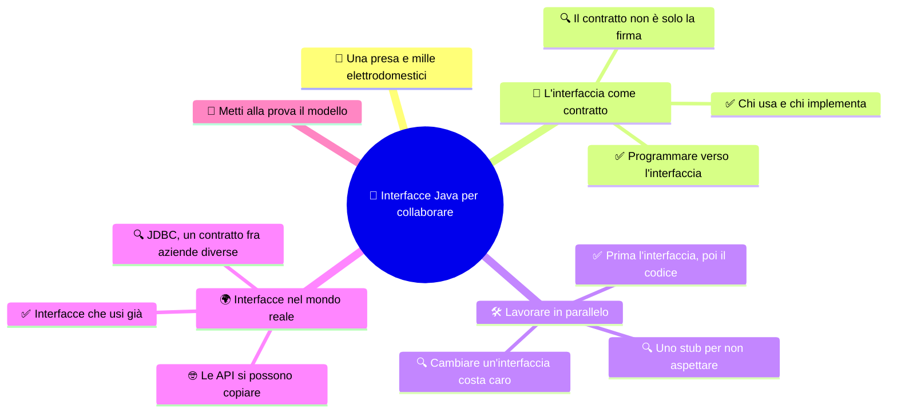

# 🤝 Interfacce Java per collaborare

**4CI · Integrazione 1 · Teoria · Si aggancia a SETT-OTT S6-S7**

> **Legenda:** ✅ da sapere · 🔍 per capire fino in fondo · 🤓 facoltativo, per curiosi · 🃏 flashcard: rispondi a voce, poi apri per controllare



## 🧭 Una presa e mille elettrodomestici

Chi costruisce un phon non sa nulla della centrale elettrica. Chi gestisce la centrale non sa quali phon esistono. Eppure il phon funziona appena lo attacchi. Il segreto è un accordo: la **presa**. Forma, tensione e frequenza sono fissate. Da una parte e dall'altra si può cambiare tutto, purché si rispetti la presa.

Nel software succede lo stesso. Un programma vero lo scrivono molte persone, spesso in aziende diverse, a volte a distanza di anni. Non possono conoscere tutto il codice degli altri. Si mettono d'accordo su una "presa": in Java questa presa si chiama **interfaccia**.

In [S6](../1%20SETT-OTT/4CI%20sett-ott%20S6.md) abbiamo visto l'interfaccia come elenco di cose che una classe "sa fare". Qui la guardiamo da un altro lato: è lo strumento con cui **persone diverse lavorano insieme** senza pestarsi i piedi.

## 📜 L'interfaccia come contratto

### ✅ Chi usa e chi implementa

Intorno a un'interfaccia ci sono sempre due ruoli:

- chi **implementa** l'interfaccia: scrive la classe che fa davvero il lavoro;
- chi **usa** l'interfaccia (il *client*): chiama i metodi senza sapere come sono fatti dentro.

Immaginiamo il progetto `LaStalla` diviso fra Anna e Bruno. Anna scrive la parte che conserva gli animali. Bruno scrive il menu che parla con l'utente. Prima di iniziare scrivono insieme questo contratto:

```java
import java.util.List;

public interface ArchivioAnimali {
    void aggiungi(Animale animale);
    Animale cercaPerNome(String nome);
    List<Animale> tutti();
}
```

Anna lo implementa con un `ArrayList`:

```java
import java.util.ArrayList;
import java.util.List;

public class ArchivioInMemoria implements ArchivioAnimali {
    private final List<Animale> animali = new ArrayList<>();

    @Override
    public void aggiungi(Animale animale) {
        animali.add(animale);
    }

    @Override
    public Animale cercaPerNome(String nome) {
        for (Animale a : animali) {
            if (a.getNome().equals(nome)) {
                return a;
            }
        }
        return null;
    }

    @Override
    public List<Animale> tutti() {
        return new ArrayList<>(animali);
    }
}
```

Bruno non deve leggere questa classe. Gli basta l'interfaccia.

<details>
<summary>🃏 Quali sono i due ruoli intorno a un'interfaccia?</summary>
Chi la implementa, cioè scrive la classe che fa il lavoro, e chi la usa, cioè chiama i metodi senza conoscerne l'interno.
</details>

<details>
<summary>🃏 Perché un'interfaccia somiglia a una presa elettrica?</summary>
Fissa un accordo fra due parti. Ognuna può cambiare come vuole il proprio lato, purché rispetti l'accordo.
</details>

<details>
<summary>🃏 Che cosa deve sapere Bruno per usare l'archivio di Anna?</summary>
Solo l'interfaccia ArchivioAnimali: nomi dei metodi, parametri, valori restituiti e che cosa promettono.
</details>

<details>
<summary>🃏 Perché il metodo tutti() restituisce una nuova lista e non quella interna?</summary>
Per proteggere l'incapsulamento: chi riceve la copia non può modificare la lista interna dell'archivio.
</details>

### ✅ Programmare verso l'interfaccia

Bruno dichiara la variabile con il tipo dell'interfaccia, non della classe:

```java
ArchivioAnimali archivio = new ArchivioInMemoria();
archivio.aggiungi(new Pollo("Pio", 1.8, "bianco"));
Animale trovato = archivio.cercaPerNome("Pio");
```

Il **tipo statico** è `ArchivioAnimali`; il **tipo dinamico** è `ArchivioInMemoria`. È il polimorfismo di [S5](../1%20SETT-OTT/4CI%20sett-ott%20S5.md), usato per collaborare.

Un giorno Anna scrive `ArchivioSuFile`, che salva gli animali su disco. Nel codice di Bruno cambia **una sola riga**: quella con `new`. Tutto il resto continua a funzionare. Questa regola ha un nome famoso: *program to an interface, not an implementation*, "programma verso l'interfaccia, non verso l'implementazione".

<details>
<summary>🃏 Che cosa significa programmare verso l'interfaccia?</summary>
Dichiarare variabili e parametri con il tipo dell'interfaccia, così il codice dipende dal contratto e non da una classe precisa.
</details>

<details>
<summary>🃏 In ArchivioAnimali archivio = new ArchivioInMemoria(), qual è il tipo statico e quale il tipo dinamico?</summary>
Il tipo statico è ArchivioAnimali, il tipo dinamico è ArchivioInMemoria.
</details>

<details>
<summary>🃏 Se Anna crea ArchivioSuFile, che cosa deve cambiare Bruno?</summary>
Solo la riga in cui crea l'oggetto con new. Il resto del menu usa l'interfaccia e resta uguale.
</details>

<details>
<summary>🃏 Si può scrivere new ArchivioAnimali()?</summary>
No. Un'interfaccia non si istanzia: si crea un oggetto di una classe che la implementa.
</details>

### 🔍 Il contratto non è solo la firma

Il compilatore controlla le **firme**: nomi, parametri e tipi restituiti. Non controlla il **comportamento**. Che cosa succede se il nome non esiste? `cercaPerNome` restituisce `null` o lancia un'eccezione? E se aggiungo due volte lo stesso animale?

Se Anna e Bruno non lo decidono, ognuno farà una scelta diversa. Il programma compila ma si rompe. Per questo il contratto si scrive anche a parole, con i commenti Javadoc:

```java
/**
 * Cerca un animale per nome, distinguendo maiuscole e minuscole.
 * @param nome il nome da cercare, non null
 * @return l'animale trovato, oppure null se non esiste
 */
Animale cercaPerNome(String nome);
```

Un buon contratto dice: che cosa riceve il metodo, che cosa restituisce, che cosa succede nei casi strani.

<details>
<summary>🃏 Che cosa controlla il compilatore di un'interfaccia?</summary>
Le firme: nomi dei metodi, parametri e tipi restituiti. Non controlla che il comportamento sia quello promesso.
</details>

<details>
<summary>🃏 Perché un programma può compilare e rompersi lo stesso, anche se tutti rispettano l'interfaccia?</summary>
Perché le due parti possono aver capito in modo diverso il comportamento, per esempio che cosa succede se un nome non esiste.
</details>

<details>
<summary>🃏 Dove si scrive la parte del contratto che il compilatore non vede?</summary>
Nei commenti di documentazione, come Javadoc: parametri ammessi, valore restituito, casi limite.
</details>

## 🛠️ Lavorare in parallelo

### ✅ Prima l'interfaccia, poi il codice

Senza interfaccia, Bruno deve aspettare che Anna finisca. Con l'interfaccia lavorano insieme:

```text
1. Anna e Bruno scrivono insieme l'interfaccia (15 minuti)
          |
          +--> Anna: ArchivioInMemoria implements ArchivioAnimali
          |
          +--> Bruno: Menu che usa ArchivioAnimali
          |
2. Integrazione: Bruno scrive new ArchivioInMemoria() e prova tutto
```

Il tempo speso a progettare l'interfaccia si recupera dopo. Ognuno sa che cosa aspettarsi dall'altro.

> 🔧 **Collegamento con il laboratorio:** quando lavorate a coppie su `LaStalla`, scrivete prima l'interfaccia in un file condiviso e solo dopo dividetevi le classi.

<details>
<summary>🃏 Perché conviene scrivere l'interfaccia prima del codice?</summary>
Perché così due persone possono lavorare in parallelo: una implementa, l'altra usa, e alla fine i pezzi si incastrano.
</details>

<details>
<summary>🃏 Che cosa succede senza un'interfaccia concordata?</summary>
Chi usa il codice deve aspettare chi lo scrive, oppure indovinare nomi e comportamenti, e l'integrazione diventa difficile.
</details>

### 🔍 Uno stub per non aspettare

Bruno vuole provare il menu prima che Anna abbia finito. Scrive una classe finta, uno **stub**, che rispetta l'interfaccia ma restituisce dati fissi:

```java
import java.util.List;

public class ArchivioFinto implements ArchivioAnimali {
    @Override
    public void aggiungi(Animale animale) {
        System.out.println("(finto) aggiunto " + animale.getNome());
    }

    @Override
    public Animale cercaPerNome(String nome) {
        return new Pollo("Pio", 1.8, "bianco");
    }

    @Override
    public List<Animale> tutti() {
        return List.of(new Pollo("Pio", 1.8, "bianco"));
    }
}
```

È come una prova teatrale con un attore sostituto. Quando arriva quello vero, Bruno cambia solo la riga con `new`. Gli stub sono molto usati anche nei **test**: permettono di provare un pezzo di programma da solo.

<details>
<summary>🃏 Che cos'è uno stub?</summary>
Una classe finta che implementa un'interfaccia restituendo dati fissi, per provare il codice che la usa prima che esista quella vera.
</details>

<details>
<summary>🃏 Perché lo stub deve implementare la stessa interfaccia?</summary>
Così il codice che lo usa non si accorge della differenza e si potrà sostituire con la classe vera cambiando solo la creazione dell'oggetto.
</details>

<details>
<summary>🃏 A che cosa servono gli stub nei test?</summary>
A provare una parte del programma da sola, senza dipendere da altre parti lente, incomplete o difficili da preparare.
</details>

### 🔍 Cambiare un'interfaccia costa caro

Se aggiungo un metodo a un'interfaccia, **tutte** le classi che la implementano smettono di compilare finché non lo implementano. In un progetto di classe è un fastidio. In una libreria usata da milioni di programmi è un disastro.

Java 8 (2014) ha introdotto i **metodi `default`** proprio per questo: un metodo dell'interfaccia con un corpo già pronto. Le classi vecchie lo ereditano senza modifiche. Fu necessario per aggiungere nuove funzioni alle collezioni, come `List`, senza rompere tutto il codice esistente.

```java
public interface ArchivioAnimali {
    void aggiungi(Animale animale);
    Animale cercaPerNome(String nome);
    List<Animale> tutti();

    default int quanti() {
        return tutti().size();
    }
}
```

Morale: un'interfaccia condivisa va progettata con calma, perché dopo cambiarla coinvolge tutti.

<details>
<summary>🃏 Che cosa succede se aggiungo un metodo astratto a un'interfaccia già usata?</summary>
Tutte le classi che la implementano non compilano più finché non implementano il nuovo metodo.
</details>

<details>
<summary>🃏 Che cos'è un metodo default?</summary>
Un metodo di un'interfaccia con un corpo già scritto. Le classi che implementano l'interfaccia lo ereditano senza doverlo riscrivere.
</details>

<details>
<summary>🃏 Perché Java 8 ha introdotto i metodi default?</summary>
Per poter aggiungere metodi a interfacce molto usate, come quelle delle collezioni, senza rompere il codice già esistente.
</details>

## 🌍 Interfacce nel mondo reale

### ✅ Interfacce che usi già

Le hai già incontrate senza saperlo:

| Interfaccia | Che cosa promette | Esempi di classi che la implementano |
|---|---|---|
| `List` | una sequenza ordinata di elementi | `ArrayList`, `LinkedList` |
| `Comparable` | "so confrontarmi con un altro oggetto" | `String`, `Integer` |
| `Runnable` | "ho un lavoro da eseguire" | qualunque classe con `run()` |

Per questo si scrive spesso `List<Animale> stalla = new ArrayList<>();`: il codice dipende da `List`, non dalla classe concreta.

Con `Comparable` possiamo insegnare agli animali a mettersi in ordine:

```java
public abstract class Animale implements Comparable<Animale> {
    // ... attributi, costruttore e metodi come in S6 ...

    @Override
    public int compareTo(Animale altro) {
        return getNome().compareTo(altro.getNome());
    }
}
```

```java
Collections.sort(stalla); // ordina per nome
```

`Collections.sort` è stato scritto anni fa da persone che non conoscevano i nostri animali. Funziona lo stesso, perché si fida del contratto `Comparable`.

<details>
<summary>🃏 Perché si scrive List di Animale stalla = new ArrayList invece di ArrayList di Animale?</summary>
Perché così il codice dipende dall'interfaccia List e si può cambiare implementazione, per esempio LinkedList, senza toccare il resto.
</details>

<details>
<summary>🃏 Che cosa promette una classe che implementa Comparable?</summary>
Di saper confrontare un proprio oggetto con un altro tramite compareTo, così le librerie la possono ordinare.
</details>

<details>
<summary>🃏 Che cosa restituisce compareTo?</summary>
Un numero negativo se l'oggetto viene prima dell'altro, zero se sono equivalenti, positivo se viene dopo.
</details>

<details>
<summary>🃏 Come fa Collections.sort a ordinare animali che non conosce?</summary>
Usa solo il contratto Comparable: chiama compareTo, che ogni animale implementa.
</details>

### 🔍 JDBC, un contratto fra aziende diverse

Nel 1997 Java aveva un problema. Ogni database (Oracle, IBM, poi MySQL, PostgreSQL...) parlava a modo suo. Sun, l'azienda che aveva creato Java, non poteva scrivere il codice per tutti. Così scrisse soltanto **interfacce**: `Connection`, `Statement`, `ResultSet`. Era **JDBC**.

Ogni produttore di database scrive un *driver*, cioè un insieme di classi che implementano quelle interfacce. Il programmatore scrive:

```java
Connection conn = DriverManager.getConnection(indirizzo, utente, password);
```

`conn` ha come tipo l'interfaccia `Connection`. La classe vera arriva dal driver, e il programmatore non la nomina mai. Cambiando database, il codice resta in gran parte uguale.

È la stessa storia di Anna e Bruno, ma con aziende concorrenti al posto di due compagni di banco.

> 🔐 **Attenzione:** nei programmi veri utente e password non si scrivono nel codice sorgente. Finirebbero su GitHub insieme al resto.

<details>
<summary>🃏 Che cos'è JDBC, in una frase?</summary>
Un insieme di interfacce Java per parlare con i database; ogni produttore di database fornisce un driver che le implementa.
</details>

<details>
<summary>🃏 Perché Sun scrisse interfacce e non classi per JDBC?</summary>
Perché non poteva conoscere tutti i database: fissò il contratto e lasciò ai produttori il compito di implementarlo.
</details>

<details>
<summary>🃏 Che cosa guadagna il programmatore da JDBC?</summary>
Scrive il codice usando le interfacce; se cambia database cambia il driver, e gran parte del programma resta uguale.
</details>

<details>
<summary>🃏 Perché non si scrive la password del database nel codice?</summary>
Perché il codice viene copiato e condiviso, per esempio su GitHub, e la password diventerebbe pubblica.
</details>

### 🤓 Le API si possono copiare

> Un'interfaccia è solo un elenco di nomi di metodi. Ma è un'idea originale, protetta dal diritto d'autore? Per dieci anni Oracle (che aveva comprato Sun) e Google ne hanno discusso in tribunale. Google, per Android, aveva riscritto il codice delle librerie Java, ma aveva copiato le **dichiarazioni**: nomi di classi e firme dei metodi, cioè le "prese".
>
> Nel 2021 la Corte Suprema degli Stati Uniti ha dato ragione a Google: quel riuso era un uso lecito (*fair use*). Molti programmatori hanno tirato un sospiro di sollievo. Se le interfacce fossero proprietà esclusiva, scrivere programmi compatibili sarebbe molto più difficile.
>
> 🐍 E in Python? Python non ha la parola `interface`. Usa il **duck typing**: "se cammina come un'anatra e fa qua qua come un'anatra, è un'anatra". Se un oggetto ha i metodi giusti, va bene. Lo vedremo a gennaio, insieme a `ABC` e `Protocol`.

<details>
<summary>🃏 Che cosa aveva copiato Google da Java per Android?</summary>
Le dichiarazioni delle API, cioè nomi e firme dei metodi, non il codice che le implementava.
</details>

<details>
<summary>🃏 Come è finita la causa Oracle contro Google?</summary>
Nel 2021 la Corte Suprema degli Stati Uniti ha stabilito che il riuso di Google era fair use, cioè lecito.
</details>

<details>
<summary>🃏 Che cos'è il duck typing?</summary>
L'idea, tipica di Python, che conta quali metodi ha un oggetto e non il nome del suo tipo.
</details>

## 🧩 Metti alla prova il modello

1. **Base.** Spiega con parole tue chi "usa" e chi "implementa" un'interfaccia. Fai un esempio diverso dalla stalla.
2. **Applicazione.** Scrivi un'interfaccia `Pagamento` con un metodo `boolean paga(double importo)`. Scrivi due classi che la implementano: `Contanti` e `Carta`.
3. **Applicazione.** Scrivi uno stub di `ArchivioAnimali` che restituisce sempre una lista vuota. A che cosa potrebbe servire?
4. **Contratto.** Scrivi il commento Javadoc di `aggiungi`: che cosa succede se l'animale è `null`? E se c'è già un animale con lo stesso nome? Scegli tu, ma scrivilo.
5. **Collegamento.** Perché `List<Animale> stalla = new ArrayList<>();` è un esempio della stessa idea di JDBC?
6. **Intuizione.** Un'interfaccia con 30 metodi è comoda da implementare? Che cosa proporresti?

**🚪 Uscita:** completa la frase «L'interfaccia permette a due persone di lavorare insieme perché ...».

## 📚 Fonti e risorse

- [Oracle - What Is an Interface?](https://docs.oracle.com/javase/tutorial/java/concepts/interface.html) (in inglese): pagina breve del tutorial ufficiale, utile per ripassare a casa.
- [Oracle - Default Methods](https://docs.oracle.com/javase/tutorial/java/IandI/defaultmethods.html) (in inglese): per chi vuole capire bene i metodi `default`.
- [Oracle - JDBC Basics](https://docs.oracle.com/javase/tutorial/jdbc/basics/index.html) (in inglese, tecnico): solo per curiosi, mostra le interfacce di JDBC in azione.
- [Google LLC v. Oracle America - sentenza 2021](https://www.supremecourt.gov/opinions/20pdf/18-956_d18f.pdf) (in inglese, giuridico): da sfogliare insieme solo per il riassunto iniziale.

---

## Apparato riservato al docente

**Collocazione.** Integrazione di S6-S7 SETT-OTT: presuppone polimorfismo, classi astratte e interfacce. Rientra nel programma (classi astratte e interfacce, `ArrayList`); JDBC, metodi `default` e Oracle/Google sono contesto, non obiettivi di verifica.

**Regia per due ore.** Prima ora (55 min): presa elettrica, Anna e Bruno alla lavagna, tipo statico/dinamico, stub. Ultimi 10 minuti: flashcard estratte a caso. Seconda ora: gioco di ruolo (35 min), poi `Comparable` e JDBC come "stessa storia, scala diversa" (15 min), uscita.

**🎭 Gioco di ruolo: «Il contratto della stalla».**
- *Scenario:* la cooperativa "Muuuvita" ha commissionato il software della stalla. Due squadre sono in due "sedi" diverse (i due lati dell'aula) e **non possono parlarsi**.
- *Ruoli:* 2 notai (scrivono alla lavagna il contratto dettato dalle squadre), squadra Archivio (4-5 studenti), squadra Menu (4-5), 1 cliente (il docente o uno studente con un cappello da contadino), il resto della classe fa i "collaudatori".
- *Svolgimento:* (1) 10 minuti: le due squadre, tramite i notai, concordano un'interfaccia con 3 metodi. (2) 10 minuti: ognuna scrive su carta il proprio pezzo: l'Archivio implementa, il Menu usa. (3) I collaudatori "eseguono" a voce il programma con un caso normale e uno strano (nome inesistente). (4) Colpo di scena: il cliente chiede «voglio sapere quanti animali ho». Discussione: aggiungere un metodo astratto o `default`?
- *Esito atteso:* nel passo 3 di solito emerge un disaccordo sul caso «nome inesistente» (`null` contro messaggio stampato dentro l'archivio). È il momento per introdurre il contratto scritto a parole.
- *Dettaglio divertente:* il notaio può timbrare il contratto con un timbro disegnato «APPROVATO DALLA MUCCA CAROLINA».

**Risposte attese.**
1. Usa: chiama i metodi conoscendo solo il contratto. Implementa: scrive il corpo. Piste: telecomando/TV, caricatore USB/telefono.
2. Un'interfaccia `Pagamento` con `boolean paga(double importo);` e due classi `implements Pagamento` con `@Override`. Accettare logiche semplici (stampa e `return true`); premiare il controllo `importo > 0`.
3. `return new ArrayList<>();` o `List.of()` in `tutti()`, gli altri metodi vuoti o con `null`. Serve a provare il menu nel caso «stalla vuota».
4. Risposta aperta: va bene ogni scelta coerente e scritta (ignorare, lanciare `IllegalArgumentException`, restituire `boolean`). Valutare la chiarezza, non la scelta.
5. Il codice dipende da un contratto (`List` / `Connection`), l'implementazione concreta si può cambiare.
6. No: obbliga a implementare tutto anche quando serve poco. Pista: dividerla in interfacce più piccole, anticipa la "I" di SOLID ([INT3](%28DOC%29%204CI%20INT3%20-%20Principi%20SOLID.md)).

**Criterio.** Minimo: distinguere i due ruoli e spiegare perché si dichiara la variabile col tipo dell'interfaccia. Completo: stub, contratto scritto, costo di modifica. Non richiedere JDBC né la sintassi dei generics oltre `List<Animale>`.

**Errori frequenti.** Pensare che `implements` "copi" codice come `extends`; dimenticare `public` nei metodi implementati (in un'interfaccia sono implicitamente `public`, e la classe non può ridurre la visibilità).

---

[INT2 - UML e diagramma delle classi ➡️](%28DOC%29%204CI%20INT2%20-%20UML%20e%20diagramma%20delle%20classi.md)
