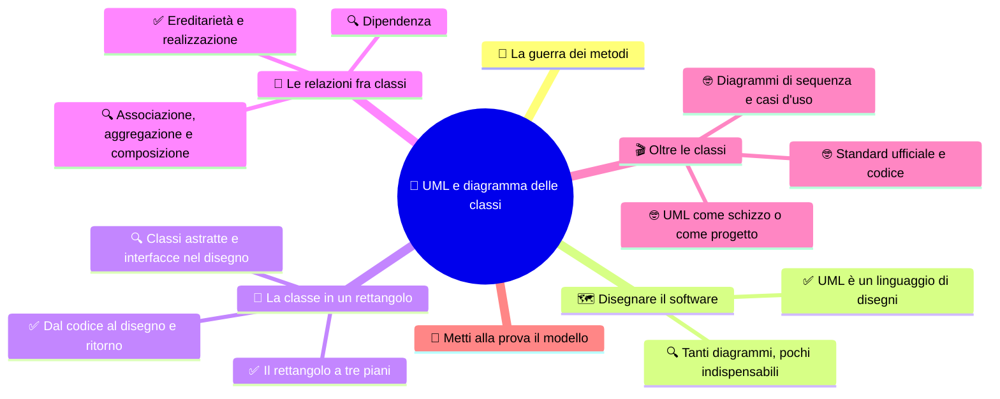
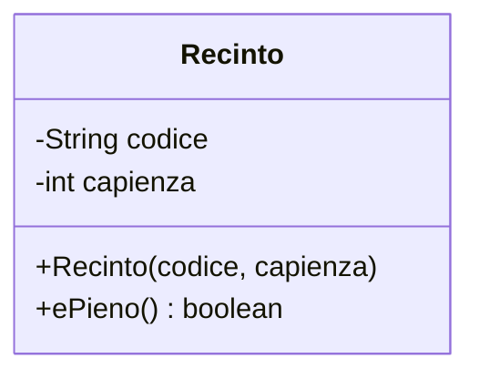
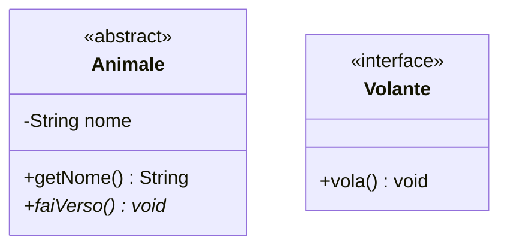
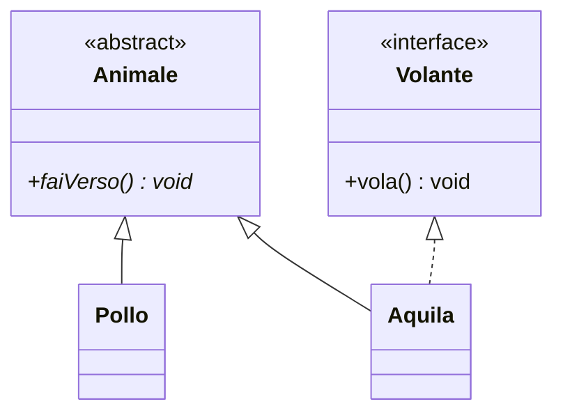
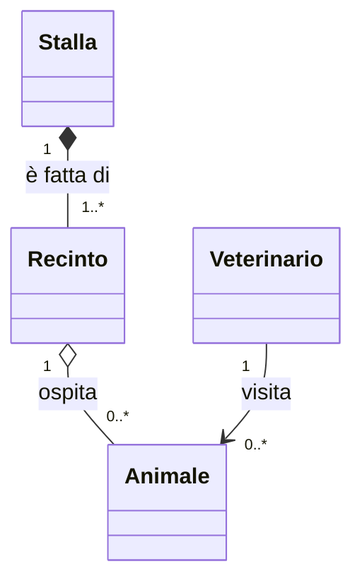
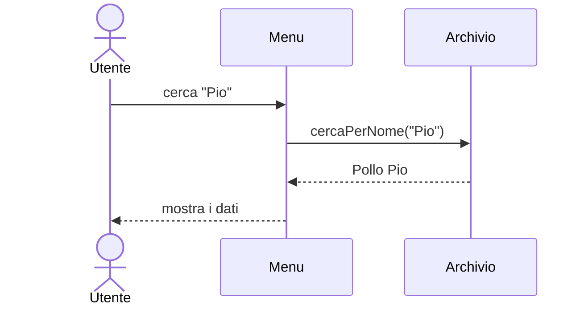

# 📐 UML e diagramma delle classi

**4CI · Integrazione 2 · Teoria · Si aggancia a SETT-OTT S4-S7**

> **Legenda:** ✅ da sapere · 🔍 per capire fino in fondo · 🤓 facoltativo, per curiosi · 🃏 flashcard: rispondi a voce, poi apri per controllare



## 🧭 La guerra dei metodi

Nessuno costruisce una casa senza un progetto. L'architetto disegna, il muratore legge il disegno, l'idraulico pure. Tutti capiscono lo stesso foglio, perché esistono simboli condivisi: una porta, una finestra, un muro portante.

All'inizio degli anni Novanta il software a oggetti esplode. C++ è ovunque, Java sta per nascere. Ma ogni esperto ha il suo modo di disegnare le classi. Grady Booch usa delle nuvolette. James Rumbaugh usa dei rettangoli. Ivar Jacobson disegna omini stilizzati per gli utenti. Ci sono decine di "metodi" in concorrenza: è la **guerra dei metodi**. Un disegno fatto in un'azienda non si capisce in un'altra.

Nel 1994-1995 i tre si ritrovano a lavorare nella stessa azienda, Rational Software. Li chiamano scherzosamente i **tre amigos**. Invece di combattersi, uniscono le notazioni. Nel 1997 l'ente di standardizzazione **Object Management Group (OMG)** adotta il risultato: **UML**, *Unified Modeling Language*. "Unified", unificato: è nato proprio per mettere fine alla torre di Babele.

## 🗺️ Disegnare il software

### ✅ UML è un linguaggio di disegni

**UML** è un linguaggio grafico standard per descrivere un programma. Non è un linguaggio di programmazione: non si esegue. Serve a **pensare** e a **comunicare** prima, durante e dopo la scrittura del codice.

Un disegno UML aiuta a:

- vedere la struttura di un progetto in un colpo d'occhio;
- discutere una soluzione con i compagni prima di scrivere codice;
- spiegare il programma a chi arriva dopo;
- trovare errori di progettazione quando correggerli costa poco.

Il diagramma più usato è il **diagramma delle classi**: mostra le classi, che cosa contengono e come sono collegate.

<details>
<summary>🃏 Che cos'è UML?</summary>
Un linguaggio grafico standard per descrivere la struttura e il comportamento di un programma.
</details>

<details>
<summary>🃏 UML è un linguaggio di programmazione?</summary>
No. Non si esegue: serve a progettare e a comunicare.
</details>

<details>
<summary>🃏 Che cosa significa la U di UML e perché?</summary>
Unified, unificato: nacque unendo le notazioni di Booch, Rumbaugh e Jacobson per mettere fine alla confusione fra metodi diversi.
</details>

<details>
<summary>🃏 Quando fu adottato UML come standard?</summary>
Nel 1997, dall'organizzazione OMG.
</details>

<details>
<summary>🃏 Qual è il diagramma UML più usato?</summary>
Il diagramma delle classi.
</details>

### 🔍 Tanti diagrammi, pochi indispensabili

UML 2 definisce quattordici tipi di diagramma. Nessuno li usa tutti. Si dividono in due famiglie:

| Famiglia | Che cosa mostra | Esempi |
|---|---|---|
| **Strutturali** | come è fatto il sistema, la sua "anatomia" | diagramma delle classi, degli oggetti, dei componenti |
| **Comportamentali** | che cosa fa il sistema nel tempo | casi d'uso, sequenza, attività, stati |

Per noi conta soprattutto il diagramma delle classi. Gli altri li incontrerai all'università o al lavoro. Sapere che esistono aiuta a riconoscerli.

<details>
<summary>🃏 Quali sono le due famiglie di diagrammi UML?</summary>
Strutturali, che mostrano come è fatto il sistema, e comportamentali, che mostrano che cosa fa nel tempo.
</details>

<details>
<summary>🃏 Il diagramma delle classi è strutturale o comportamentale?</summary>
Strutturale.
</details>

<details>
<summary>🃏 Bisogna usare tutti i diagrammi UML in un progetto?</summary>
No. Si sceglie solo quello che aiuta davvero a capire o a comunicare.
</details>

## 🧱 La classe in un rettangolo

### ✅ Il rettangolo a tre piani

In UML una classe è un rettangolo diviso in tre parti:

```text
+---------------------------+
|         Animale           |   <- nome
+---------------------------+
| - nome : String           |   <- attributi
| - peso : double           |
+---------------------------+
| + Animale(nome, peso)     |   <- metodi (operazioni)
| + getNome() : String      |
| + aumentaPeso(kg : double)|
+---------------------------+
```

I simboli davanti indicano la **visibilità**:

| Simbolo | Visibilità Java | Chi vede |
|---|---|---|
| `+` | `public` | tutti |
| `-` | `private` | solo la classe |
| `#` | `protected` | la classe e le sottoclassi (e il package) |
| `~` | nessun modificatore | il package |

Attenzione a un dettaglio: in UML **il tipo va dopo i due punti**. In Java si scrive `String nome`, in UML `nome : String`.

<details>
<summary>🃏 Quali sono le tre parti del rettangolo di una classe UML?</summary>
Il nome, gli attributi e i metodi.
</details>

<details>
<summary>🃏 Che cosa significano i simboli più, meno e cancelletto?</summary>
Più è public, meno è private, cancelletto è protected.
</details>

<details>
<summary>🃏 Come si scrive in UML l'attributo Java private double peso?</summary>
- peso : double
</details>

<details>
<summary>🃏 Dove si mette il tipo restituito di un metodo in UML?</summary>
Dopo i due punti, alla fine: getNome() : String.
</details>

### ✅ Dal codice al disegno e ritorno

Il diagramma e il codice raccontano la stessa cosa. Si può passare dall'uno all'altro.

```java
public class Recinto {
    private String codice;
    private int capienza;

    public Recinto(String codice, int capienza) { ... }
    public boolean ePieno() { ... }
}
```

diventa:

```text
+-------------------------------+
|           Recinto             |
+-------------------------------+
| - codice : String             |
| - capienza : int              |
+-------------------------------+
| + Recinto(codice, capienza)   |
| + ePieno() : boolean          |
+-------------------------------+
```

Il disegno **non contiene il corpo dei metodi**. Dice che cosa esiste, non come funziona. Per questo un diagramma delle classi si legge in fretta.

Si può disegnare UML anche con il testo. Lo strumento **Mermaid**, che funziona in Obsidian e su GitHub, trasforma poche righe in un diagramma:



Mermaid scrive il tipo prima del nome, come Java: è una sua comodità, ma il significato è lo stesso.

<details>
<summary>🃏 Il diagramma delle classi mostra il corpo dei metodi?</summary>
No. Mostra solo nomi, parametri e tipi: che cosa esiste, non come funziona.
</details>

<details>
<summary>🃏 Che cos'è Mermaid?</summary>
Uno strumento che disegna diagrammi, anche UML, partendo da poche righe di testo. Funziona in Obsidian e su GitHub.
</details>

<details>
<summary>🃏 Perché un diagramma delle classi si legge più in fretta del codice?</summary>
Perché nasconde i dettagli dei metodi e mostra solo la struttura e i collegamenti.
</details>

### 🔍 Classi astratte e interfacce nel disegno

Ricordi [S6](../1%20SETT-OTT/4CI%20sett-ott%20S6.md)? In UML:

- una **classe astratta** ha il nome in *corsivo*, oppure l'etichetta `«abstract»`;
- un **metodo astratto** è scritto in *corsivo*;
- un'**interfaccia** ha l'etichetta `«interface»` sopra il nome.

Le etichette fra `« »` si chiamano **stereotipi**: aggiungono un'informazione al simbolo base.



In Mermaid l'asterisco dopo il metodo indica che è astratto.

<details>
<summary>🃏 Come si riconosce una classe astratta in UML?</summary>
Dal nome in corsivo oppure dall'etichetta abstract fra virgolette caporali.
</details>

<details>
<summary>🃏 Come si riconosce un'interfaccia in UML?</summary>
Dall'etichetta interface fra virgolette caporali sopra il nome.
</details>

<details>
<summary>🃏 Che cos'è uno stereotipo in UML?</summary>
Un'etichetta fra virgolette caporali che aggiunge un significato a un simbolo, per esempio interface.
</details>

## 🔗 Le relazioni fra classi

### ✅ Ereditarietà e realizzazione

Le classi non vivono da sole. Le frecce UML mostrano i legami.

| Relazione | Java | Freccia UML |
|---|---|---|
| **Ereditarietà** (generalizzazione) | `extends` | linea continua con triangolo vuoto verso la superclasse |
| **Realizzazione** | `implements` | linea tratteggiata con triangolo vuoto verso l'interfaccia |



La freccia punta sempre verso la classe più generale. Si legge: "Pollo **è un** Animale", "Aquila **sa fare** ciò che promette Volante".

<details>
<summary>🃏 Come si disegna l'ereditarietà in UML?</summary>
Con una linea continua e un triangolo vuoto che punta verso la superclasse.
</details>

<details>
<summary>🃏 Come si disegna la realizzazione di un'interfaccia?</summary>
Con una linea tratteggiata e un triangolo vuoto che punta verso l'interfaccia.
</details>

<details>
<summary>🃏 Verso dove punta la freccia di ereditarietà?</summary>
Verso la classe più generale, cioè la superclasse.
</details>

<details>
<summary>🃏 A quali parole chiave Java corrispondono generalizzazione e realizzazione?</summary>
Generalizzazione a extends, realizzazione a implements.
</details>

### 🔍 Associazione, aggregazione e composizione

Spesso un oggetto **usa** o **contiene** altri oggetti. Un `Recinto` ha una lista di `Animale`. In UML ci sono tre gradi di legame:

| Relazione | Idea | Simbolo | Esempio |
|---|---|---|---|
| **Associazione** | "conosce", "lavora con" | linea semplice | `Veterinario` — `Animale` |
| **Aggregazione** | "contiene, ma le parti vivono anche da sole" | rombo **vuoto** dal lato del contenitore | `Recinto` ◇— `Animale` |
| **Composizione** | "è fatto di, le parti muoiono con il tutto" | rombo **pieno** dal lato del contenitore | `Stalla` ◆— `Recinto` |

Se smonto un recinto, gli animali restano vivi e vanno altrove: aggregazione. Se demolisco la stalla, i suoi recinti spariscono con lei: composizione.

Sulle linee si scrivono anche le **molteplicità**: quanti oggetti partecipano.

| Scrittura | Significato |
|---|---|
| `1` | esattamente uno |
| `0..1` | zero o uno |
| `*` oppure `0..*` | zero o più |
| `1..*` | almeno uno |



Si legge: "una stalla è fatta di almeno un recinto; un recinto ospita zero o più animali".

In Java, aggregazione e composizione si scrivono spesso nello stesso modo, con un attributo `List<...>`. La differenza sta nel **significato** e in chi crea e distrugge le parti.

<details>
<summary>🃏 Che differenza c'è fra aggregazione e composizione?</summary>
Nell'aggregazione le parti possono esistere da sole; nella composizione nascono e muoiono con il tutto.
</details>

<details>
<summary>🃏 Come si disegnano aggregazione e composizione?</summary>
Aggregazione con un rombo vuoto, composizione con un rombo pieno, entrambi dal lato del contenitore.
</details>

<details>
<summary>🃏 Che cosa significa la molteplicità 1..* su una linea?</summary>
Almeno uno: uno o più oggetti.
</details>

<details>
<summary>🃏 Recinto e Animale: aggregazione o composizione? Perché?</summary>
Aggregazione: se il recinto viene smontato, gli animali continuano a esistere e possono essere spostati.
</details>

<details>
<summary>🃏 In Java come si vede la differenza fra aggregazione e composizione?</summary>
Spesso il codice è simile, un attributo lista; la differenza sta nel significato e in chi crea e distrugge le parti.
</details>

### 🔍 Dipendenza

La **dipendenza** è il legame più debole: una classe usa un'altra solo per un momento, per esempio come parametro di un metodo. Non la tiene come attributo.

```java
public class Veterinario {
    public void visita(Animale animale) { ... }
}
```

Si disegna con una **freccia tratteggiata** con punta aperta: `Veterinario ..> Animale`.

Perché ci interessa? Ogni freccia è un legame: se la classe puntata cambia, chi la usa potrebbe rompersi. Un diagramma pieno di frecce che si incrociano è un campanello d'allarme. Ne riparleremo con i [principi SOLID](%28DOC%29%204CI%20INT3%20-%20Principi%20SOLID.md).

<details>
<summary>🃏 Che cos'è una dipendenza in UML?</summary>
Il legame più debole: una classe usa un'altra temporaneamente, per esempio come parametro, senza tenerla come attributo.
</details>

<details>
<summary>🃏 Come si disegna una dipendenza?</summary>
Con una freccia tratteggiata a punta aperta verso la classe usata.
</details>

<details>
<summary>🃏 Perché un diagramma con troppe frecce è un campanello d'allarme?</summary>
Perché ogni freccia è un legame: più legami ci sono, più una modifica rischia di rompere altre classi.
</details>

## 🎬 Oltre le classi

### 🤓 Diagrammi di sequenza e casi d'uso

> Il **diagramma dei casi d'uso** guarda il programma da fuori. Gli utenti sono omini stilizzati, chiamati *attori*. Le cose che possono fare sono ovali: "Registrare un animale", "Cercare un animale". È l'eredità di Jacobson e serve a parlare con chi non programma.
>
> Il **diagramma di sequenza** mostra una conversazione fra oggetti nel tempo, dall'alto in basso:



> È utile quando un'operazione attraversa molte classi e non si capisce più chi chiama chi.

<details>
<summary>🃏 Che cosa mostra un diagramma dei casi d'uso?</summary>
Gli attori, cioè gli utenti, e le azioni che possono svolgere con il sistema.
</details>

<details>
<summary>🃏 Che cosa mostra un diagramma di sequenza?</summary>
I messaggi scambiati fra oggetti nel tempo, dall'alto verso il basso.
</details>

### 🤓 UML come schizzo o come progetto

> Negli anni Duemila alcune aziende sognavano di disegnare tutto in UML e far **generare il codice** in automatico. In parte funziona, ma i diagrammi giganti invecchiano in fretta: il codice cambia, il disegno no.
>
> Martin Fowler, autore di un libro famoso su UML, distingue tre usi: **schizzo** (un disegno veloce alla lavagna per discutere), **progetto** (un disegno dettagliato da seguire), **linguaggio di programmazione** (il disegno diventa codice). Oggi l'uso più diffuso è lo schizzo. Anche il [Manifesto Agile](%28DOC%29%204CI%20INT6%20-%20Metodologie%20di%20sviluppo%20Agile.md) preferisce "il software funzionante più che la documentazione esaustiva". Non vuol dire "niente disegni": vuol dire disegni utili.

<details>
<summary>🃏 Quali sono i tre usi di UML secondo Martin Fowler?</summary>
Come schizzo per discutere, come progetto dettagliato da seguire, come linguaggio da cui generare codice.
</details>

<details>
<summary>🃏 Perché i diagrammi UML giganti rischiano di diventare inutili?</summary>
Perché il codice cambia e il disegno, se non viene aggiornato, non lo descrive più.
</details>

### 🤓 Lo standard ufficiale è più grande del disegno

> UML non è solo una collezione di simboli inventati dagli strumenti di disegno: è una **specifica ufficiale** pubblicata da OMG. La versione UML 2.5.1 è del dicembre 2017. Definisce un linguaggio per visualizzare, specificare, costruire e documentare sistemi software.
>
> Alcuni strumenti possono ricavare un diagramma dal codice o generare dal diagramma uno scheletro di codice. Ma non è una traduzione magica: se nel disegno manca il corpo di `ePieno()`, dal solo diagramma non si può sapere come calcolarlo. **Il disegno conserva solo le informazioni che abbiamo deciso di rappresentare.**

<details>
<summary>🃏 <b>Un diagramma UML permette sempre di ricostruire tutto il codice?</b></summary>
No: si possono ricostruire solo le informazioni rappresentate; per esempio, da una firma non si ricava il corpo del metodo.
</details>

✏️ **Prova in un minuto:** guarda il diagramma di `Recinto` e indica una cosa che si vede e una cosa che non si può dedurre, come il modo in cui `ePieno()` decide se il recinto è pieno.

## 🧩 Metti alla prova il modello

1. **Base.** Disegna in UML la classe `Pollo` della stalla con attributi e metodi, usando i simboli di visibilità.
2. **Traduzione.** Dal disegno UML qui sotto scrivi lo scheletro Java (solo firme, niente corpi):

```text
+--------------------------------+
|      Mungitrice                |
+--------------------------------+
| - litriTotali : double         |
| # modello : String             |
+--------------------------------+
| + Mungitrice(modello : String) |
| + mungi(m : Mucca) : double    |
| - pulisci() : void             |
+--------------------------------+
```

3. **Relazioni.** Disegna `Animale` astratta, `Mucca` e `Pollo` sottoclassi, interfaccia `Descrivibile` realizzata da `Animale` e da `Recinto`.
4. **Aggregazione o composizione?** Scegli e motiva: `Scuola`-`Aula`, `Classe`-`Studente`, `Libro`-`Pagina`, `Playlist`-`Canzone`.
5. **Molteplicità.** Scrivi le molteplicità fra `Mucca` e `Vitello` (una mucca può avere zero o più vitelli; ogni vitello ha una sola madre).
6. **Intuizione.** Un diagramma delle classi dice in che ordine vengono chiamati i metodi? Quale diagramma useresti per mostrarlo?

**🚪 Uscita:** disegna il diagramma più piccolo possibile che contenga una classe astratta, un'interfaccia e una composizione.

## 📚 Fonti e risorse

- [OMG - UML](https://www.omg.org/spec/UML/) (in inglese, molto tecnico): la specifica ufficiale. Solo da sfogliare per vedere quanto è grande.
- [OMG - UML 2.5.1](https://www.omg.org/spec/UML/2.5.1/About-UML) (in inglese): scheda ufficiale della versione, pubblicata nel dicembre 2017.
- [Mermaid - Class diagrams](https://mermaid.js.org/syntax/classDiagram.html) (in inglese): per disegnare i diagrammi del progetto direttamente in Obsidian o su GitHub.
- [draw.io / diagrams.net](https://www.drawio.com/) (gratuito, open source): editor grafico con una libreria di simboli UML; utile per esercitarsi a casa.
- [PlantUML](https://plantuml.com/it/class-diagram) (open source): un'altra notazione testuale, molto usata nelle aziende.

---

## Apparato riservato al docente

**Collocazione.** Integrazione trasversale a S4-S7 (ereditarietà, interfacce, `ArrayList`). Il programma ufficiale non nomina UML, ma lo supporta come strumento di progettazione e documentazione ("Documentazione e Stile"). Proposta: verificare solo rettangolo, visibilità, ereditarietà e realizzazione; il resto è approfondimento.

**Regia per due ore.** Prima ora: guerra dei metodi (5 min, racconto), rettangolo a tre piani, traduzione codice → disegno con la classe `Animale` del laboratorio, astratte e interfacce. Seconda ora: relazioni, molteplicità con esempi di classe (studenti/classe/scuola), gioco "Architetti e muratori", uscita.

**🎭 Gioco: «Architetti e muratori».**
- *Scenario:* l'agenzia "Fattorie del Futuro" deve consegnare il software di un maneggio. L'ufficio progettazione e il cantiere sono in due città e comunicano solo con disegni.
- *Ruoli:* coppie di architetti, coppie di muratori, un ispettore (il docente).
- *Svolgimento:* (1) gli architetti ricevono una descrizione a parole (cavalli, box, istruttori, lezioni; un box ospita al massimo un cavallo; un istruttore tiene molte lezioni) e in 10 minuti producono un diagramma UML **senza scrivere frasi**. (2) Il foglio passa ai muratori, che scrivono lo scheletro Java. (3) L'ispettore confronta il Java con la descrizione originale. Ogni differenza è un "crollo": si cerca se è colpa del disegno o della lettura.
- *Esito atteso:* errori tipici su molteplicità e verso delle frecce. Emerge che la notazione condivisa riduce gli equivoci solo se tutti la conoscono.
- *Dettaglio divertente:* l'ispettore ha un elmetto di carta e consegna il "Certificato di agibilità software".

**Risposte attese.**
1. Rettangolo con `- nome : String`, `- peso : double`, `- colore : String` (o gli attributi reali del laboratorio), costruttore e `+ faiVerso() : void`.
2. `public class Mungitrice { private double litriTotali; protected String modello; public Mungitrice(String modello) {} public double mungi(Mucca m) {} private void pulisci() {} }`. Accettare corpi vuoti con `return 0;`.
3. `Animale` in corsivo o «abstract»; linee continue con triangolo vuoto da `Mucca` e `Pollo`; linee tratteggiate da `Animale` e `Recinto` verso `Descrivibile` «interface».
4. Piste: Scuola-Aula composizione (l'aula non esiste senza l'edificio); Classe-Studente aggregazione; Libro-Pagina composizione; Playlist-Canzone aggregazione. Accettare motivazioni diverse se coerenti: il modello dipende dal punto di vista.
5. `Mucca "1" -- "0..*" Vitello`.
6. No; il diagramma di sequenza.

**Criterio.** Minimo: leggere e disegnare una classe con visibilità e tipi, ereditarietà e realizzazione. Completo: aggregazione/composizione con molteplicità. Non valutare i diagrammi 🤓.

**Errori frequenti.** Freccia di ereditarietà orientata verso la sottoclasse; tipo prima del nome in UML "carta" (tollerare se lo studente usa la convenzione Mermaid in modo coerente); rombo dal lato sbagliato.

---

[⬅️ INT1 - Interfacce Java per collaborare](%28DOC%29%204CI%20INT1%20-%20Interfacce%20Java%20per%20collaborare.md) · [INT3 - Principi SOLID ➡️](%28DOC%29%204CI%20INT3%20-%20Principi%20SOLID.md)
