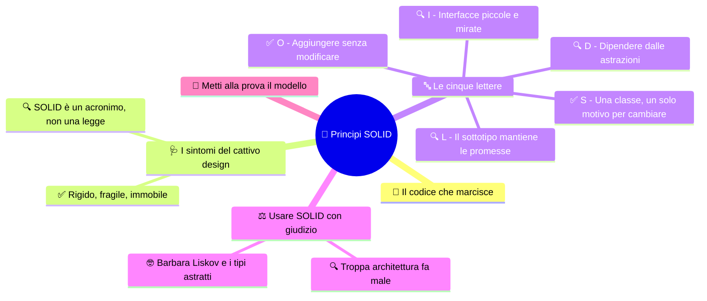

# 🧱 Principi SOLID

**4CI · Integrazione 3 · Teoria · Dopo SETT-OTT S7 e INT1-INT2**

> **Legenda:** ✅ da sapere · 🔍 per capire fino in fondo · 🤓 facoltativo, per curiosi · 🃏 flashcard: rispondi a voce, poi apri per controllare



## 🧭 Il codice che marcisce

Un programma appena scritto è come una cucina nuova: tutto è al suo posto. Poi arrivano le richieste. "Aggiungi le capre." "Stampa un report." "Salva su file." Ogni volta si infila una riga dove capita. Dopo un anno nessuno osa più toccare niente: si sposta una pentola e crolla la mensola.

Gli informatici chiamano questo fenomeno *software rot*, "marciume del software". Il codice non si guasta da solo come una mela. Marcisce perché viene cambiato in fretta, senza un'idea di come dovrebbe crescere.

Negli anni Ottanta e Novanta diversi studiosi cercano regole per costruire codice che invecchi bene. Bertrand Meyer, Barbara Liskov, Robert C. Martin (detto *Uncle Bob*) scrivono articoli e libri. Nel 2000 Martin raccoglie alcune di queste idee in un articolo. Qualche anno dopo Michael Feathers nota che le iniziali formano una parola: **SOLID**. Il nome è perfetto: è proprio quello che vogliamo dal nostro codice.

## 🩺 I sintomi del cattivo design

### ✅ Rigido, fragile, immobile

Robert C. Martin descrive i sintomi di un codice malato:

| Sintomo | Che cosa succede | Esempio nella stalla |
|---|---|---|
| **Rigidità** | ogni piccola modifica obbliga a cambiare molte classi | aggiungere `Capra` richiede di toccare dieci file |
| **Fragilità** | cambi una cosa e se ne rompe un'altra lontana | modifico il calcolo del peso e si rompe la stampa del report |
| **Immobilità** | non riesci a riusare un pezzo in un altro progetto | la classe `Animale` si porta dietro il menu e il file |

I principi SOLID sono cinque "medicine" contro questi sintomi. Hanno tutti lo stesso scopo: **rendere le modifiche più facili e meno pericolose**.

<details>
<summary>🃏 Che cos'è il software rot?</summary>
Il degrado del codice che, a forza di modifiche fatte in fretta, diventa difficile da capire e da cambiare.
</details>

<details>
<summary>🃏 Che cosa significa che un codice è rigido?</summary>
Che ogni piccola modifica obbliga a cambiare molte parti del programma.
</details>

<details>
<summary>🃏 Che cosa significa che un codice è fragile?</summary>
Che una modifica in un punto rompe qualcosa in un altro punto, spesso lontano e inatteso.
</details>

<details>
<summary>🃏 Che cosa significa che un codice è immobile?</summary>
Che non si riesce a riusare una sua parte altrove, perché è legata a troppe altre cose.
</details>

<details>
<summary>🃏 Qual è lo scopo comune dei principi SOLID?</summary>
Rendere le modifiche al codice più facili e meno rischiose.
</details>

### 🔍 SOLID è un acronimo, non una legge

SOLID mette insieme cinque principi in inglese:

| Lettera | Nome inglese | In una frase |
|---|---|---|
| **S** | Single Responsibility Principle | una classe ha un solo motivo per cambiare |
| **O** | Open/Closed Principle | aperto alle estensioni, chiuso alle modifiche |
| **L** | Liskov Substitution Principle | una sottoclasse deve poter sostituire la superclasse |
| **I** | Interface Segregation Principle | meglio tante interfacce piccole che una enorme |
| **D** | Dependency Inversion Principle | dipendere da astrazioni, non da classi concrete |

Sono **principi**, non regole del compilatore. Il codice che li viola compila lo stesso. Sono consigli nati dall'esperienza, come "non mettere il ferro da stiro sulla pila dei piatti".

<details>
<summary>🃏 Che cosa significano le cinque lettere di SOLID?</summary>
Single responsibility, Open/closed, Liskov substitution, Interface segregation, Dependency inversion.
</details>

<details>
<summary>🃏 Un codice che viola SOLID compila?</summary>
Sì. SOLID è un insieme di consigli di progettazione, non di regole del linguaggio.
</details>

<details>
<summary>🃏 Chi ha inventato il nome SOLID?</summary>
Michael Feathers, mettendo in fila le iniziali dei principi raccolti da Robert C. Martin.
</details>

## 🔤 Le cinque lettere

### ✅ S - Una classe, un solo motivo per cambiare

**Single Responsibility:** una classe deve avere **una sola responsabilità**, cioè un solo motivo per essere modificata.

Ecco una classe che fa troppo:

```java
public class Animale {
    private String nome;
    private double peso;

    public void aumentaPeso(double kg) { ... }      // logica dell'animale
    public void stampaScheda() { ... }              // presentazione
    public void salvaSuFile(String percorso) { ... } // persistenza
}
```

Ha tre motivi per cambiare: se cambia la logica degli animali, se cambia il formato della scheda, se cambia il formato del file. Tre persone diverse potrebbero modificarla per tre ragioni diverse, e pestarsi i piedi.

Meglio dividere:

```text
Animale          -> sa tutto sull'animale
SchedaAnimale    -> sa come mostrarlo
ArchivioSuFile   -> sa come salvarlo
```

Un trucco per scoprire le violazioni: prova a descrivere la classe in una frase. Se ti serve la parola "**e**" ("gestisce l'animale **e** stampa **e** salva"), probabilmente fa troppo.

<details>
<summary>🃏 Che cosa dice il principio di singola responsabilità?</summary>
Che una classe deve avere una sola responsabilità, cioè un solo motivo per essere modificata.
</details>

<details>
<summary>🃏 Perché una classe Animale che si salva su file viola la S?</summary>
Perché dovrebbe cambiare sia quando cambia la logica dell'animale sia quando cambia il formato del file: due motivi diversi.
</details>

<details>
<summary>🃏 Qual è il trucco della parola e per scoprire una violazione della S?</summary>
Se per descrivere la classe in una frase devi usare la congiunzione e più volte, probabilmente ha più responsabilità.
</details>

<details>
<summary>🃏 Una sola responsabilità significa un solo metodo?</summary>
No. Una classe può avere molti metodi, purché servano tutti allo stesso scopo.
</details>

### ✅ O - Aggiungere senza modificare

**Open/Closed:** una classe deve essere **aperta alle estensioni** e **chiusa alle modifiche**. Per aggiungere un comportamento nuovo dovrei scrivere codice nuovo, non riaprire codice che già funziona.

Ecco una violazione tipica:

```java
public double razioneGiornaliera(Animale a) {
    if (a instanceof Pollo) {
        return 0.12;
    } else if (a instanceof Mucca) {
        return 25.0;
    }
    return 0;
}
```

Ogni volta che arriva un nuovo animale bisogna riaprire questo metodo e aggiungere un `else if`. Se ci sono cinque metodi così, bisogna ricordarsi di modificarli tutti.

La soluzione la conosci già: il **polimorfismo** di [S5](../1%20SETT-OTT/4CI%20sett-ott%20S5.md).

```java
public abstract class Animale {
    public abstract double razioneGiornaliera();
}

public class Capra extends Animale {
    @Override
    public double razioneGiornaliera() {
        return 2.5;
    }
}
```

Per aggiungere `Capra` scrivo una classe **nuova**. Nessun file vecchio viene toccato. Una lunga catena di `instanceof` è spesso un segnale che il polimorfismo sta aspettando di essere usato.

<details>
<summary>🃏 Che cosa dice il principio aperto/chiuso?</summary>
Che una classe deve essere aperta alle estensioni e chiusa alle modifiche: si aggiunge comportamento con codice nuovo, senza riaprire quello che funziona.
</details>

<details>
<summary>🃏 Perché una catena di if con instanceof viola il principio aperto/chiuso?</summary>
Perché ogni nuovo tipo obbliga a riaprire e modificare quel metodo, e magari tanti altri simili.
</details>

<details>
<summary>🃏 Quale strumento OOP aiuta di più a rispettare il principio aperto/chiuso?</summary>
Il polimorfismo: ogni sottoclasse implementa il proprio comportamento e il codice che la usa non cambia.
</details>

<details>
<summary>🃏 Chi formulò per primo il principio aperto/chiuso?</summary>
Bertrand Meyer, nel 1988, nel libro Object-Oriented Software Construction.
</details>

### 🔍 L - Il sottotipo mantiene le promesse

**Liskov Substitution:** ovunque il programma usa un oggetto della superclasse, deve poter usare un oggetto di una sottoclasse **senza accorgersene**. La sottoclasse deve mantenere tutte le promesse della superclasse.

Un esempio che sembra innocuo:

```java
public class Uccello {
    public void vola() { System.out.println("Volo!"); }
}

public class Pinguino extends Uccello {
    @Override
    public void vola() {
        throw new UnsupportedOperationException("I pinguini non volano");
    }
}
```

Il codice compila. Ma un metodo che riceve un `Uccello` e chiama `vola()` esplode appena gli arriva un pinguino. `Pinguino` "è un" uccello per la biologia, ma **non mantiene la promessa** "so volare".

La soluzione è quella di [S6](../1%20SETT-OTT/4CI%20sett-ott%20S6.md): togliere `vola()` da `Uccello` e metterlo nell'interfaccia `Volante`. Solo chi vola davvero la implementa.

La lezione: "è un" nella vita reale non basta. Conta "**si comporta come**" nel programma.

<details>
<summary>🃏 Che cosa dice il principio di sostituzione di Liskov?</summary>
Che un oggetto di una sottoclasse deve poter sostituire un oggetto della superclasse senza che il programma si comporti in modo sbagliato.
</details>

<details>
<summary>🃏 Perché Pinguino che estende Uccello con vola() viola il principio di Liskov?</summary>
Perché chi usa un Uccello si aspetta che sappia volare, e il pinguino rompe questa promessa lanciando un'eccezione.
</details>

<details>
<summary>🃏 Come si corregge l'esempio del pinguino?</summary>
Si toglie vola() dalla superclasse e lo si mette in un'interfaccia Volante, implementata solo dagli uccelli che volano.
</details>

<details>
<summary>🃏 Basta che una cosa sia un tipo di un'altra nella realtà per usare extends?</summary>
No. Serve che nel programma la sottoclasse si comporti come promette la superclasse.
</details>

### 🔍 I - Interfacce piccole e mirate

**Interface Segregation:** nessuna classe dovrebbe essere costretta a implementare metodi che non usa. Meglio **tante interfacce piccole** che un'unica interfaccia enorme.

```java
public interface AnimaleDaFattoria {
    double mungi();
    double tosa();
    int raccogliUova();
}
```

`Pollo` deve implementare `mungi()`. Che cosa restituisce? Zero? Un'eccezione? Siamo di nuovo nel problema del pinguino.

Meglio dividere:

```java
public interface Mungibile  { double mungi(); }
public interface Tosabile   { double tosa(); }
public interface Ovaiolo    { int raccogliUova(); }

public class Pecora extends Animale implements Mungibile, Tosabile { ... }
public class Pollo  extends Animale implements Ovaiolo { ... }
```

Ognuno promette solo quello che sa fare. È esattamente la forza delle interfacce multiple di Java.

<details>
<summary>🃏 Che cosa dice il principio di segregazione delle interfacce?</summary>
Che nessuna classe deve essere costretta a implementare metodi che non usa: meglio tante interfacce piccole che una grande.
</details>

<details>
<summary>🃏 Che problema crea un'interfaccia AnimaleDaFattoria con mungi, tosa e raccogliUova?</summary>
Obbliga ogni animale a implementare anche metodi che non hanno senso per lui, come mungi() per un pollo.
</details>

<details>
<summary>🃏 Quale caratteristica di Java rende facile rispettare la I di SOLID?</summary>
Una classe può implementare più interfacce contemporaneamente.
</details>

### 🔍 D - Dipendere dalle astrazioni

**Dependency Inversion:** le classi importanti non devono dipendere dai dettagli. Entrambi devono dipendere da **astrazioni**, cioè da interfacce o classi astratte.

Il `Menu` della stalla, scritto così, è incollato a un dettaglio:

```java
public class Menu {
    private ArchivioInMemoria archivio = new ArchivioInMemoria();
}
```

Se domani vogliamo salvare su file, dobbiamo modificare `Menu`. Meglio far dipendere `Menu` dall'interfaccia di [INT1](%28DOC%29%204CI%20INT1%20-%20Interfacce%20Java%20per%20collaborare.md) e **ricevere** l'archivio da fuori:

```java
public class Menu {
    private final ArchivioAnimali archivio;

    public Menu(ArchivioAnimali archivio) {
        this.archivio = archivio;
    }
}
```

```java
Menu menu = new Menu(new ArchivioSuFile("stalla.csv"));
Menu menuDiProva = new Menu(new ArchivioFinto());
```

Questa tecnica si chiama **iniezione delle dipendenze** (*dependency injection*): chi crea il `Menu` gli "inietta" l'archivio. Il `Menu` non sa e non vuole sapere quale.

```text
PRIMA:   Menu ----------> ArchivioInMemoria

DOPO:    Menu ----------> «interface» ArchivioAnimali
                                ^              ^
                                |              |
                   ArchivioInMemoria    ArchivioSuFile
```

La freccia verso il dettaglio si è "invertita": ora sono i dettagli a puntare verso l'astrazione.

<details>
<summary>🃏 Che cosa dice il principio di inversione delle dipendenze?</summary>
Che le classi non devono dipendere da classi concrete di dettaglio, ma da astrazioni come interfacce o classi astratte.
</details>

<details>
<summary>🃏 Che cos'è l'iniezione delle dipendenze?</summary>
Una tecnica in cui un oggetto riceve dall'esterno, per esempio nel costruttore, gli oggetti di cui ha bisogno invece di crearli da solo.
</details>

<details>
<summary>🃏 Che vantaggio ha un Menu che riceve un ArchivioAnimali nel costruttore?</summary>
Si può usare con qualsiasi archivio, anche uno finto per i test, senza modificare il Menu.
</details>

<details>
<summary>🃏 Perché si parla di inversione?</summary>
Perché prima la freccia andava dal Menu al dettaglio; dopo sono i dettagli a dipendere dall'interfaccia, quindi il verso si inverte.
</details>

## ⚖️ Usare SOLID con giudizio

### 🔍 Troppa architettura fa male

Si può esagerare. Uno studente entusiasta di SOLID potrebbe scrivere un'interfaccia, una factory e tre classi per stampare "Ciao". Il risultato è codice difficile da leggere quanto quello marcio, solo in un altro modo.

Due motti aiutano a trovare l'equilibrio:

- **KISS**, *Keep It Simple, Stupid*: la soluzione più semplice che funziona è spesso la migliore.
- **YAGNI**, *You Aren't Gonna Need It*: "non ti servirà". Non costruire oggi flessibilità per un futuro immaginario.

Una buona regola pratica: applica i principi **quando senti il dolore**. La prima volta che aggiungi un animale, un `if` va bene. Alla terza volta che riapri lo stesso metodo, è il momento di usare il polimorfismo.

<details>
<summary>🃏 Che cosa significa KISS?</summary>
Keep It Simple, Stupid: preferire la soluzione più semplice che funziona.
</details>

<details>
<summary>🃏 Che cosa significa YAGNI?</summary>
You Aren't Gonna Need It: non aggiungere funzioni o flessibilità per esigenze future che forse non arriveranno.
</details>

<details>
<summary>🃏 Applicare SOLID ovunque rende sempre il codice migliore?</summary>
No. Troppe astrazioni rendono il codice difficile da leggere. I principi vanno applicati quando risolvono un problema reale.
</details>

### 🤓 Barbara Liskov e i tipi astratti

> Barbara Liskov nasce a Los Angeles nel 1939. Nel 1968 è tra le prime donne negli Stati Uniti a ottenere un dottorato in informatica, a Stanford. Negli anni Settanta, al MIT, inventa il linguaggio **CLU**, che introduce idee oggi ovunque: i tipi di dato astratti, le eccezioni, gli iteratori.
>
> Nel 1987, durante una conferenza, pone la domanda che porterà il suo nome: quando un tipo può davvero sostituirne un altro? La risposta, formalizzata con Jeannette Wing nel 1994, è il principio L di SOLID.
>
> Nel 2008 riceve il **Premio Turing**, considerato il "Nobel dell'informatica". Il nome "principio di Liskov" non l'ha scelto lei: glielo hanno dato altri programmatori, anni dopo. Vedi anche la dispensa su [Ada Lovelace e le pioniere dell'informatica](../../Integrazioni%20e%20curiosit%C3%A0/Ada%20Lovelace%2C%20le%20pioniere%20dell%27informatica%20e%20il%20gender%20gap.md).

<details>
<summary>🃏 Chi è Barbara Liskov?</summary>
Un'informatica statunitense, tra le prime donne con un dottorato in informatica negli USA, inventrice del linguaggio CLU e Premio Turing 2008.
</details>

<details>
<summary>🃏 Quali idee ha introdotto il linguaggio CLU?</summary>
Tipi di dato astratti, eccezioni e iteratori.
</details>

## 🧩 Metti alla prova il modello

1. **Base.** Per ogni lettera di SOLID scrivi il nome del principio e una frase di spiegazione con parole tue.
2. **Diagnosi.** Questa classe quali principi viola? Proponi una divisione.

```java
public class GestoreStalla {
    public void aggiungiAnimale(Animale a) { ... }
    public void stampaReportPDF() { ... }
    public void inviaEmailAlVeterinario(String testo) { ... }
    public double calcolaCostoMangime() { ... }
}
```

3. **Aperto/chiuso.** Riscrivi senza `instanceof`:

```java
public String verso(Animale a) {
    if (a instanceof Pollo) return "Coccodè";
    if (a instanceof Mucca) return "Muuu";
    return "...";
}
```

4. **Liskov.** `Quadrato extends Rettangolo` sembra ragionevole. Ma `Rettangolo` ha `setLarghezza` e `setAltezza` indipendenti. Che cosa succede a un metodo che imposta larghezza 5, altezza 4 e si aspetta area 20?
5. **Inversione.** Riscrivi la classe `Allarme`, che oggi crea dentro di sé `new SirenaRumorosa()`, perché riceva un'interfaccia `Segnalatore`.
6. **Giudizio.** Un programma di 30 righe che stampa la tabellina del 7 ha bisogno di SOLID? Motiva.

**🚪 Uscita:** scegli la lettera di SOLID che ti sembra più utile per il progetto della stalla e spiega perché in due righe.

## 📚 Fonti e risorse

- [Wikipedia - SOLID](https://it.wikipedia.org/wiki/SOLID) (in italiano): voce breve con un collegamento a ciascun principio; utile per ripassare a casa.
- Robert C. Martin, *Design Principles and Design Patterns* (2000) (in inglese): l'articolo da cui nascono i principi; le prime pagine sui "sintomi" sono leggibili anche a scuola. Si trova cercando il titolo.
- [ACM - Barbara Liskov, Premio Turing 2008](https://amturing.acm.org/award_winners/liskov_1108679.cfm) (in inglese): biografia ufficiale, da leggere insieme alla dispensa sulle pioniere.

---

## Apparato riservato al docente

**Collocazione.** Fuori dal programma ufficiale come contenuto autonomo; consolida però ereditarietà, polimorfismo e interfacce (S4-S7). Proposta: valutare solo S e O come "uso corretto del polimorfismo e divisione delle responsabilità"; L, I, D come approfondimento. Si collega a GEN-FEB S5 ("separazione fra modello, logica e interfaccia" nelle GUI).

**Regia per due ore.** Prima ora: racconto del marciume (cucina, 5 min), sintomi, S e O con codice alla lavagna; flashcard a sorteggio. Seconda ora: L (pinguino, colpo di scena), I, D in sintesi; processo alla Classe Dio (30 min); KISS/YAGNI come sentenza finale.

**🎭 Gioco di ruolo: «Processo alla Classe Dio».**
- *Scenario:* tribunale dell'Ingegneria del Software, aula 404. Imputata: `GestoreStallaTotale`, 2000 righe, accusata di "aver reso impossibile la vita di tre generazioni di programmatori".
- *Ruoli:* giudice (docente), imputata (uno studente che recita la classe, con un cartello lungo pieno di metodi), pubblico ministero (2 studenti), avvocati difensori (2 studenti), cinque testimoni: i principi S, O, L, I, D (uno studente ciascuno con un cartellino), giuria (il resto della classe).
- *Svolgimento:* (1) il docente legge il "capo d'accusa": un elenco di metodi della classe (aggiunge animali, stampa PDF, manda email, calcola mangime con `instanceof`, crea dentro di sé `new ArchivioInMemoria()`). (2) Ogni testimone depone: "Ho visto l'imputata violare me quando...". (3) La difesa argomenta: "funziona, è veloce da scrivere, è un progetto piccolo" (è l'aggancio a KISS/YAGNI). (4) La giuria vota la condanna: una pena possibile è "la divisione in classi" e la giuria deve dire in quali.
- *Esito atteso:* la giuria propone almeno `Archivio`, `Report`, `Notifiche`, `CalcoloMangime`; la difesa ottiene qualche attenuante se il progetto è davvero piccolo. È il punto per dire che SOLID è un giudizio, non un dogma.
- *Dettaglio divertente:* l'imputata può dichiarare "Sono stata scritta la notte prima della consegna". Il giudice batte il martelletto con un mouse.

**Risposte attese.**
1. Vedi tabella del testo; accettare parafrasi corrette.
2. Viola S (quattro responsabilità). Possibile divisione: `Stalla` o `ArchivioAnimali`, `ReportPDF`, `NotificatoreEmail`, `CalcolatoreMangime`. Se `calcolaCostoMangime` usa `instanceof`, anche O.
3. Metodo astratto `String verso()` in `Animale`, implementato in `Pollo` e `Mucca`; il chiamante usa `a.verso()`.
4. Se il metodo riceve un `Quadrato`, impostare l'altezza cambia anche la larghezza: area 16, non 20. Il quadrato non mantiene la promessa "lati indipendenti": violazione di L. Piste: niente ereditarietà fra le due, oppure classi immutabili con un'interfaccia `Figura`.
5. `interface Segnalatore { void segnala(String msg); }`; `Allarme` con campo `private final Segnalatore s;` e costruttore `Allarme(Segnalatore s)`.
6. No (KISS/YAGNI). Accettare un "sì, almeno un metodo separato per la stampa" se motivato.

**Criterio.** Minimo: nominare le cinque lettere, spiegare S e O, riconoscere una catena di `instanceof` sostituibile con polimorfismo. Completo: L con un controesempio, D con iniezione nel costruttore. Liskov biografia e CLU non valutabili.

**Errori frequenti.** Confondere S con "un metodo per classe"; credere che SOLID sia "obbligatorio" o verificato dal compilatore; confondere Dependency Inversion con "dependency injection" (la seconda è una tecnica per ottenere la prima).

---

[⬅️ INT2 - UML e diagramma delle classi](%28DOC%29%204CI%20INT2%20-%20UML%20e%20diagramma%20delle%20classi.md) · [INT4 - Design Pattern ➡️](%28DOC%29%204CI%20INT4%20-%20Design%20Pattern.md)
