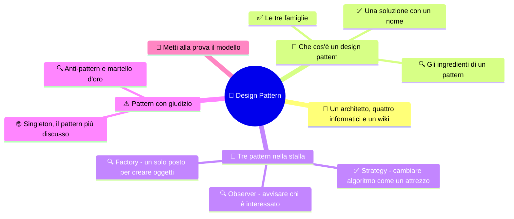
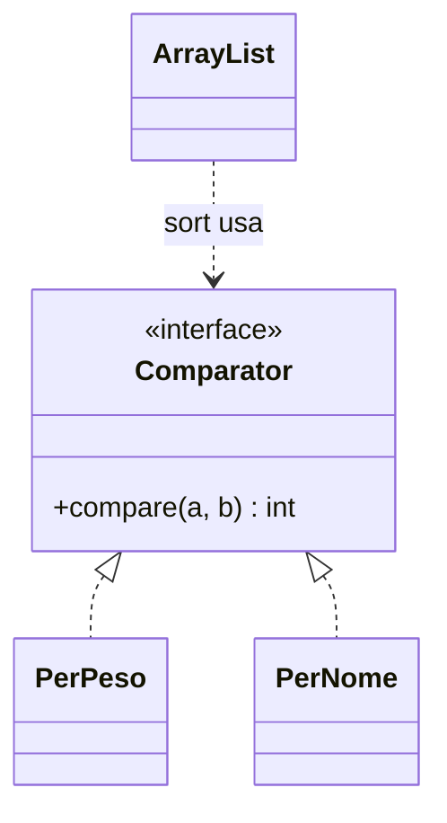

# 🧩 Design Pattern

**4CI · Integrazione 4 · Teoria · Dopo INT1-INT3**

> **Legenda:** ✅ da sapere · 🔍 per capire fino in fondo · 🤓 facoltativo, per curiosi · 🃏 flashcard: rispondi a voce, poi apri per controllare



## 🧭 Un architetto, quattro informatici e un wiki

La storia dei design pattern non comincia con un computer. Comincia con un architetto. Nel 1977 Christopher Alexander pubblica *A Pattern Language*. È un libro su come costruire case e città in cui le persone stiano bene. Contiene 253 "pattern": problemi che si ripetono e la loro soluzione. Per esempio: "una stanza è più piacevole se riceve luce da due lati". Ogni pattern ha un nome, così gli abitanti e gli architetti possono parlarne.

Dieci anni dopo, nel 1987, due programmatori, Kent Beck e Ward Cunningham, leggono Alexander e pensano: "Anche noi risolviamo sempre gli stessi problemi. Diamo loro un nome!". Nel 1994 quattro autori, Erich Gamma, Richard Helm, Ralph Johnson e John Vlissides, pubblicano il libro *Design Patterns*. Descrive 23 pattern per la programmazione a oggetti. I quattro vengono soprannominati la **Gang of Four**, "la banda dei quattro". Il libro diventa uno dei più famosi della storia dell'informatica.

E il wiki? Nel 1995 Ward Cunningham vuole un posto dove i programmatori possano raccogliere e correggere insieme i pattern. Inventa un sito che chiunque può modificare dal browser. Lo chiama **WikiWikiWeb**, dal nome delle navette "Wiki Wiki" dell'aeroporto di Honolulu: in hawaiano *wiki* vuol dire "veloce". Sei anni dopo nasce Wikipedia. Un'enciclopedia mondiale discende, in un certo senso, da un catalogo di design pattern.

## 📖 Che cos'è un design pattern

### ✅ Una soluzione con un nome

Un **design pattern** è una soluzione tipica a un problema di progettazione che si ripete. Non è codice da copiare: è un'**idea** di come organizzare classi e oggetti, che poi si adatta ogni volta.

I pattern servono a due cose:

1. **Non reinventare la ruota.** Altri hanno già incontrato il problema e trovato una buona soluzione.
2. **Parlare più in fretta.** Dire "qui usiamo uno Strategy" equivale a spiegare dieci righe di progetto. È come in cucina: "soffritto" riassume "cipolla, carota e sedano tritati e rosolati nell'olio".

I pattern usano tutto quello che abbiamo studiato: interfacce, ereditarietà, polimorfismo, composizione. Spesso sono i [principi SOLID](%28DOC%29%204CI%20INT3%20-%20Principi%20SOLID.md) messi in pratica.

<details>
<summary>🃏 Che cos'è un design pattern?</summary>
Una soluzione tipica e con un nome a un problema di progettazione che si ripete spesso.
</details>

<details>
<summary>🃏 Un design pattern è un pezzo di codice da copiare?</summary>
No. È un'idea di organizzazione di classi e oggetti che va adattata ogni volta.
</details>

<details>
<summary>🃏 Quali sono i due grandi vantaggi dei design pattern?</summary>
Riusare soluzioni già sperimentate e comunicare in fretta con un nome condiviso.
</details>

<details>
<summary>🃏 Chi è la Gang of Four?</summary>
Gamma, Helm, Johnson e Vlissides, autori nel 1994 del libro Design Patterns con 23 pattern.
</details>

<details>
<summary>🃏 Da dove viene l'idea di pattern?</summary>
Dall'architetto Christopher Alexander, che nel 1977 descrisse pattern per costruire case e città.
</details>

### ✅ Le tre famiglie

La Gang of Four divide i pattern in tre famiglie:

| Famiglia | Domanda a cui risponde | Esempi |
|---|---|---|
| **Creazionali** | come creo gli oggetti? | Factory Method, Singleton, Builder |
| **Strutturali** | come combino classi e oggetti? | Adapter, Decorator, Composite |
| **Comportamentali** | come si dividono il lavoro e comunicano? | Strategy, Observer, Iterator |

Ne usi già uno senza saperlo. Quando scrivi:

```java
for (Animale a : stalla) { ... }
```

Java usa dietro le quinte un **Iterator**: un oggetto che sa scorrere la collezione un elemento alla volta, senza mostrare come è fatta dentro. È un pattern comportamentale.

<details>
<summary>🃏 Quali sono le tre famiglie di design pattern?</summary>
Creazionali, strutturali e comportamentali.
</details>

<details>
<summary>🃏 A quale domanda rispondono i pattern creazionali?</summary>
Come creare gli oggetti.
</details>

<details>
<summary>🃏 A quale domanda rispondono i pattern comportamentali?</summary>
Come gli oggetti si dividono il lavoro e comunicano fra loro.
</details>

<details>
<summary>🃏 Quale pattern usa il ciclo for-each di Java?</summary>
Iterator: un oggetto che scorre la collezione un elemento alla volta senza mostrarne la struttura interna.
</details>

### 🔍 Gli ingredienti di un pattern

Ogni pattern del libro della Gang of Four è descritto con gli stessi ingredienti principali:

- **nome:** una o due parole facili da ricordare;
- **problema:** quando conviene usarlo;
- **soluzione:** quali classi e interfacce servono e come collaborano, di solito con un [diagramma UML](%28DOC%29%204CI%20INT2%20-%20UML%20e%20diagramma%20delle%20classi.md);
- **conseguenze:** vantaggi **e** svantaggi.

L'ultimo punto è importante. Nessun pattern è gratis. Ognuno aggiunge classi e complessità. Va usato quando il problema c'è davvero.

<details>
<summary>🃏 Quali sono gli ingredienti principali della descrizione di un pattern?</summary>
Nome, problema, soluzione e conseguenze.
</details>

<details>
<summary>🃏 Perché la descrizione di un pattern include le conseguenze?</summary>
Perché ogni pattern ha anche costi, come più classi e più complessità, e bisogna valutare se conviene.
</details>

## 🐄 Tre pattern nella stalla

### ✅ Strategy - cambiare algoritmo come un attrezzo

**Problema:** vogliamo ordinare gli animali, a volte per nome, a volte per peso, a volte per età. Non vogliamo un metodo pieno di `if`.

**Idea:** ogni modo di fare la cosa diventa un oggetto separato, una **strategia**. Tutte le strategie rispettano la stessa interfaccia. Il programma riceve la strategia e la usa senza sapere quale sia. È come un trapano con le punte intercambiabili.

Java ha già l'interfaccia giusta: `Comparator`.

```java
import java.util.Comparator;

public class PerPeso implements Comparator<Animale> {
    @Override
    public int compare(Animale a, Animale b) {
        return Double.compare(a.getPeso(), b.getPeso());
    }
}

public class PerNome implements Comparator<Animale> {
    @Override
    public int compare(Animale a, Animale b) {
        return a.getNome().compareTo(b.getNome());
    }
}
```

```java
stalla.sort(new PerPeso()); // ordina per peso
stalla.sort(new PerNome()); // ordina per nome
```

Il metodo `sort` non cambia. Cambia solo l'oggetto che gli passiamo. Per un nuovo ordinamento scriviamo una nuova classe: è il principio aperto/chiuso.



<details>
<summary>🃏 Quale problema risolve il pattern Strategy?</summary>
Permette di scegliere fra più modi di fare la stessa cosa senza riempire il codice di if, mettendo ogni modo in un oggetto separato.
</details>

<details>
<summary>🃏 Come è fatto lo Strategy?</summary>
Un'interfaccia comune e più classi che la implementano, una per strategia; il codice riceve l'oggetto strategia e lo usa.
</details>

<details>
<summary>🃏 Quale interfaccia Java è un esempio di Strategy per l'ordinamento?</summary>
Comparator, con il metodo compare.
</details>

<details>
<summary>🃏 Come si aggiunge un nuovo criterio di ordinamento con lo Strategy?</summary>
Si scrive una nuova classe che implementa Comparator, senza modificare il codice che ordina.
</details>

<details>
<summary>🃏 Che differenza c'è fra Comparable e Comparator?</summary>
Comparable è implementata dall'oggetto stesso e dà un solo ordine naturale; Comparator è un oggetto esterno e permette tanti ordinamenti diversi.
</details>

### 🔍 Observer - avvisare chi è interessato

**Problema:** nella stalla c'è un sensore di temperatura. Quando cambia, devono reagire il display, il ventilatore e il registro degli allarmi. Domani forse anche un'app sul telefono. Il sensore non deve conoscerli tutti uno per uno.

**Idea:** chi è interessato si **iscrive** al sensore. Quando succede qualcosa, il sensore avvisa tutti gli iscritti. È come iscriversi a un canale: il canale non sa chi sei, sa solo che deve mandarti la notifica.

```java
public interface Osservatore {
    void aggiorna(double temperatura);
}
```

```java
import java.util.ArrayList;
import java.util.List;

public class SensoreTemperatura {
    private final List<Osservatore> iscritti = new ArrayList<>();

    public void iscrivi(Osservatore o) {
        iscritti.add(o);
    }

    public void misura(double temperatura) {
        for (Osservatore o : iscritti) {
            o.aggiorna(temperatura);
        }
    }
}
```

```java
public class Ventilatore implements Osservatore {
    @Override
    public void aggiorna(double temperatura) {
        if (temperatura > 28) {
            System.out.println("Ventilatore acceso");
        }
    }
}
```

```java
SensoreTemperatura sensore = new SensoreTemperatura();
sensore.iscrivi(new Ventilatore());
sensore.iscrivi(new Display());
sensore.misura(30.5); // tutti gli iscritti vengono avvisati
```

L'Observer è ovunque nelle interfacce grafiche. Quando a gennaio, con `tkinter`, collegheremo una funzione a un pulsante, faremo proprio questo: il pulsante avvisa chi si è iscritto al suo clic.

<details>
<summary>🃏 Quale problema risolve il pattern Observer?</summary>
Permette a un oggetto di avvisare tanti altri oggetti interessati quando cambia qualcosa, senza conoscerli uno per uno.
</details>

<details>
<summary>🃏 Come è fatto l'Observer?</summary>
Un'interfaccia per gli osservatori con un metodo di aggiornamento, e un oggetto osservato che tiene una lista di iscritti e li avvisa tutti.
</details>

<details>
<summary>🃏 Per aggiungere un nuovo osservatore bisogna modificare il sensore?</summary>
No. Basta scrivere una classe che implementa Osservatore e iscriverla.
</details>

<details>
<summary>🃏 Dove si usa molto l'Observer?</summary>
Nelle interfacce grafiche: un pulsante avvisa le funzioni collegate al suo clic.
</details>

### 🔍 Factory - un solo posto per creare oggetti

**Problema:** leggiamo gli animali da un file, una riga alla volta: `pollo;Pio`, `mucca;Muu`. Per ogni riga dobbiamo creare l'oggetto giusto. Se questo `if` si ripete in tre punti del programma, aggiungere `Capra` diventa un incubo.

**Idea:** mettere la creazione in **un solo posto**, una "fabbrica".

```java
public class FabbricaAnimali {
    public static Animale crea(String tipo, String nome) {
        switch (tipo) {
            case "pollo": return new Pollo(nome);
            case "mucca": return new Mucca(nome);
            case "capra": return new Capra(nome);
            default: throw new IllegalArgumentException("Tipo sconosciuto: " + tipo);
        }
    }
}
```

```java
String[] campi = "pollo;Pio".split(";");
Animale a = FabbricaAnimali.crea(campi[0], campi[1]);
```

Il resto del programma non usa più `new Pollo(...)`: chiede alla fabbrica. Per una nuova specie si modifica un solo metodo.

Questa è la versione più semplice, detta *simple factory*. Il libro della Gang of Four descrive versioni più flessibili, **Factory Method** e **Abstract Factory**, che usano ereditarietà e interfacce. L'idea di fondo è la stessa: separare **chi usa** gli oggetti da **chi li crea**.

<details>
<summary>🃏 Quale problema risolve una Factory?</summary>
Raccoglie in un solo punto la creazione degli oggetti, così il resto del programma non deve sapere quale classe istanziare.
</details>

<details>
<summary>🃏 A quale famiglia appartiene la Factory?</summary>
Ai pattern creazionali.
</details>

<details>
<summary>🃏 Che cosa succede nella FabbricaAnimali se il tipo non esiste?</summary>
Lancia una IllegalArgumentException con un messaggio che indica il tipo sconosciuto.
</details>

<details>
<summary>🃏 Che differenza c'è fra simple factory e Factory Method?</summary>
La simple factory è un metodo che crea oggetti con uno switch; il Factory Method della Gang of Four lascia alle sottoclassi la scelta dell'oggetto da creare.
</details>

## ⚠️ Pattern con giudizio

### 🔍 Anti-pattern e martello d'oro

Esistono anche gli **anti-pattern**: soluzioni che sembrano buone ma creano problemi. Anche loro hanno un nome, per riconoscerli in fretta.

| Anti-pattern | Che cos'è |
|---|---|
| **God Object** (oggetto Dio) | una classe che sa e fa tutto; viola la S di SOLID |
| **Spaghetti code** | codice senza struttura, in cui il flusso salta da tutte le parti |
| **Copia e incolla** | lo stesso codice ripetuto in tanti punti; un errore va corretto ovunque |
| **Martello d'oro** | usare sempre la stessa soluzione preferita, anche quando non c'entra |

Il **martello d'oro** riguarda anche i pattern. Chi li ha appena scoperti tende a vederli dappertutto. Lo psicologo Abraham Maslow scrisse nel 1966: "se l'unico attrezzo che hai è un martello, tutto ti sembra un chiodo". Un programma di 50 righe non ha bisogno di tre pattern.

<details>
<summary>🃏 Che cos'è un anti-pattern?</summary>
Una soluzione che si ripete spesso e sembra buona, ma in realtà crea problemi.
</details>

<details>
<summary>🃏 Che cos'è un God Object?</summary>
Una classe che sa e fa troppe cose; viola il principio di singola responsabilità.
</details>

<details>
<summary>🃏 Che cos'è il martello d'oro?</summary>
L'abitudine di usare sempre la stessa soluzione preferita, anche quando non è adatta al problema.
</details>

<details>
<summary>🃏 Perché il copia e incolla è un anti-pattern?</summary>
Perché se il codice copiato contiene un errore, bisogna trovarlo e correggerlo in tutti i punti.
</details>

### 🤓 Singleton, il pattern più discusso

> Il **Singleton** garantisce che di una classe esista **un solo oggetto** in tutto il programma:
>
> ```java
> public class Configurazione {
>     private static Configurazione istanza;
>     private Configurazione() { }
>     public static Configurazione get() {
>         if (istanza == null) {
>             istanza = new Configurazione();
>         }
>         return istanza;
>     }
> }
> ```
>
> Il costruttore è `private`: nessuno può fare `new`. L'unico modo è chiamare `get()`.
>
> Sembra comodo, ma molti programmatori lo considerano quasi un anti-pattern. È di fatto una **variabile globale** travestita: chiunque può modificarlo da qualunque punto, e i test diventano difficili perché lo stato resta da una prova all'altra. Questa versione, inoltre, non è sicura se più thread la usano insieme. Erich Gamma, uno della Gang of Four, ha detto in un'intervista del 2009 che, riscrivendo il libro, avrebbe tolto proprio il Singleton. Spesso è meglio passare l'oggetto con l'iniezione delle dipendenze, la D di SOLID.

<details>
<summary>🃏 Che cosa garantisce il Singleton?</summary>
Che di una classe esista un solo oggetto in tutto il programma.
</details>

<details>
<summary>🃏 Perché il costruttore di un Singleton è private?</summary>
Per impedire a chiunque di creare altri oggetti con new.
</details>

<details>
<summary>🃏 Perché il Singleton è criticato?</summary>
Perché è come una variabile globale: si può modificare da ovunque e rende difficili i test.
</details>

## 🧩 Metti alla prova il modello

1. **Base.** Spiega con parole tue che cos'è un design pattern e perché ha un nome.
2. **Famiglie.** Classifica come creazionale, strutturale o comportamentale: Strategy, Factory, Iterator, Singleton, Observer.
3. **Strategy.** Scrivi un `Comparator<Animale>` che ordina dal più pesante al più leggero.
4. **Observer.** Aggiungi al sensore un osservatore `RegistroAllarmi` che stampa un messaggio quando la temperatura scende sotto 5 gradi.
5. **Factory.** Che cosa succede se il file contiene la riga `Pollo;Pio`, con la P maiuscola? Come renderesti la fabbrica più tollerante?
6. **Riconoscimento.** Una app di consegne avvisa il cliente, il ristorante e il rider quando l'ordine cambia stato. Quale pattern riconosci?
7. **Giudizio.** Un compagno vuole usare un Singleton per il punteggio di un gioco. Quali rischi gli segnaleresti?

**🚪 Uscita:** scegli uno dei tre pattern della stalla e disegna il suo diagramma UML a memoria.

## 📚 Fonti e risorse

- [Refactoring.Guru - Design Patterns](https://refactoring.guru/design-patterns) (in inglese, molto illustrato): il miglior catalogo visivo gratuito; ogni pattern ha esempi anche in Java e Python. Ottimo per ripassare a casa.
- [Wikipedia - Design pattern](https://it.wikipedia.org/wiki/Design_pattern) (in italiano): elenco dei 23 pattern della Gang of Four con collegamenti alle singole voci.
- [WikiWikiWeb](https://wiki.c2.com/) (in inglese): il primo wiki della storia, ancora online in sola lettura. Da guardare come pezzo da museo.

---

## Apparato riservato al docente

**Collocazione.** Fuori dal programma ufficiale; consolida interfacce, polimorfismo e `ArrayList`. Strategy si collega a `Comparable` (INT1), Observer anticipa callback ed eventi di GEN-FEB S3, Factory anticipa il parsing CSV di MAR-APR S2. Proposta: verificare solo definizione, famiglie e Strategy.

**Regia per due ore.** Prima ora: storia Alexander → Gang of Four → wiki (8 min, raccontata con calma), definizione, famiglie, Iterator "nascosto", Strategy con `Comparator` scritto in diretta. Seconda ora: Observer con il gioco del sensore (20 min), Factory, anti-pattern, uscita.

**🎭 Gioco: «Il sensore e gli iscritti».**
- *Scenario:* la stalla "La Muuucca Felice" ha un nuovo sensore di temperatura collegato a mezza fattoria.
- *Ruoli:* il Sensore (uno studente con un termometro di cartone), 4-6 Osservatori con un cartellino (Ventilatore, Display, Allarme, Riscaldamento, App del contadino, Gallina freddolosa), un Registro iscrizioni (uno studente alla lavagna), il Programmatore (docente).
- *Svolgimento:* (1) ogni osservatore va dal Registro e dice "iscrivi()". Il Registro scrive il nome alla lavagna. (2) Il Programmatore annuncia una temperatura. Il Sensore la legge e chiama, nell'ordine della lista, ogni iscritto: "aggiorna(30)". (3) Ogni osservatore reagisce secondo il cartellino (il ventilatore si alza e gira le braccia sopra 28; il riscaldamento sotto 10; la gallina si lamenta sotto 15). (4) Colpo di scena: arriva un nuovo osservatore, "Gelataio", che vende gelati sopra 25. Domanda: il Sensore deve cambiare? (5) Un osservatore fa "disiscrivi()": quale metodo manca nel codice del testo?
- *Esito atteso:* il sensore non cambia mai; manca un metodo `disiscrivi(Osservatore o)` con `iscritti.remove(o)`.
- *Dettaglio divertente:* se il Sensore dimentica di chiamare qualcuno, quello può gridare "BUG!". La Gallina freddolosa può chiedere un plaid.

**Risposte attese.**
1. Soluzione riusabile e nominata a un problema ricorrente; il nome serve a comunicare.
2. Strategy comportamentale, Factory creazionale, Iterator comportamentale, Singleton creazionale, Observer comportamentale.
3. `return Double.compare(b.getPeso(), a.getPeso());` (o il negativo del confronto crescente; segnalare che invertire `a` e `b` è più pulito).
4. Classe `implements Osservatore` con `if (temperatura < 5)`; iscriverla al sensore.
5. Viene lanciata l'eccezione, perché `"Pollo"` è diverso da `"pollo"`. Piste: `tipo.toLowerCase()` o `tipo.trim().toLowerCase()` prima dello `switch`.
6. Observer.
7. Stato globale modificabile ovunque, difficile da testare e da azzerare fra due partite; pista: passare l'oggetto punteggio a chi serve.

**Criterio.** Minimo: definizione, tre famiglie, riconoscere lo Strategy in `Comparator`. Completo: Observer e Factory scritti o riconosciuti in uno scenario. Singleton e storia del wiki non valutabili.

**Attenzione.** La `FabbricaAnimali` usa costruttori con il solo nome: adattarla alle firme reali delle classi del laboratorio. Lo `switch` con `return` evita i `break`; se la classe conosce lo `switch` a freccia (Java 14+), mostrarlo come alternativa.

---

[⬅️ INT3 - Principi SOLID](%28DOC%29%204CI%20INT3%20-%20Principi%20SOLID.md) · [INT5 - Extreme Programming ➡️](%28DOC%29%204CI%20INT5%20-%20Extreme%20Programming.md)
