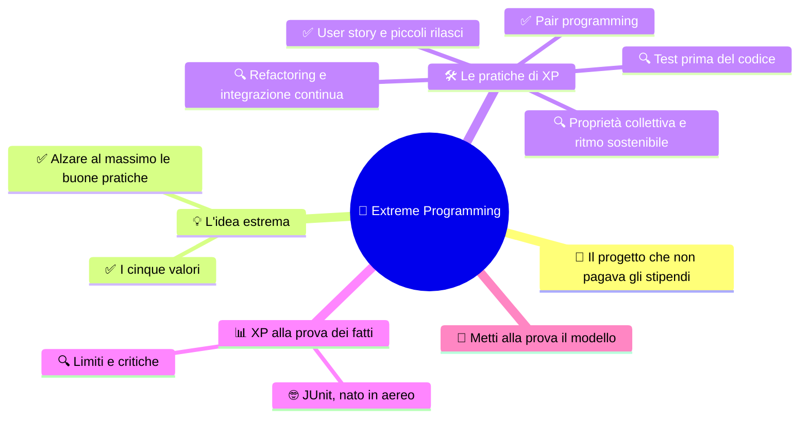

# 🚀 Extreme Programming

**4CI · Integrazione 5 · Teoria · Collegata al lavoro a coppie in laboratorio**

> **Legenda:** ✅ da sapere · 🔍 per capire fino in fondo · 🤓 facoltativo, per curiosi · 🃏 flashcard: rispondi a voce, poi apri per controllare



## 🧭 Il progetto che non pagava gli stipendi

Vicino a Detroit, 1996. La Chrysler, una delle grandi case automobilistiche americane, ha un problema. Deve sostituire i vecchi programmi che calcolano gli stipendi dei dipendenti. Il nuovo progetto si chiama **C3**. È in ritardo, il codice è un groviglio e nessuno sa quando funzionerà.

Chiamano un consulente: Kent Beck. Beck non porta un nuovo linguaggio o uno strumento magico. Porta un'idea quasi provocatoria. "Prendiamo le cose che sappiamo funzionare e **alziamo la manopola al massimo**." Se rileggere il codice è utile, lo rileggiamo sempre, mentre lo scriviamo. Se i test sono utili, li scriviamo prima del codice. Se integrare il lavoro è utile, lo facciamo più volte al giorno.

Nel 1999 Beck racconta questo modo di lavorare in un libro: *Extreme Programming Explained*. Il nome ricorda gli sport estremi, di gran moda alla fine degli anni Novanta, l'epoca dello snowboard e della bolla di Internet. Ma XP non chiede di lavorare di notte con la musica a palla. Al contrario, come vedremo, chiede di **non** farlo.

## 💡 L'idea estrema

### ✅ Alzare al massimo le buone pratiche

**Extreme Programming** (XP) è una metodologia di sviluppo software. Una metodologia è un insieme di regole e abitudini per organizzare il lavoro di una squadra.

L'idea centrale di XP: le buone pratiche della programmazione funzionano meglio se fatte **spesso** e **in piccolo**.

| Buona pratica | Versione "estrema" in XP |
|---|---|
| far rileggere il codice | due persone scrivono sempre insieme: **pair programming** |
| testare | scrivere il test **prima** del codice |
| migliorare il codice | migliorarlo continuamente: **refactoring** |
| consegnare al cliente | consegnare versioni piccole molto spesso: **piccoli rilasci** |
| integrare il lavoro | unire il lavoro di tutti più volte al giorno |

Il motto del libro di Beck è *Embrace change*, "abbraccia il cambiamento". Il cliente cambierà idea: invece di lamentarsene, organizziamoci per adattarci in fretta.

<details>
<summary>🃏 Che cos'è Extreme Programming?</summary>
Una metodologia di sviluppo software, ideata da Kent Beck alla fine degli anni Novanta, basata su buone pratiche fatte spesso e in piccolo.
</details>

<details>
<summary>🃏 Perché si chiama extreme?</summary>
Perché prende pratiche già note, come test e revisione del codice, e le porta al massimo: sempre e fin dall'inizio.
</details>

<details>
<summary>🃏 Qual è il motto di XP?</summary>
Embrace change, abbraccia il cambiamento: organizzarsi per adattarsi quando i requisiti cambiano.
</details>

<details>
<summary>🃏 Come si chiamava il progetto in cui nacque XP?</summary>
C3, il sistema per gli stipendi della Chrysler, a partire dal 1996.
</details>

### ✅ I cinque valori

XP si basa su cinque valori. Le pratiche cambiano da squadra a squadra; i valori restano.

| Valore | Che cosa significa | In laboratorio |
|---|---|---|
| 💬 **Comunicazione** | parlare dei problemi invece di nasconderli | dire "sono bloccato qui" |
| 🪶 **Semplicità** | fare la cosa più semplice che funziona | prima una versione minima che parte |
| 🔁 **Feedback** | scoprire presto se si sbaglia | provare il programma spesso, non solo alla fine |
| 🦁 **Coraggio** | cambiare codice, buttare una soluzione sbagliata, chiedere aiuto | cancellare un metodo confuso e riscriverlo |
| 🤝 **Rispetto** | per i compagni, il loro tempo e il loro lavoro | criticare il codice, mai la persona |

Il rispetto è stato aggiunto nella seconda edizione del libro, nel 2004. Beck si era accorto che senza rispetto le altre pratiche non reggono.

<details>
<summary>🃏 Quali sono i cinque valori di XP?</summary>
Comunicazione, semplicità, feedback, coraggio e rispetto.
</details>

<details>
<summary>🃏 Che cosa significa feedback in XP?</summary>
Scoprire il prima possibile se si sta sbagliando, con test, prove e confronti frequenti.
</details>

<details>
<summary>🃏 Perché in XP serve coraggio?</summary>
Per cambiare codice che già esiste, buttare una soluzione sbagliata, ammettere un errore e chiedere aiuto.
</details>

<details>
<summary>🃏 Quale valore fu aggiunto nella seconda edizione e perché?</summary>
Il rispetto: senza rispetto fra le persone le altre pratiche non funzionano.
</details>

## 🛠️ Le pratiche di XP

### ✅ User story e piccoli rilasci

Una **user story** descrive in una frase che cosa vuole chi userà il programma:

```text
Come contadino
voglio cercare un animale per nome
per vedere subito quanto pesa.
```

Non dice come programmarlo. Dice **chi**, **che cosa** e **perché**. Si aggiungono dei **criteri di accettazione**, cioè prove concrete per dire "fatto":

```text
- se il nome esiste, vedo nome, specie e peso;
- se il nome non esiste, vedo un messaggio chiaro;
- una ricerca vuota non blocca il programma.
```

Le storie si realizzano una alla volta, con **piccoli rilasci**: versioni funzionanti, anche minime, che si possono mostrare.

```text
Rilascio 1: aggiungo e stampo animali
Rilascio 2: cerco per nome
Rilascio 3: modifico e rimuovo
Rilascio 4: salvo su file
```

Ogni rilascio parte e fa qualcosa di utile. Così si evita il dramma della "grande consegna finale che non compila".

<details>
<summary>🃏 Che cos'è una user story?</summary>
Una frase breve che descrive che cosa vuole un utente e perché, nella forma come, voglio, per.
</details>

<details>
<summary>🃏 Una user story dice come programmare la funzione?</summary>
No. Dice chi la vuole, che cosa vuole e perché; il come lo decide la squadra.
</details>

<details>
<summary>🃏 A che cosa servono i criteri di accettazione?</summary>
A stabilire con prove concrete quando una storia è davvero finita.
</details>

<details>
<summary>🃏 Che cos'è un piccolo rilascio?</summary>
Una versione del programma che funziona e fa qualcosa di utile, anche se non ha ancora tutte le funzioni.
</details>

<details>
<summary>🃏 Perché i piccoli rilasci riducono il rischio?</summary>
Perché si scoprono presto gli errori e c'è sempre una versione funzionante, invece di tutto o niente alla fine.
</details>

### ✅ Pair programming

Due persone, un computer. I ruoli sono due:

- 🚗 **driver**, il pilota: ha la tastiera e scrive il codice;
- 🧭 **navigator**, il navigatore: legge, fa domande, controlla, pensa al passo successivo.

I ruoli si scambiano spesso, per esempio ogni 15-20 minuti. Il navigatore non è un capo e il pilota non è un dattilografo: **entrambi** devono capire tutto il codice.

Alcune regole d'oro:

1. il pilota dice ad alta voce che cosa sta per scrivere;
2. il navigatore non strappa la tastiera;
3. si parla del codice, non della persona ("questo metodo è lungo", non "sei lento");
4. alla fine ciascuno sa spiegare ogni parte.

> 🔧 **Collegamento con il laboratorio:** nel progetto `LaStalla` lavorerete a coppie con cambio di ruolo. Scrivete sul file chi era pilota a ogni cambio.

<details>
<summary>🃏 Che cos'è il pair programming?</summary>
Due programmatori lavorano allo stesso codice sullo stesso computer, con ruoli che si scambiano.
</details>

<details>
<summary>🃏 Che cosa fa il driver?</summary>
Ha la tastiera e scrive il codice, spiegando ad alta voce che cosa sta facendo.
</details>

<details>
<summary>🃏 Che cosa fa il navigator?</summary>
Legge, controlla, fa domande e pensa al passo successivo e ai possibili errori.
</details>

<details>
<summary>🃏 Ogni quanto si scambiano i ruoli?</summary>
Spesso, per esempio ogni 15-20 minuti, così entrambi scrivono e controllano.
</details>

### 🔍 Test prima del codice

Nel **Test-Driven Development** (TDD), "sviluppo guidato dai test", si scrive **prima** il test e **poi** il codice. Il ciclo ha tre colori:

```text
   🔴 ROSSO              🟢 VERDE               🔵 REFACTOR
 scrivo un test   ->  scrivo il codice   ->  miglioro il codice
 che fallisce         minimo che lo fa       senza cambiare
                      passare                il comportamento
        ^                                          |
        +------------------------------------------+
```

Esempio con il `Recinto`. Prima il test, anche senza strumenti speciali:

```java
public class ProvaRecinto {
    public static void main(String[] args) {
        Recinto r = new Recinto("A1", 2);
        r.aggiungi(new Pollo("Pio"));
        r.aggiungi(new Pollo("Pia"));
        System.out.println(r.ePieno() ? "OK" : "ERRORE: dovrebbe essere pieno");
    }
}
```

Il metodo `ePieno()` ancora non esiste: il programma non compila. È **rosso**. Ora scriviamo il minimo per farlo passare: **verde**. Infine sistemiamo nomi e duplicazioni: **refactor**.

Nei progetti veri si usa una libreria di test. In Java la più famosa è **JUnit**:

```java
import static org.junit.jupiter.api.Assertions.assertTrue;
import org.junit.jupiter.api.Test;

class RecintoTest {
    @Test
    void recintoConDueAnimaliSuDueEPieno() {
        Recinto r = new Recinto("A1", 2);
        r.aggiungi(new Pollo("Pio"));
        r.aggiungi(new Pollo("Pia"));
        assertTrue(r.ePieno());
    }
}
```

Perché il test prima? Ti costringe a pensare a **che cosa** deve fare il codice prima di pensare a **come**. È il "contratto" di [INT1](%28DOC%29%204CI%20INT1%20-%20Interfacce%20Java%20per%20collaborare.md), scritto in forma eseguibile.

<details>
<summary>🃏 Che cos'è il TDD?</summary>
Test-Driven Development: si scrive prima un test che fallisce, poi il codice minimo per farlo passare, poi si migliora il codice.
</details>

<details>
<summary>🃏 Quali sono le tre fasi del ciclo TDD?</summary>
Rosso, test che fallisce; verde, codice minimo che lo fa passare; refactor, miglioramento senza cambiare il comportamento.
</details>

<details>
<summary>🃏 Perché nel TDD il primo test deve fallire?</summary>
Per essere sicuri che il test controlli davvero qualcosa che ancora non c'è; un test che passa subito potrebbe non provare nulla.
</details>

<details>
<summary>🃏 Che cos'è JUnit?</summary>
La libreria più diffusa per scrivere ed eseguire test automatici in Java.
</details>

<details>
<summary>🃏 Che cosa controlla assertTrue?</summary>
Che la condizione passata sia vera; se è falsa, il test fallisce.
</details>

### 🔍 Refactoring e integrazione continua

Il **refactoring** cambia la struttura del codice **senza cambiare quello che fa**. Esempi:

- rinominare `x` in `pesoIniziale`;
- spezzare un metodo di 80 righe in tre metodi;
- eliminare codice copiato e incollato;
- spostare un metodo nella classe giusta, come chiede la S di [SOLID](%28DOC%29%204CI%20INT3%20-%20Principi%20SOLID.md).

Come sappiamo che il comportamento non è cambiato? Rieseguiamo i test. Senza test il refactoring è un salto nel buio.

L'**integrazione continua** significa unire spesso il lavoro di tutti, più volte al giorno. Ogni volta si controlla che il programma compili e che i test passino. Se due persone lavorano separate per tre settimane, alla fine i pezzi non combaciano. Se si integra ogni ora, i problemi sono piccoli e freschi. Oggi questo si fa con [Git e GitHub](../../Integrazioni%20e%20curiosit%C3%A0/Collaborazione%20con%20Git%20e%20Live%20Share.md).

<details>
<summary>🃏 Che cos'è il refactoring?</summary>
Modificare la struttura interna del codice per renderlo più chiaro, senza cambiarne il comportamento.
</details>

<details>
<summary>🃏 Perché servono i test per fare refactoring in sicurezza?</summary>
Perché permettono di verificare che, dopo la modifica, il programma faccia ancora le stesse cose.
</details>

<details>
<summary>🃏 Che cos'è l'integrazione continua?</summary>
Unire spesso il lavoro di tutti, controllando ogni volta che il programma compili e che i test passino.
</details>

<details>
<summary>🃏 Perché integrare spesso è meglio che integrare alla fine?</summary>
Perché i conflitti e gli errori sono piccoli e recenti, quindi facili da capire e correggere.
</details>

### 🔍 Proprietà collettiva e ritmo sostenibile

**Proprietà collettiva** del codice: il programma è di tutta la squadra. Chiunque può leggere e migliorare qualunque parte. Niente "non toccare, l'ho scritto io". Nessuna parte deve essere conosciuta da una sola persona: se si ammala, il progetto si ferma.

**Ritmo sostenibile**: nella prima edizione la pratica si chiamava "settimana di 40 ore". Beck osservava che chi lavora stanco scrive più errori, e poi serve altro tempo per correggerli. Gli straordinari continui sono un segnale che il progetto è pianificato male, non una prova di impegno.

Il tema è serio. In alcuni settori, come quello dei videogiochi, sono stati raccontati periodi di *crunch*, cioè mesi di lavoro con orari molto lunghi prima dell'uscita di un titolo. Le conseguenze su salute e vita privata hanno aperto un dibattito, anche sindacale. Vale anche per te: un programma che funziona solo dopo una notte insonne non è un buon programma.

<details>
<summary>🃏 Che cosa significa proprietà collettiva del codice?</summary>
Che il codice appartiene a tutta la squadra e chiunque può leggerlo e migliorarlo.
</details>

<details>
<summary>🃏 Perché è rischioso che una parte del codice sia conosciuta da una sola persona?</summary>
Perché se quella persona manca, nessuno sa più modificare quella parte e il progetto si blocca.
</details>

<details>
<summary>🃏 Che cosa significa ritmo sostenibile?</summary>
Lavorare con orari che si possono mantenere a lungo, senza straordinari continui, perché la stanchezza produce errori.
</details>

<details>
<summary>🃏 Che cos'è il crunch?</summary>
Un periodo di lavoro con orari molto lunghi, raccontato soprattutto nell'industria dei videogiochi prima delle uscite.
</details>

## 📊 XP alla prova dei fatti

### 🔍 Limiti e critiche

XP non è una bacchetta magica.

- **Il progetto C3 fu chiuso.** Nel 1998 la Chrysler si fuse con la tedesca Daimler e nel 2000 il progetto venne cancellato. I sostenitori di XP danno la colpa a cambiamenti aziendali; i critici lo citano come prova che XP non basta.
- **Il pair programming ha costi.** Una revisione di molti studi, pubblicata nel 2009, ha trovato che le coppie tendono a finire prima e con un po' più di qualità, ma usano più ore di lavoro totali. I risultati dipendono molto dalla difficoltà del compito e dall'esperienza delle persone.
- **Non tutti amano lavorare sempre in coppia.** Per alcune persone è stancante. Serve equilibrio.
- **Le pratiche si sostengono a vicenda.** Il refactoring senza test è rischioso, la proprietà collettiva senza integrazione continua crea caos. Prendere solo una pratica a caso funziona male.

Oggi poche aziende fanno XP "puro". Ma molte sue pratiche (test automatici, refactoring, integrazione continua, pair programming) sono diventate normali in tutto il mondo. XP è anche uno dei padri delle [metodologie Agile](%28DOC%29%204CI%20INT6%20-%20Metodologie%20di%20sviluppo%20Agile.md): Kent Beck è tra i diciassette firmatari del Manifesto.

<details>
<summary>🃏 Che fine fece il progetto C3?</summary>
Fu cancellato nel 2000, dopo la fusione fra Chrysler e Daimler.
</details>

<details>
<summary>🃏 Che cosa dicono gli studi sul pair programming?</summary>
In media le coppie finiscono prima e con un po' più di qualità, ma spendono più ore totali; dipende da compito ed esperienza.
</details>

<details>
<summary>🃏 Perché non conviene adottare una sola pratica XP a caso?</summary>
Perché le pratiche si sostengono a vicenda: per esempio il refactoring è sicuro solo se ci sono i test.
</details>

<details>
<summary>🃏 Quali pratiche nate o rese famose da XP sono oggi diffuse ovunque?</summary>
Test automatici, refactoring, integrazione continua e pair programming.
</details>

### 🤓 JUnit, nato in aereo

> Nel 1997 Kent Beck ed Erich Gamma, uno della Gang of Four dei [design pattern](%28DOC%29%204CI%20INT4%20-%20Design%20Pattern.md), sono sullo stesso volo da Zurigo ad Atlanta, diretti a una conferenza. Hanno qualche ora libera e un portatile. Decidono di scrivere insieme, in pair programming e con il TDD, una piccola libreria per testare il codice Java.
>
> Quando atterrano, JUnit esiste. Martin Fowler ha scritto anni dopo: "mai tanto fu dovuto da così tanti a così poche righe di codice". È una parodia della famosa frase di Churchill sui piloti della battaglia d'Inghilterra. Oggi JUnit è usato da milioni di progetti e ha ispirato strumenti simili in quasi tutti i linguaggi, come `pytest` e `unittest` in Python.

<details>
<summary>🃏 Chi scrisse JUnit e in che occasione?</summary>
Kent Beck ed Erich Gamma, nel 1997, durante un volo da Zurigo ad Atlanta.
</details>

<details>
<summary>🃏 Quali strumenti simili a JUnit esistono in Python?</summary>
unittest, incluso in Python, e pytest.
</details>

## 🧩 Metti alla prova il modello

1. **Base.** Elenca i cinque valori di XP e spiega uno di questi con un esempio dalla tua esperienza di laboratorio.
2. **User story.** Scrivi una user story con tre criteri di accettazione per la funzione "rimuovi un animale dalla stalla".
3. **Rilasci.** Dividi in quattro piccoli rilasci il progetto "rubrica dei contatti della classe".
4. **TDD.** Scrivi, prima del codice, un test per un metodo `int contaPolli()` della stalla. Che cosa ti aspetti con una stalla vuota? E con due polli e una mucca?
5. **Refactoring.** Questo è un refactoring? Motiva: "ho rinominato `calcola()` in `calcolaRazione()` e ho anche cambiato il risultato da kg a grammi".
6. **Critica.** Un compagno dice: "Il pair programming è uno spreco, due persone fanno il lavoro di una". Rispondi con due argomenti a favore e uno contro.

**🚪 Uscita:** quale pratica XP proveresti per prima nel prossimo laboratorio? Perché?

## 📚 Fonti e risorse

- [Wikipedia - Extreme programming](https://it.wikipedia.org/wiki/Extreme_programming) (in italiano): riassunto di valori e pratiche, per ripassare.
- [Martin Fowler - Test Driven Development](https://martinfowler.com/bliki/TestDrivenDevelopment.html) (in inglese, breve): una pagina chiara sul ciclo rosso-verde-refactor.
- [JUnit 5](https://junit.org/junit5/) (in inglese, open source): il sito ufficiale; per chi vuole provare i test automatici a casa.

---

## Apparato riservato al docente

**Collocazione.** Fuori dal programma ufficiale come contenuto di teoria; sostiene però il metodo di laboratorio (coppie, piccoli rilasci, test). Riferimento operativo per il docente: [Extreme Programming nei laboratori](../../Integrazioni%20e%20curiosit%C3%A0/Extreme%20Programming%20nei%20laboratori.md), con la scaletta della sessione da tre ore e le regole del pair programming. Proposta: valutare solo valori, user story e pair programming.

**Regia per due ore.** Prima ora: racconto C3 (8 min), manopole al massimo, valori (chiedere un esempio di classe per ciascuno), user story e rilasci con la stalla. Seconda ora: ping-pong TDD su carta (35 min), refactoring e integrazione in sintesi, limiti (5 min, dibattito veloce sulla domanda 6), uscita.

**🎭 Gioco: «Ping-pong TDD su carta».**
- *Scenario:* la startup "Pollaio 4.0" deve consegnare entro fine ora la funzione `prezzoUova(int numero)`. Regole del cliente, rivelate **una alla volta** dal docente: (a) un uovo costa 0,30 €; (b) la confezione da 6 costa 1,50 €; (c) sopra le 30 uova sconto del 10%; (d) numero negativo: errore.
- *Ruoli:* coppie formate da Tester e Programmatore; il docente è il Cliente; un "Bug Hunter" per ogni fila, che passa tra i banchi a cercare casi non testati.
- *Svolgimento:* (1) il Tester scrive su un foglio un test, cioè una chiamata e il risultato atteso (`prezzoUova(1) -> 0.30`). (2) Il Programmatore scrive lo pseudocodice o il Java **minimo** per farlo passare, senza anticipare regole future. (3) Si scambiano i ruoli e si ripete. (4) A ogni nuova regola il Cliente la annuncia con enfasi ("Notizia dal mercato!"). (5) Il Bug Hunter propone casi limite (`0`, `6`, `7`, `30`, `31`, `-1`).
- *Esito atteso:* alla regola (b) emergono soluzioni con `/ 6` e `% 6`; alla (c) la discussione su "30 incluso o escluso" mostra il valore dei criteri di accettazione. Possibile soluzione: `if (n < 0) throw ...; double p = (n / 6) * 1.50 + (n % 6) * 0.30; if (n > 30) p *= 0.9; return p;`.
- *Dettaglio divertente:* il Cliente può cambiare idea all'ultimo ("ah, le uova di Pasqua costano doppio!") per mettere in scena *embrace change*. Se la coppia ha i test, adattarsi è facile.

**Risposte attese.**
1. Comunicazione, semplicità, feedback, coraggio, rispetto; esempio libero ma concreto.
2. Es. "Come contadino voglio rimuovere un animale per nome per tenere aggiornata la stalla"; criteri: rimozione se esiste, messaggio se non esiste, la stalla resta coerente (conteggio aggiornato).
3. Pista: aggiungi/stampa, cerca, modifica/rimuovi, salva/carica.
4. Stalla vuota → 0; due polli e una mucca → 2. Valutare la scrittura del test **prima** dell'implementazione.
5. No: il cambio di unità cambia il comportamento. La rinomina da sola sarebbe refactoring.
6. Pro: meno errori e revisione continua, conoscenza condivisa, apprendimento reciproco. Contro: più ore totali, fatica, non adatto a compiti banali. Accettare argomenti diversi se motivati.

**Criterio.** Minimo: valori, user story ben formata, ruoli del pair programming. Completo: ciclo TDD e differenza fra refactoring e modifica funzionale. Storia di C3 e JUnit non valutabili.

**Attenzione.** Le affermazioni sul pair programming si basano sulla meta-analisi di Hannay, Dybå, Arisholm e Sjøberg (*Information and Software Technology*, 2009): presentarle come tendenze medie, non come leggi. JUnit richiede la configurazione del progetto: in teoria basta il test "a mano" con `main`.

---

[⬅️ INT4 - Design Pattern](%28DOC%29%204CI%20INT4%20-%20Design%20Pattern.md) · [INT6 - Metodologie di sviluppo Agile ➡️](%28DOC%29%204CI%20INT6%20-%20Metodologie%20di%20sviluppo%20Agile.md)
