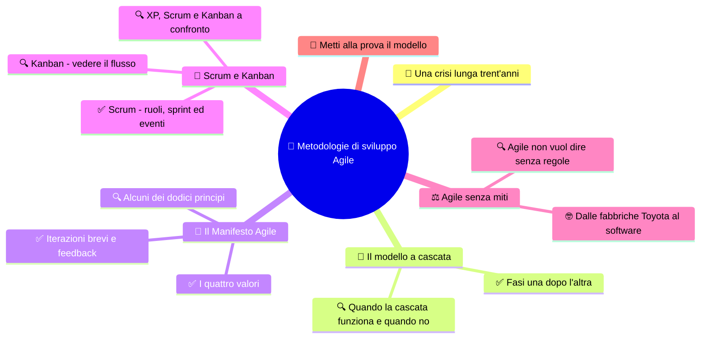

# 🔁 Metodologie di sviluppo Agile

**4CI · Integrazione 6 · Teoria · Dopo INT5**

> **Legenda:** ✅ da sapere · 🔍 per capire fino in fondo · 🤓 facoltativo, per curiosi · 🃏 flashcard: rispondi a voce, poi apri per controllare



## 🧭 Una crisi lunga trent'anni

Ottobre 1968, Garmisch, nelle Alpi bavaresi. Nel mondo è l'anno delle proteste studentesche e della corsa alla Luna. In un albergo si riuniscono una cinquantina di esperti, invitati dalla NATO. L'argomento è preoccupante: i computer sono sempre più potenti, ma i programmi arrivano in ritardo, costano il doppio e sono pieni di errori. Lo chiamano **crisi del software**. Per uscirne propongono un nome nuovo, quasi una promessa: **ingegneria del software**. Se gli ingegneri costruiscono ponti che stanno in piedi, perché non programmi?

L'idea sembra semplice: fare come in un cantiere. Prima il progetto completo, poi la costruzione, poi il collaudo. Nasce così, negli anni Settanta, il **modello a cascata**.

Per trent'anni la crisi non finisce. Progetti enormi falliscono anche dopo il Duemila: nel 2005 l'FBI abbandona il suo nuovo sistema informatico per le indagini, il *Virtual Case File*, dopo averci speso circa 170 milioni di dollari.

Febbraio 2001, Snowbird, una località sciistica dello Utah. La bolla delle aziende di Internet è appena scoppiata. Diciassette programmatori, tra cui Kent Beck di [XP](%28DOC%29%204CI%20INT5%20-%20Extreme%20Programming.md), passano tre giorni fra piste da sci e discussioni. Ognuno ha il suo metodo, spesso in concorrenza con gli altri. Scoprono però di credere nelle stesse cose. Le scrivono su una pagina: il **Manifesto per lo sviluppo Agile del software**. Dice, in sostanza: il software non è un ponte. Cambia mentre lo costruisci.

## 🌊 Il modello a cascata

### ✅ Fasi una dopo l'altra

Nel **modello a cascata** (*waterfall*) lo sviluppo è diviso in fasi. Ogni fase comincia quando la precedente è finita, come l'acqua che scende da un gradino all'altro e non risale.

```text
Requisiti           che cosa vuole il cliente?
    \
     Progettazione      come sarà fatto il programma?
         \
          Implementazione    scrittura del codice
              \
               Test               il programma funziona?
                   \
                    Rilascio e manutenzione
```

Ogni fase produce **documenti** che passano alla fase successiva. Il cliente vede il programma solo alla fine.

Vantaggi: è facile da capire e da pianificare. Si sa in anticipo che cosa sarà consegnato, quando e a che prezzo, almeno sulla carta.

<details>
<summary>🃏 Che cos'è il modello a cascata?</summary>
Un modo di sviluppare software in fasi successive: requisiti, progettazione, implementazione, test, rilascio. Ogni fase inizia quando la precedente è finita.
</details>

<details>
<summary>🃏 Quando vede il programma il cliente, nel modello a cascata?</summary>
Di solito solo alla fine, quando tutte le fasi sono concluse.
</details>

<details>
<summary>🃏 Quali sono i vantaggi del modello a cascata?</summary>
È semplice da capire e permette di pianificare tempi, costi e documenti fin dall'inizio.
</details>

<details>
<summary>🃏 Che cosa fu la crisi del software?</summary>
Il problema, discusso già nel 1968, di programmi che arrivavano in ritardo, costavano troppo ed erano pieni di errori.
</details>

<details>
<summary>🃏 Dove e quando nacque l'espressione ingegneria del software?</summary>
A una conferenza NATO a Garmisch, in Germania, nel 1968.
</details>

### 🔍 Quando la cascata funziona e quando no

Il problema della cascata è uno: **scoprire gli errori tardi**. Se un requisito era sbagliato, lo si scopre nei test o, peggio, quando il cliente vede il programma. Tornare su per la cascata costa moltissimo.

E i requisiti sbagliati sono la norma, non l'eccezione. Spesso il cliente capisce che cosa vuole **solo quando vede qualcosa**. "Sì, è quello che ho chiesto. Ma non è quello che mi serve."

La cascata funziona meglio quando:

- i requisiti sono chiari e stabili;
- le regole impongono molta documentazione, come nel software di aerei o dispositivi medici;
- la tecnologia è nota e senza sorprese.

C'è un'ironia storica. L'articolo del 1970 di Winston Royce, spesso citato come l'origine della cascata, mostrava sì le fasi in fila. Ma subito dopo Royce scriveva che quel modo di lavorare era "rischioso e invita al fallimento". Proponeva di tornare indietro fra le fasi e perfino di costruire il programma due volte. Molti lessero solo il primo disegno. Il nome *waterfall*, poi, non compare nemmeno nel suo articolo: arrivò anni dopo.

<details>
<summary>🃏 Qual è il problema principale del modello a cascata?</summary>
Gli errori, soprattutto nei requisiti, si scoprono tardi, quando correggerli costa molto.
</details>

<details>
<summary>🃏 Perché i requisiti sono spesso sbagliati all'inizio?</summary>
Perché il cliente spesso capisce davvero che cosa gli serve solo quando vede qualcosa di concreto.
</details>

<details>
<summary>🃏 In quali casi la cascata può essere una buona scelta?</summary>
Con requisiti chiari e stabili, tecnologia nota, oppure quando norme e sicurezza richiedono molta documentazione.
</details>

<details>
<summary>🃏 Che cosa scriveva davvero Winston Royce nel 1970?</summary>
Che il modello a fasi in fila era rischioso e invitava al fallimento, e proponeva di iterare fra le fasi.
</details>

## 📜 Il Manifesto Agile

### ✅ I quattro valori

Ecco il cuore del Manifesto, nella traduzione italiana ufficiale:

> Stiamo scoprendo modi migliori di creare software, sviluppandolo e aiutando gli altri a fare lo stesso. Grazie a questa attività siamo arrivati a considerare importanti:
>
> - **Gli individui e le interazioni** più che i processi e gli strumenti
> - **Il software funzionante** più che la documentazione esaustiva
> - **La collaborazione col cliente** più che la negoziazione dei contratti
> - **Rispondere al cambiamento** più che seguire un piano
>
> Ovvero, fermo restando il valore delle voci a destra, consideriamo più importanti le voci a sinistra.

L'ultima frase è la più dimenticata. Il Manifesto **non** dice "niente documentazione" o "niente piani". Dice che, se bisogna scegliere, la parte a sinistra conta di più.

<details>
<summary>🃏 Quali sono i quattro valori del Manifesto Agile?</summary>
Individui e interazioni più che processi e strumenti; software funzionante più che documentazione esaustiva; collaborazione col cliente più che negoziazione dei contratti; rispondere al cambiamento più che seguire un piano.
</details>

<details>
<summary>🃏 Il Manifesto Agile dice di non scrivere documentazione?</summary>
No. Riconosce il valore delle voci a destra, come la documentazione, ma considera più importanti quelle a sinistra.
</details>

<details>
<summary>🃏 Quando e dove fu scritto il Manifesto Agile?</summary>
Nel febbraio 2001, a Snowbird, nello Utah, da diciassette sviluppatori.
</details>

### ✅ Iterazioni brevi e feedback

L'idea pratica di Agile è lo **sviluppo iterativo e incrementale**:

- **iterativo:** si lavora a cicli brevi, di una o poche settimane, chiamati *iterazioni*;
- **incrementale:** alla fine di ogni ciclo il programma cresce di un pezzo che **funziona**.

```text
CASCATA:   [ requisiti | progetto | codice | test ] ---------------> 🎁 (dopo mesi)

AGILE:     [r|p|c|t] 🎁  ->  [r|p|c|t] 🎁  ->  [r|p|c|t] 🎁  ->  ...
              ^ feedback del cliente dopo ogni ciclo
```

Ogni iterazione contiene un po' di tutto: analisi, progetto, codice e test. Dopo ogni ciclo il cliente vede il programma e dice che cosa cambiare. Gli errori emergono presto, quando costano poco.

Un paragone: per andare in una città nuova senza navigatore puoi studiare tutta la mappa e poi guidare a occhi chiusi (cascata). Oppure guidare guardando la strada e correggere a ogni incrocio (Agile).

<details>
<summary>🃏 Che cosa significa sviluppo iterativo?</summary>
Lavorare a cicli brevi che si ripetono, ciascuno con analisi, progetto, codice e test.
</details>

<details>
<summary>🃏 Che cosa significa sviluppo incrementale?</summary>
Che alla fine di ogni ciclo il programma cresce di una parte nuova e funzionante.
</details>

<details>
<summary>🃏 Perché le iterazioni brevi riducono il rischio?</summary>
Perché il cliente vede spesso il programma e gli errori emergono presto, quando correggerli costa poco.
</details>

### 🔍 Alcuni dei dodici principi

Oltre ai quattro valori, il Manifesto elenca dodici principi. Eccone alcuni, riassunti:

| Principio | In parole semplici |
|---|---|
| consegnare presto e con continuità software di valore | il cliente riceve qualcosa di utile molto prima della fine |
| accogliere i cambiamenti, anche tardi | il cambiamento è normale, non un tradimento |
| il software funzionante è la misura principale del progresso | contano i programmi che girano, non le pagine scritte |
| persone del business e sviluppatori lavorano insieme ogni giorno | chi ha bisogno e chi programma si parlano spesso |
| ritmo sostenibile, mantenibile indefinitamente | niente maratone notturne |
| la semplicità, cioè l'arte di massimizzare il lavoro non fatto, è essenziale | non costruire ciò che non serve (YAGNI) |
| a intervalli regolari il team riflette su come migliorare | dopo ogni ciclo ci si ferma a ragionare |

L'ultimo principio è la **retrospettiva**: che cosa ha funzionato? che cosa ci ha bloccato? che cosa cambiamo? Non si cercano colpevoli: si sceglie almeno un miglioramento concreto.

<details>
<summary>🃏 Qual è la misura principale del progresso secondo il Manifesto Agile?</summary>
Il software funzionante.
</details>

<details>
<summary>🃏 Che cosa significa massimizzare il lavoro non fatto?</summary>
Evitare di costruire funzioni che non servono, scegliendo la soluzione più semplice.
</details>

<details>
<summary>🃏 Che cos'è una retrospettiva?</summary>
Un momento a fine ciclo in cui il team riflette su che cosa ha funzionato, che cosa no e che cosa cambiare.
</details>

<details>
<summary>🃏 Come si comporta un team Agile verso i cambiamenti tardivi?</summary>
Li accoglie, perché il cambiamento è considerato normale e può dare un vantaggio al cliente.
</details>

## 🏉 Scrum e Kanban

### ✅ Scrum - ruoli, sprint ed eventi

**Scrum** è il metodo Agile più diffuso. Il nome viene dal rugby: la *mischia*, in cui la squadra spinge tutta insieme. L'immagine fu usata nel 1986 da due studiosi giapponesi, Takeuchi e Nonaka, per descrivere come lavoravano i team di aziende come Honda e Canon. Nel 1995 Ken Schwaber e Jeff Sutherland presentarono Scrum per il software.

Il lavoro è diviso in **sprint**: cicli di durata fissa, al massimo un mese, spesso due settimane.

**Tre ruoli:**

| Ruolo | Che cosa fa |
|---|---|
| **Product Owner** | decide le priorità: che cosa è più importante per il cliente |
| **Scrum Master** | aiuta il team a lavorare bene e rimuove gli ostacoli; non è un capo |
| **Developers** | costruiscono il prodotto; decidono loro come |

**Tre elenchi (artefatti):**

- **Product Backlog:** la lista ordinata di tutto ciò che si potrebbe fare, spesso scritto come user story;
- **Sprint Backlog:** ciò che il team si impegna a fare in questo sprint;
- **Incremento:** il pezzo di prodotto funzionante ottenuto alla fine.

**Quattro eventi dentro ogni sprint:**

```text
Sprint Planning  ->  Daily Scrum (ogni giorno, 15 min)  ->  Sprint Review  ->  Retrospettiva
"che cosa facciamo?"   "a che punto siamo?"                 "mostriamo"       "come miglioriamo?"
```

<details>
<summary>🃏 Da dove viene il nome Scrum?</summary>
Dal rugby: è la mischia, in cui la squadra spinge tutta insieme.
</details>

<details>
<summary>🃏 Che cos'è uno sprint?</summary>
Un ciclo di lavoro di durata fissa, al massimo un mese, alla fine del quale c'è un pezzo di prodotto funzionante.
</details>

<details>
<summary>🃏 Quali sono i tre ruoli di Scrum?</summary>
Product Owner, Scrum Master e Developers.
</details>

<details>
<summary>🃏 Che cosa fa il Product Owner?</summary>
Decide le priorità del lavoro, ordinando il Product Backlog in base al valore per il cliente.
</details>

<details>
<summary>🃏 Lo Scrum Master è il capo del team?</summary>
No. Aiuta il team a seguire Scrum e a rimuovere gli ostacoli.
</details>

<details>
<summary>🃏 Che differenza c'è fra Product Backlog e Sprint Backlog?</summary>
Il Product Backlog è la lista di tutto il lavoro possibile; lo Sprint Backlog è la parte scelta per lo sprint in corso.
</details>

<details>
<summary>🃏 Quali sono i quattro eventi di uno sprint?</summary>
Sprint Planning, Daily Scrum, Sprint Review e Sprint Retrospective.
</details>

### 🔍 Kanban - vedere il flusso

**Kanban** in giapponese significa "cartellino" o "insegna". Il metodo nasce nelle fabbriche Toyota e arriva al software negli anni Duemila.

L'idea si vede su una lavagna divisa in colonne. Ogni attività è un foglietto che si sposta da sinistra a destra:

```text
+-------------+---------------+-------------+-----------+
| DA FARE     | IN CORSO (2)  | DA PROVARE  | FATTO     |
+-------------+---------------+-------------+-----------+
| Salvataggio | Ricerca       | Aggiunta    | Stampa    |
| Modifica    | Rimozione     |             |           |
+-------------+---------------+-------------+-----------+
```

Due regole fondamentali:

1. **visualizzare il lavoro:** tutti vedono a colpo d'occhio che cosa sta succedendo;
2. **limitare il lavoro in corso** (*WIP limit*, Work In Progress): quel "(2)" significa che non possono esserci più di due attività in corso. Per iniziarne una nuova, bisogna prima finirne una.

Perché limitare? Perché chi inizia dieci cose insieme non ne finisce nessuna. Saltare da un compito all'altro fa perdere tempo e concentrazione. Kanban non ha sprint né ruoli obbligatori: il lavoro scorre di continuo.

> 🔧 **Collegamento con il laboratorio:** una lavagna Kanban con tre colonne su un foglio o su GitHub Projects basta per organizzare il progetto di gruppo.

<details>
<summary>🃏 Che cosa significa la parola kanban?</summary>
In giapponese significa cartellino o insegna.
</details>

<details>
<summary>🃏 Come è fatta una lavagna Kanban?</summary>
È divisa in colonne, come da fare, in corso e fatto; ogni attività è un foglietto che si sposta da sinistra a destra.
</details>

<details>
<summary>🃏 Che cos'è il limite WIP?</summary>
Il numero massimo di attività che possono stare contemporaneamente in una colonna, di solito quella del lavoro in corso.
</details>

<details>
<summary>🃏 Perché Kanban limita il lavoro in corso?</summary>
Perché iniziare troppe cose insieme rallenta tutto: si salta da un compito all'altro e non si finisce niente.
</details>

<details>
<summary>🃏 Kanban usa gli sprint?</summary>
No. Il lavoro scorre in modo continuo, senza cicli di durata fissa.
</details>

### 🔍 XP, Scrum e Kanban a confronto

| | XP | Scrum | Kanban |
|---|---|---|---|
| Si concentra su | **come scrivere** il codice | **come organizzare** il team | **come far scorrere** il lavoro |
| Ritmo | iterazioni brevi | sprint di durata fissa | flusso continuo |
| Ruoli | cliente, programmatori, coach | Product Owner, Scrum Master, Developers | nessuno obbligatorio |
| Pratiche tipiche | pair programming, TDD, refactoring | planning, daily, review, retrospettiva | lavagna, limiti WIP |

Non sono in guerra. Molti team usano Scrum per organizzarsi, le pratiche di XP per scrivere il codice e una lavagna Kanban per vedere il lavoro.

<details>
<summary>🃏 Su che cosa si concentra XP rispetto a Scrum?</summary>
XP si concentra su come scrivere il codice; Scrum su come organizzare il lavoro del team.
</details>

<details>
<summary>🃏 Che differenza di ritmo c'è fra Scrum e Kanban?</summary>
Scrum lavora a sprint di durata fissa; Kanban ha un flusso continuo.
</details>

<details>
<summary>🃏 XP, Scrum e Kanban si possono usare insieme?</summary>
Sì. Spesso si combinano: Scrum per organizzare, XP per il codice, Kanban per visualizzare il lavoro.
</details>

## ⚖️ Agile senza miti

### 🔍 Agile non vuol dire senza regole

Agile è diventato di moda, e le mode si deformano. Alcuni equivoci frequenti:

- **"Agile = niente documentazione né piani."** Falso: il Manifesto dice "più che", non "invece di".
- **"Agile = più veloce."** Non sempre. Agile aiuta a consegnare prima qualcosa di **utile** e a correggere la rotta. Non fa magie sui tempi.
- **"Facciamo la daily, quindi siamo Agile."** Copiare i riti senza capirne lo scopo si chiama *cargo cult*. Ron Jeffries, uno dei firmatari, ha parlato di *Dark Scrum*: riunioni quotidiane usate per controllare e mettere pressione alle persone, invece che per aiutarle.
- **"Sprint vuol dire correre sempre."** Il Manifesto chiede un ritmo sostenibile. Uno sprint dopo l'altro senza respiro porta allo sfinimento.

E non tutto il software si presta allo stesso modo. Un'app per ordinare la pizza può cambiare ogni settimana. Il programma di un pacemaker ha bisogno di regole, documenti e controlli severi. Molte organizzazioni usano approcci **ibridi**. La domanda giusta non è "Agile o cascata?", ma "**quanto è incerto** il problema, e **quanto costa** un errore?".

<details>
<summary>🃏 Che cos'è il cargo cult applicato ad Agile?</summary>
Copiare i riti di un metodo, come le riunioni quotidiane, senza capirne lo scopo e quindi senza ottenerne i benefici.
</details>

<details>
<summary>🃏 Agile rende sempre lo sviluppo più veloce?</summary>
No. Aiuta a consegnare prima qualcosa di utile e a correggere la rotta, ma non garantisce tempi più brevi.
</details>

<details>
<summary>🃏 Che cos'è il Dark Scrum di cui parla Ron Jeffries?</summary>
Un uso distorto di Scrum, in cui i suoi eventi servono a controllare e mettere pressione alle persone invece che ad aiutarle.
</details>

<details>
<summary>🃏 Quali domande aiutano a scegliere fra Agile e un approccio più pianificato?</summary>
Quanto è incerto il problema e quanto costa un errore.
</details>

### 🤓 Dalle fabbriche Toyota al software

> Giappone, anni Cinquanta. La Toyota è piccola, povera, e non può permettersi magazzini pieni di pezzi come le grandi fabbriche americane. L'ingegnere Taiichi Ohno trova l'ispirazione nei **supermercati americani**: il cliente prende dallo scaffale solo quello che gli serve, e il supermercato riempie solo lo spazio che si è svuotato.
>
> Ohno applica l'idea alla fabbrica. Ogni reparto produce solo quando il reparto successivo lo chiede, con un **cartellino**, un *kanban*. Niente sprechi, niente magazzini enormi. Nasce il **Toyota Production System**, poi chiamato *lean*, "snello".
>
> Decenni dopo, gli informatici scoprono che il codice scritto e non ancora usato è come un magazzino pieno: costa, invecchia e nasconde difetti. Lean e Kanban entrano nel software. È un bell'esempio di come le idee viaggiano: da un supermercato americano a una fabbrica giapponese, fino al tuo progetto di laboratorio.

<details>
<summary>🃏 Da dove prese ispirazione Taiichi Ohno per il kanban?</summary>
Dai supermercati americani, che riempiono gli scaffali solo quando i prodotti vengono presi.
</details>

<details>
<summary>🃏 Che cosa significa lean nella produzione?</summary>
Snello: produrre solo ciò che serve, quando serve, eliminando gli sprechi.
</details>

## 🧩 Metti alla prova il modello

1. **Base.** Disegna il modello a cascata e scrivi un vantaggio e uno svantaggio.
2. **Manifesto.** Scegli uno dei quattro valori e spiega che cosa significa con un esempio di progetto scolastico.
3. **Scrum.** In un progetto di gruppo di quattro persone per due settimane, chi potrebbe fare il Product Owner? Che cosa mettereste nel primo sprint?
4. **Kanban.** Disegna una lavagna Kanban per il progetto `LaStalla` con almeno sei attività e un limite WIP. Perché hai scelto quel limite?
5. **Scelta.** Cascata, Agile o ibrido? Motiva per: (a) l'app della festa di fine anno; (b) il software di controllo di un ascensore; (c) un videogioco indipendente.
6. **Intuizione.** Perché il Manifesto parla di "collaborazione col cliente" e non di "soddisfazione del cliente"? Che differenza c'è?

**🚪 Uscita:** completa la frase «Agile non significa ..., significa ...».

## 📚 Fonti e risorse

- [Manifesto per lo Sviluppo Agile di Software](https://agilemanifesto.org/iso/it/manifesto.html) (in italiano): il testo originale, una sola pagina; leggerlo tutto richiede due minuti.
- [I dodici principi del software Agile](https://agilemanifesto.org/iso/it/principles.html) (in italiano): da confrontare con la tabella della dispensa.
- [La Guida a Scrum](https://scrumguides.org/) (anche in italiano): la definizione ufficiale di Scrum, circa quindici pagine. Per chi vuole vedere le regole "vere".
- [GitHub Projects](https://docs.github.com/en/issues/planning-and-tracking-with-projects) (in inglese): per creare una lavagna Kanban collegata al repository del progetto.

---

## Apparato riservato al docente

**Collocazione.** Fuori dal programma ufficiale come contenuto disciplinare; utile come cornice metodologica per i progetti di gruppo (GEN-FEB progetto GUI, MAR-APR progetto integrato, MAG-GIU portfolio). Proposta: verificare cascata contro iterativo, i quattro valori e i ruoli di Scrum; Kanban e principi come approfondimento.

**Regia per due ore.** Prima ora: Garmisch 1968 → cascata → Royce (colpo di scena) → Snowbird 2001 (10 min di racconto in totale), lettura ad alta voce del Manifesto, iterativo/incrementale con il paragone della guida. Seconda ora: gioco «La fattoria di carta» (40 min), Scrum e Kanban in sintesi usando ciò che è emerso nel gioco, miti (5 min), uscita.

**🎭 Gioco: «La fattoria di carta. Cascata contro sprint».**
- *Scenario:* il cliente, il signor Brambilla (docente, con cappello di paglia), vuole il plastico di una fattoria di carta per la fiera del paese. Non sa bene che cosa vuole.
- *Materiale:* fogli colorati, forbici con punta arrotondata, nastro adesivo, pennarelli.
- *Ruoli:* due squadre da 5-6. Squadra Cascata: 1 analista, 1 progettista, 3 costruttori, 1 collaudatore. Squadra Scrum: 1 Product Owner, 1 Scrum Master, 3-4 Developers. Due osservatori che prendono appunti sui comportamenti.
- *Svolgimento:* (1) Il cliente consegna a entrambe la stessa richiesta vaga: "una fattoria con animali, recinti e una stalla". (2) Cascata: 8 minuti di analisi e progetto su carta, senza parlare più col cliente; 16 minuti di costruzione; consegna finale. (3) Scrum: tre sprint da 7 minuti (1 min planning, 5 costruzione, 1 review col cliente). (4) Dopo il primo sprint il cliente cambia idea con entrambe le squadre: "Ah, dimenticavo: ci vuole un alpaca, ed è l'animale più importante!". La squadra Cascata lo riceve a costruzione già iniziata. (5) Consegna e confronto: il cliente dà un voto di soddisfazione; gli osservatori raccontano.
- *Esito atteso:* di solito la squadra Scrum integra meglio l'alpaca e ha comunque qualcosa da mostrare a ogni review; la Cascata produce un progetto più coerente ma meno aderente alla richiesta finale. Se succede il contrario, è un ottimo spunto: quali condizioni favorivano la cascata?
- *Dettaglio divertente:* l'alpaca deve "sputare" (un pallino di carta) per essere accettato. Il signor Brambilla può dire "Non è quello che ho chiesto, ma è quello che volevo".
- *Retrospettiva finale (5 min):* ogni squadra risponde a «che cosa ha funzionato, che cosa ci ha bloccato, che cosa cambieremmo».

**Risposte attese.**
1. Fasi in fila; vantaggio: semplice da pianificare; svantaggio: errori scoperti tardi, cliente coinvolto solo alla fine.
2. Risposta aperta; es. "software funzionante": mostrare al docente una versione minima che parte piuttosto che una relazione lunga su un programma che non compila.
3. Pista: chi conosce meglio le esigenze del "cliente" (o il docente stesso come PO esterno). Primo sprint: le storie più importanti e piccole, es. aggiungi e stampa.
4. Lavagna con colonne Da fare / In corso / Fatto (eventualmente Da provare); limite pari circa al numero di coppie.
5. Piste: (a) Agile, requisiti incerti, errore poco costoso; (b) cascata o ibrido, sicurezza e norme; (c) Agile, il divertimento si scopre giocando. Accettare motivazioni diverse se coerenti con incertezza e costo dell'errore.
6. Collaborare significa lavorare insieme durante lo sviluppo, non solo accontentare alla fine; il cliente partecipa alle scelte.

**Criterio.** Minimo: differenza fra cascata e iterativo/incrementale, i quattro valori, cos'è uno sprint. Completo: ruoli ed eventi di Scrum, limite WIP, scelta motivata del metodo. Storia Toyota, Royce e Garmisch non valutabili.

**Attenzione.** Il dato sull'FBI (circa 170 milioni di dollari, abbandono nel 2005) è documentato da inchieste giornalistiche e dell'ispettorato del Dipartimento di Giustizia USA; presentarlo come caso, non come prova che la cascata fallisca sempre: le cause furono anche organizzative. La traduzione italiana del Manifesto è citata alla lettera dal sito ufficiale.

---

[⬅️ INT5 - Extreme Programming](%28DOC%29%204CI%20INT5%20-%20Extreme%20Programming.md) · [INT1 - Interfacce Java per collaborare 🔁](%28DOC%29%204CI%20INT1%20-%20Interfacce%20Java%20per%20collaborare.md)
